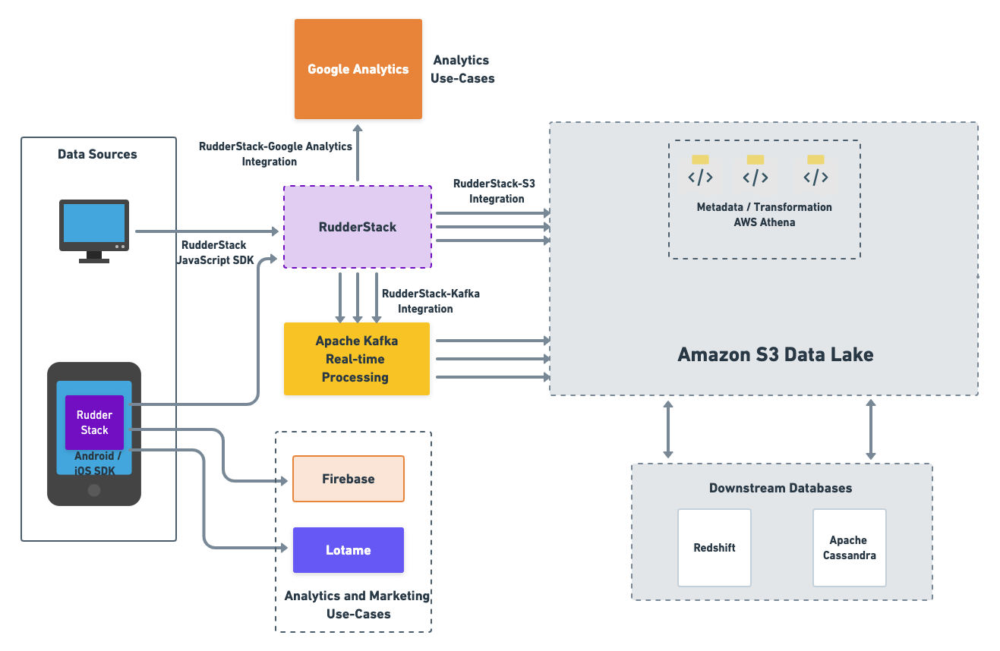

Overview
--------

In this post we break down 1mg’s data stack that allows them to harness unlimited, real-time data securely. We will also look at the tools they use to activate this data for their downstream analytics and personalization use-cases.

Who is 1mg?
-----------

1mg is an online platform that provides services for medical diagnostics, consultation, lab tests, and general healthcare. Every day, millions of users visit the 1mg website or use their apps to buy medicine, schedule time with doctors, or simply find helpful medical information.

1mg’s Data Stack
----------------

*   **Data Collection and Synchronization**
    *   [RudderStack](http://www.rudderstack.com) SDKs, custom scripts
*   **Data Transformation and Enrichment**
    *   SQL, RudderStack Transformations, AWS Athena
*   **Data Lake and Downstream Databases** 
    *   Amazon S3, Amazon Redshift, Apache Cassandra
*   **BI and Cloud Toolset**
    *   Google Analytics, Lotame
*   **Job Orchestration**
    *   Apache Kafka

Data Challenges Faced by 1mg
----------------------------

1mg is completely data-driven. They use data for making decisions in every aspect of their business – including supply chain, marketing, and product development. With millions of daily users, 1mg collects an enormous amount of data. With such high volume and so many different data needs around the company, Utkarsh Gupta – Senior Engineer of the Data Science team at 1mg –  and his data engineering team must manage a complex, technically demanding data pipeline.

1mg faced two key challenges with respect to their overall data infrastructure:

1.  **Secure, real-time collection of unstructured data**: Most of the data collected by 1mg was unstructured, such as medical reports, emails, customer chats, etc. Collecting and storing this data without worrying about the data volume and pricing, while adhering to the data security regulations, was a major challenge for the data engineering team.
2.  **Effective data activation**: 1mg wanted to build a data workflow that utilized the unstructured data to gain critical insights into their customer journeys and for other product personalization use-cases.

Let’s look at how the data engineering team at 1mg’s data stack to address these concerns.

1mg’s Data Stack Explained
--------------------------

At a high level, here’s the flow of 1mg’s data stack: 

*   Event collection and routing happens via **RudderStack** Enterprise, leveraging the JavaScript and mobile SDKs. Note that RudderStack Enterprise is hosted in 1mg’s VPC to achieve maximum security and compliance, which is mandatory for healthcare companies.
*   1mg dumps all of the data into their **Amazon S3** data lake. The events flowing through RudderStack, as well as data from the other sources, are routed to S3 for transformation and orchestration.
*   **AWS Athena** is used to transform and enrich the data. This normalized data is then also batched to **Redshift** and **Cassandra** for 1mg’s downstream use-cases.
*   The events flowing through RudderStack are also sent to Firebase and Google Analytics directly for analytics and business intelligence, and **Lotame** for marketing activation. 
*   The real-time events are also routed to **Apache Kafka**, which is used by 1mg’s data science team to optimize their product recommendation engine.

Here’s a visualization of their data flow: 

In the following sections, we delve into each aspect of the data flow in more detail, from collection to enrichment and analytics.

Data Collection and Storage
---------------------------

For data collection, 1mg deployed RudderStack in their own VPC, allowing them to:

*   Comply with the existing regulations around their healthcare data collection and storage
*   Overcome any limitations on the volume or type of data collection, without worrying about the pricing
*   Route any data to any team through their warehouse infrastructure, or directly to an end-destination for their downstream use-cases

Most of 1mg’s data comes from their customers behavior, so the website and the mobile app are their primary data sources.

1mg use RudderStack’s [JavaScript SDK](https://docs.rudderstack.com/rudderstack-sdk-integration-guides/rudderstack-javascript-sdk) to collect real-time customer event data from their website. Through this SDK, they track all kinds of user behaviors, from pageviews to product views, clicks, checkout flows and more. They also leverage RudderStack’s identify() method to track new VS returning customers and drive personalization use cases. 

For their mobile apps, 1mg used RudderStack’s [iOS](https://docs.rudderstack.com/rudderstack-sdk-integration-guides/rudderstack-ios-sdk) and [Android](https://docs.rudderstack.com/rudderstack-sdk-integration-guides/rudderstack-android-sdk) native SDKs to track and collect app events, and send them directly to Firebase and Lotame for the analytics and marketing use-cases. RudderStack sends the event data to these destinations via the [device mode](https://docs.rudderstack.com/get-started/rudderstack-connection-modes#device-mode). In other words, the RudderStack native SDK within the app automatically calls the destination APIs directly.

1mg also collects data from various other sources. This data is mostly transactional,but also includes data from their API logs, microservices, CRM systems, and so on. 1mg have built a dedicated ETL pipeline to extract data from all of these data sources and push it to their **Amazon S3** data lake.

To move the transactional data from databases like MongoDB, PostgreSQL and MySQL, 1mg use AWS’s data migration service. Their data engineering team has also written custom scripts to pull data from clickstream sources such as Google BigQuery on a daily basis. Also, they’ve built a custom data pipeline that pushes data from various microservices and API logs to their S3 data lake.

Data Transformation, Enrichment, and Routing
--------------------------------------------

The next step is to convert the raw data extracted from various sources into a usable format. For this transformation, 1mg uses **AWS Athena** – an interactive, serverless query service that allows them to normalize the raw data into usable, optimized data tables.

All the major data transformations within the data lake happen in Athena. These include converting the data from JSON to a readable tabular format or joining different data lake tables. 1mg also uses Athena to store all the relevant metadata and schema information related to the tables residing in the data lake.

1mg’s Toolset for Downstream Use-cases
--------------------------------------

After the raw data is normalized, it is again pushed into the S3 data lake and also batched to other databases such as **Amazon Redshift** and **Apache Cassandra** for 1mg’s downstream use-cases. 

While all the data tables related to the business and product analytics use-cases reside in Redshift, Cassandra is used for storing the user and product personalization data. 1mg sends this data to third-party analytics tools such as **Google Analytics** for real-time insights and reports, which can be acted upon by their product and marketing teams for effective decision-making.

In addition to these tools, 1mg also leverages **Apache Kafka**‘s real-time data processing capabilities for their recommendation use-cases. RudderStack supports Apache Kafka as a destination to which it sends real-time events from the 1mg web and mobile apps. Their data science team leverages this data to build and optimize 1mg’s product recommendation engine, which recommends relevant product offerings to its customers.

The clickstream data sent to **Lotame** allows the 1mg teams to segment their users and get a 360-degree view on their customers’ product and purchase journey. They can A/B test new product features and use the insights to revamp their website and drive more efficient customer acquisition programs. The product marketing teams also use the data to build more effective marketing campaigns that improve overall customer engagement and retention rates.

Summing it all up…
------------------

1mg has built a modern customer data stack capable of reliably handling immense scale. Not only have their real-time data products created better customer experiences, but Utkarsh’s team has helped build significant competitive advantage by enabling teams to move fast and optimize every part of the company.

## Try RudderStack Today

Start building a smarter customer data pipeline. Use all your customer data. Answer more difficult questions. Send insights to your whole customer data stack. Sign up for [RudderStack Cloud Free](https://app.rudderlabs.com/signup?type=freetrial) today.

Join our [Slack](https://resources.rudderstack.com/join-rudderstack-slack) to chat with our team, check out our open source repos on [GitHub](https://github.com/rudderlabs), subscribe to [our blog](https://rudderstack.com/blog/), and follow us on social: [Twitter](https://twitter.com/RudderStack), [LinkedIn](https://www.linkedin.com/company/rudderlabs/), [dev.to](https://dev.to/rudderstack), [Medium](https://rudderstack.medium.com/), [YouTube](https://www.youtube.com/channel/UCgV-B77bV_-LOmKYHw8jvBw). Don’t miss out on any updates. [Subscribe](https://rudderstack.com/blog/) to our blogs today!
