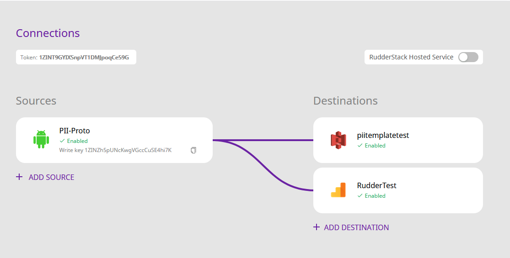
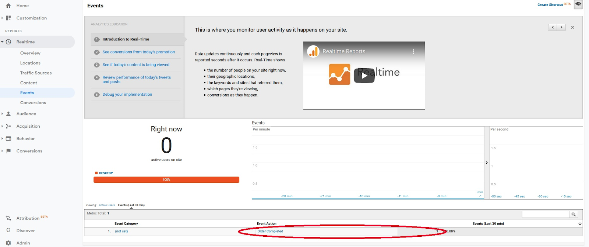

**This blog presents an approach for routing data to RudderStack using Amazon Kinesis and AWS Lambda Functions.**

Introduction
------------

Many organizations today make use of streaming event data from their applications and websites. For collecting the data streams, they use tools like Amazon Kinesis. But how can these businesses turn the data streams into actionable insights? A popular approach to do this is through a process that is called _activation_. In this process, we transform the raw data and then route to different applications and services for insights. For example, we can send signup events to our CRM so that the sales team can work with new leads and establish business opportunities.

In this post, we present a very powerful architecture that uses readily-available services to achieve the above tasks. We combine Amazon Kinesis with AWS Lambda Functions and [RudderStack](https://www.rudderstack.com), an open-source and flexible Customer Data Infrastructure that performs the activation we are looking for. The lambda functions in AWS read the Kinesis data streams and pass them on RudderStack for performing the necessary data mapping. RudderStack then passes on this mapped data to the analytics platforms (Google Analytics, Amplitude, etc.) for analytics.

**Note**: In this post, we use the AWS stack as an example. However, it is possible to substitute Kinesis with Kafka and AWS with any other cloud provider. The stack will still work seamlessly with RudderStack.

How AWS Lambda integrates with RudderStack
------------------------------------------

As mentioned above, we use Lambda functions in AWS as an intermediary for processing and routing data streams for analytics. As Lambda functions can be coded in Node.js, its integration with data routing tools such as RudderStack is very easy. RudderStack provides a [**Node.js SDK**](https://github.com/rudderlabs/rudder-sdk-node) which we can use with the Lambda code.

Quick Overview of the Data Flow
-------------------------------

For the purpose of this blog, we devise a simple application flow:

*   Use [**AWS Kinesis Agent**](https://github.com/awslabs/amazon-kinesis-agent) to:
    *   Monitor the file system for specific file patterns in a specified location 
    *   Upload the newly arrived files to the pre-defined Kinesis stream
*   Use AWS Kinesis Data Streams Consumer to read and process the data
*   The Consumer triggers an AWS Lambda Function
*   The Lambda function maps the Kinesis data to the RudderStack API arguments
*   The Lambda function invokes the RudderStack API
*   RudderStack routes the data to two destinations – AWS S3 and Google Analytics

Setting up the AWS Kinesis Agent
--------------------------------

We can configure the AWS Kinesis Agent using the following lines of code:

`gist:Veenap/2f1e45ddae4ba25e9ab4523107fb95e8`

Some important points to note here:

*   We configure the AWS Kinesis Agent to monitor CSV files in the `/tmp` directory.
*   The Kinesis Agent passes the data to the `lambda-integration-poc` Kinesis data stream. 
*   The data processing options stipulate that the CSV data be converted to JSON. The field names for the generated JSON are also mentioned. 

Some examples of a sample CSV file and the corresponding generated Kinesis records follow:

`gist:Veenap/0ed5196cb3ee0ddb161745fa98b23a07`

**Note**: We use this transformation as an example to demonstrate the operation of AWS Kinesis Agent. Some businesses already have their own programs that write to Kinesis in a format that suits their business requirements. There is no need to change such programs and/or formats.

Setting up AWS Lambda
---------------------

Before we proceed to the Lambda Function code, it is imperative that we review the overall setup. For this blog, we set up a Docker version of the RudderStack server in an EC2 instance. You can find more instructions on the setup [here](https://github.com/rudderlabs/rudder-server#setup-instructions-docker).

**Note**: You also need to have the AWS CLI installed in your development environment.

### Integrating RudderStack with AWS Lambda

As mentioned previously, we can integrate AWS Lambda seamlessly with third-party libraries such as the RudderStack Node.js SDK. The lambda function calls this SDK to perform the necessary data mappings and route the data streams to the specified analytics destinations. Hence, it would also be prudent at this point to go over a few steps that are necessary for integrating the RudderStack Node SDK with the Lambda Function.

*   You should install the RudderStack Node.js SDK at the location where we maintain the Lambda function artifacts in the development environment, as shown:
`gist:Veenap/a4768eafdef85b9c4d9659063f493af0`

*   Archive all the contents of the Lambda function development directory in a ZIP file.
`gist:Veenap/137fddf176d1974f6b61d1a7dabec0de`

*   Update the lambda function deployment, as shown:
`gist:Veenap/7e2a4747533c26b62042ae6b23bbc65d`

Using the Lambda function
-------------------------

As the next step, the following snippet shows the Lambda code. You can use the Lambda code response to test the availability of the function at the AWS-designated web endpoint, created at the time of deployment of the function for the first time.

In the following code snippet, the following actions occur:

*   The function initializes some of the variables used for constructing the RudderStack canonical object
*   The lambda function iterates over every record in the Kinesis event
*   The function parses the records, which are in JSON format
*   The function then uses the attribute values of the JSON object as the values for the RudderStack object attributes
*   In some cases, RudderStack object attribute values are derived by aggregating the JSON object attribute values, as in the case of `revenue`
*   Each record is used to create a `product` object. Multiple `product` objects are collected into a `products`array. An `order` object is constructed using the `products` array, the `order_id` from the records and the `revenue`

After this, the `order` object is used as the value for the `properties` key while invoking the `track` API of RudderStack. 
`gist:Veenap/b5e632c6274ecf964779b905c55516c7`

The `write_key` and the RudderStack endpoint is used to initialize the Rudder client. In this particular case, we configure RudderStack to dump the event to **Amazon S3** as well as **Google Analytics,** for analytics. Learn more on configuring the sources and destinations in RudderStack [here](https://docs.rudderstack.com/getting-started/adding-source-and-destination-rudderstack):

RudderStack Connections Configuration

The delivered event dumped to Amazon S3 looks like the following:
`gist:Veenap/de5465e6c5c3c9e906051b6fa1d4be7f`

The screenshot below shows the delivered event in Google Analytics:

The RudderStack event as seen in Google Analytics

Summary
-------

In this post, we saw how to combine the data streams with RudderStack and AWS Lambda functions to create an extremely flexible and real-time activation data flow for your event data. Combining infrastructures like AWS Kinesis and AWS Lambdas with RudderStack results in a lean and scalable data infrastructure where value can be extracted from your data in no time.

Moreover, RudderStack is an open and flexible Customer Data Infrastructure which means that it can be combined with any of the common data platforms you can find. In this post, we use the AWS stack as an example, but it is possible to substitute Kinesis with Kafka and AWS with any other cloud provider.