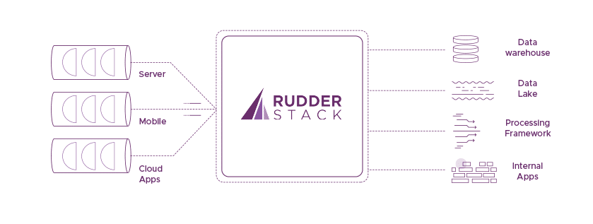
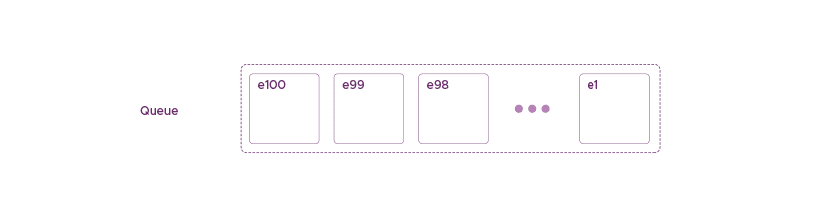
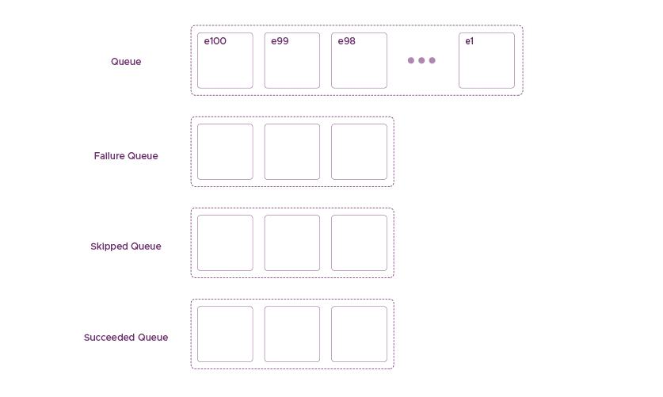
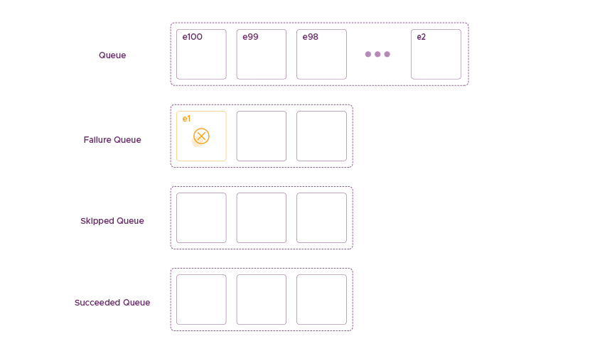
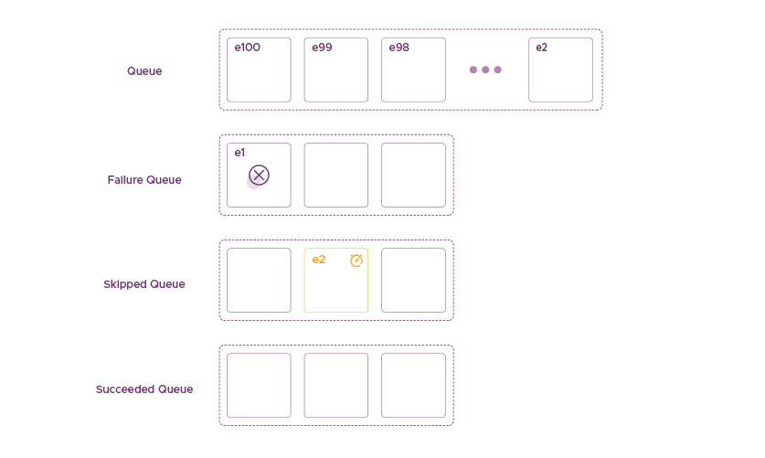
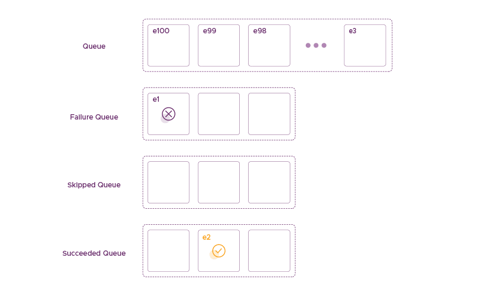
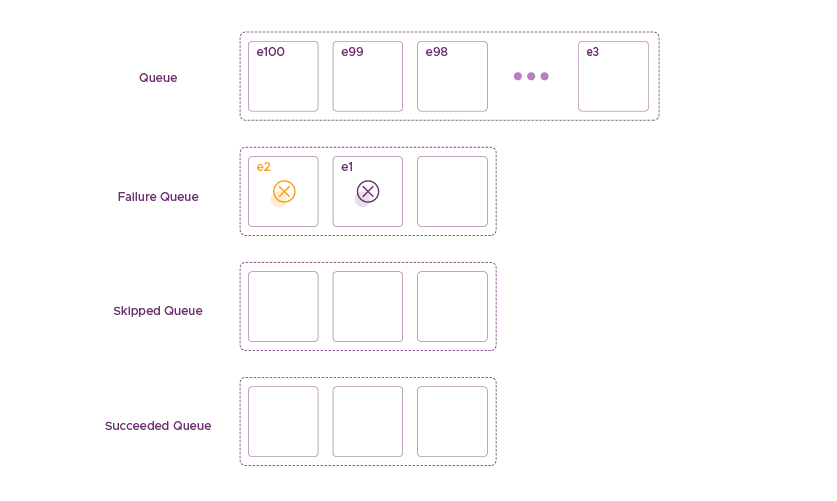

**Customer Data Infrastructure (CDI)** is a typical example of a Data-Intensive Application. Martin Kleppmann’s book [Design Data-Intensive Applications](https://dataintensive.net/) does an amazing job of explaining what a data-intensive application is. CDI, at its core, is an infrastructure for capturing, processing, and routing streams of events from applications. 

Routing in Customer Data Infrastructure
---------------------------------------

Routing might not be the most common term you have heard when it comes to data infrastructure. However, it adds many complexities and engineering challenges around building a CDI. Routing involves sending the event stream from CDI to various systems and applications that usually live on the cloud. An example of such an application is a CRM like Salesforce. This interaction between systems that live on different hardware, different networks, interact through unreliable web APIs. Also, these interactions are managed by various organizations, which adds to all the complexities of a CDI.

Routing needs to be fault-tolerant to ensure that you do not lose any data. However, it also needs to provide strong consistency guarantees. For example, routing requires a strict ordering in how it delivers the data to the destination service that will perform some action on the data. Consider a stream of events of a customer interacting with an e-commerce app. Say, the first event is product search followed by the addition of the product in the basket, and finally checkout. We would like to maintain this order when streaming these events to a system that executes the order.

Deduping in Customer Data Infrastructure
----------------------------------------

Another related problem is deduping events as are routed through the CDI to these destinations. Duplicate events may happen for any number of reasons from network failures and retries at the client end to failures in the CDI. But these duplicate events at source should not result in duplicate events in the destinations.

This post is a part of a series of posts where we try to describe the engineering challenges we face at [RudderStack](/) and how we deal with them. Hopefully, this will be an excellent opportunity for a dialog with the engineering community. After all, when dealing with tough engineering problems, you have to interact with the community to find the best possible solutions. This is fun, and you are most likely to identify the issues you might be overlooking.

Dissecting a Customer Data infrastructure
-----------------------------------------

The diagram shows a typical deployment of a Customer Data Infrastructure such as RudderStack:

### Components in Customer Data Infrastructure

As we can see above, there are three main components in Customer Data Infrastructure.

*   **The clients**: This is where all the data is collected. A client can be on a mobile device on a server inside a data center. Also, a client can even be a cloud application that generates events. 
*   **The data plane**: This is where all the magic happens. RudderStack pushes data from clients to the data plane, which is responsible for handling it. Schema mapping, processing, filtering, and routing of events are happening at this part.
*   **The destinations**: The data plane is responsible only for the reliable delivery of the data into the right form to the right destination. A destination can be a storage engine such as a data warehouse, file system, a processing framework such as Apache Spark, or applications on the cloud.

### How These Components fit Together

It is essential to remember that clients can live on different networks, hardware, and software. All of the clients are using a small piece of software that is responsible for capturing the data and reliably pushing it into the data plane. We have control over this small piece of software. The number of clients can be anywhere from a few 10s for server-side clients to millions in the case of mobile devices. 

The data plane is a distributed system, running on different servers that might fail at any point. The system must provide fault tolerance and consistency guarantees even under failure conditions. 

Destinations, too, have different capabilities and reliability guarantees, such as strongly consistent database systems that implement transactions. Furthermore, some destinations can manage applications running on unreliable networks communicating over UTP.

As a result, defining and maintaining a reliable CDI is an exercise in advanced distributed systems.

Fault Tolerance and Consistency in RudderStack
----------------------------------------------

Hopefully, I have convinced you so far for how messy real life is and that failures are a norm.

Destinations may go down, and they may be throttle event s. Also, there may be transient network failures between RudderStack and destination. More so for us, because part of RudderStack runs inside the client’s environment. So, there may be individual message failures where a given message is nor deliverable. This can happen, for example, due to malformed messages or destination bugs. We have seen errors where the presence of non-standard encodings triggers failures. 

To make things worse, the destinations often don’t return an error response code to distinguish between these. Google Analytics always returns 200 error response codes. However, some destinations return 5xx for both server-side downtimes and individual message errors it can’t handle. The goal of RudderStack is to design a system that can gracefully handle these scenarios. This post will focus on how we are dealing with scenarios that are related to destinations.

### The Scenario

For simplicity, we will consider a simple scenario. Here, we have:

*   A sequence of events
*   RudderStack that receives these events
*   One destination that is receives these events from RudderStack

In this case, we don’t care about how we deliver the sequence of events to RudderStack. We will assume that they always arrive without losses. Furthermore, even if they are unordered, RudderStack can always sort the sequence.

The destination can be any system, interfacing through any interface. Also, it lives outside the hardware and software boundaries of RudderStack. 

Data in RudderStack is always in the form of a sequence of events. RudderStack orders these events such that one can always sort these events using their timestamps. This order is important, and we want to maintain it.

As we can see, the above messages are a series of tuples. Here, each tuple contains the event and a flag to let the system know whether the system has processed these tuples.

### Implementing Fault Tolerance

The most straightforward way of dealing with failures, while trying to push the events to a destination, is by implementing some kind of retrying mechanism. If event e1 fails, we can keep retrying for this particular event (with some exponential back-off for some time). We can eventually give up and move on to the next message. This isn’t the right solution because of the following reasons:

*   The destination server may just be down, and sometimes downtimes can span hours. Hence, we don’t want to lose a bunch of messages during that window. Defining such a window is not straightforward, and its parameters might frequently change even for the same destination.
*   If the error is in the message itself, we want to immediately move on to the next event. Retrying with exponential back-off unnecessarily slows down the whole pipe. Here there are two cases that we want to handle:

1.  There’s no dependency between the events, and the order does not matter. This is an easy case, and we can relax our consistency constraints and discard the event.
2.  There is a strong dependency between events, and failing at one event should also affect the rest of the interdependent events.

### Fault Tolerance Solution at RudderStack – Three Queues

At RudderStack, we implement fault tolerance and consistency, considering the above specific reasons. We came up with a solution with three queues that correspond to the three different **states**. An event can be at any of the following three queues at any time inside RudderStack:

*   Succeeded Queue
*   Failure Queue
*   Skipped Queue

Instead of retrying and discarding event e1 where it cannot be delivered, we move it to a failure state together with a timestamp that we generated during the last failed attempt. By changing the state of the event into failed, we move it into the Failure Queue. RudderStack tracks the Failure Queue, and events are retried based on their failure timestamp and a configurable retry delta.

After RudderStack moves event e1 into the Failure Queue, we move into the next event, e2. The reason for using a queue for each state will become clear using the following scenarios.

### Event e2 is Related to Event e1

If the next event e2 is related to event e1, then we can’t send it to the destination. Since we want to ensure the consistency of the delivery order, we will also push e2 into the Skipped Queue. Hence, we don’t just implement a state machine that transitions each event from one state to another. Furthermore, we use queues, where we can preserve the order. The rule for identifying if the event e2 relates to e1 is by checking the ownership of both of them. If the same user generates them, then they are considered related.

The Skipped Queue – Event e2 is Related to Event e1

### Event e2 is not Related to Event e1

The next scenario is that event e2 is not related to event e1. In this case, RudderStack will attempt to process it. If we succeed in delivering the event, then we mark it as successful. RudderStack puts it into the Succeeded Queue, and will eventually remove it entirely from the system.

The Succeeded Queue – Event e2 is not Related to Event e1

### Event e2 is not Related to Event e1 – Also Fails to be Delivered

In the next scenario, event e2 is not related to event e1, but it also fails to be delivered. In this case, RudderStsck pushes e2 into the Failed Queue behind e1. The two unrelated messages failed hint towards failure at the destination end, unlike some message problem. Considering this hint, we use the ratio of Succeeded Queue and Failure Queue in some previous time history. This ratio helps to decide if the problem is related to the destination or the messages. We use this ratio and some heuristic to:

*   Determine long to sleep before retrying after failure – If too many of the last few messages are failing, we should sleep more before hitting the destination again. Also, we should preserve the failed messages for a longer time.
*   If the ratio is low, then there are likely issues with the messages themselves, and hence they can be discarded.

The above algorithm manages the state and the order of events in RudderStack. It describes how we deal with the reliability of our system in case of faults at the destination end. It allows us to be fault-tolerant in a configurable and adaptive way. We can decide how long to wait and maintain the events. Also, we can heuristically decide where the issue is. It also allows us to maintain event order and be consistent at a level that allows RudderStack to deliver activation on top of the data it manages.

Conclusion
----------

Building reliable data applications is not an easy task, especially with an [open system like RudderStack](https://rudderstack.com/blog/open-source-analytics/). In this post, we sketched a high-level algorithm of how we handle failed delivery to destinations using a combination of a state machine and queues for achieving satisfactory fault tolerance and consistency. 

The algorithm on its own does not guarantee the above objectives completely. What happens if the RudderStack node that handles the data crashes? What if we run out of memory, and the Queues cannot fit anymore? There are more details on how we deal with these. For example, we implement the queues we mentioned as rotating tables on Postgres, but this is material for another blog post.