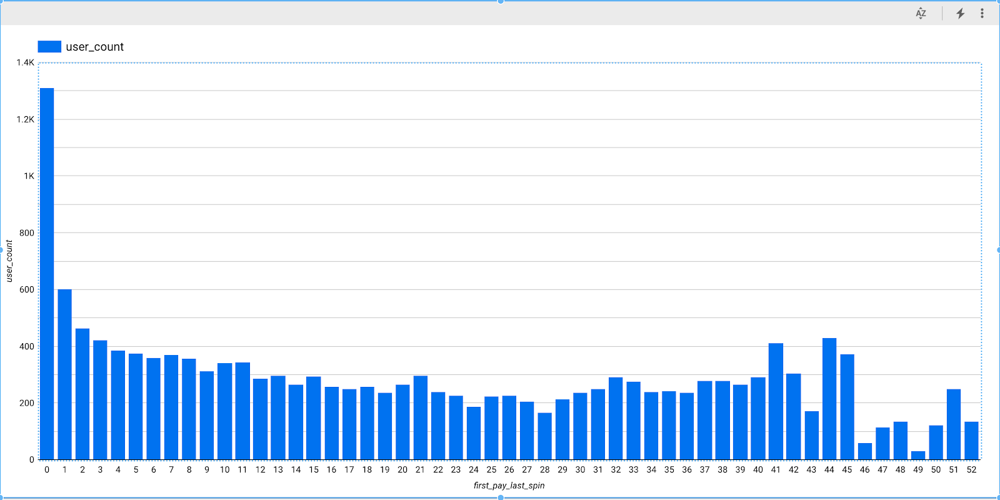

There are a lot of blogs out there on building churn prediction models using scikit-learn, R, or other advanced ML toolkits. However, most of them require strong engineering as well as data science skills. That said, it is now possible to create robust models using SQL and basic knowledge of data science by leveraging the tools that companies like Google have developed to democratize machine learning.

In this post, we will use Google’s BigQueryML together with the clickstream data collected and delivered using the RudderStack platform. This data represents events, such as slot machine spins, associated with a [mobile casino game](https://rudderstack.com/blog/rudderstack-case-study-casino-game-analytics/). The volume of the data is typical for such scenarios, and as we will see, performing churn analysis is both easily accessible and efficient without having to spend a fortune on the infrastructure.

What is Customer Churn and Why We Care About It
-----------------------------------------------

Customer churn is a problem for any consumer business, be it eCommerce or mobile games. Its definition is simple – churn happens whenever a customer stops doing business with your company or stops buying your product. The **impact** of losing a customer does not result in just **revenue loss**. The **cost** of **customer acquisition** can range from a few dollars to tens of dollars; hence losing a customer also implies a negative impact on the return on that investment.

Customer churn can happen for many reasons, including but not limited to:

*   Inferior product quality
*   Unsatisfactory customer service
*   Consumers losing interest (particularly true for games) 
*   Just the nature of the product itself

It is not possible to always identify and control these factors, but it is important to track and try to understand the factors that contribute to churn. This can inform the product and the overall business strategy and also optimize processes like customer acquisition and support.

> **A disclaimer first** –  We understand that there may be some ethical questions around engineering user behavior to keep them hooked to the game or an application in general. We won’t get into this debate, though. We consider this particular case because the volume and the type of data is an excellent candidate for the type of analysis we want to perform. Furthermore, it allows us to explore different sophisticated tools and techniques available to perform this exercise.

For the purpose of this blog, we will analyze the clickstream data purely from a prediction point of view – how accurately and how soon can we predict if a user is going to churn based on their in-app behavior. We can use the same setup to predict any kind of churn in other domains.

Data capturing and setting up the delivery infrastructure
---------------------------------------------------------

For our use-case, the mobile game integrated RudderStack’s **[Unity SDK](https://github.com/rudderlabs/rudder-sdk-unity)** for generating events. These events were then sent to RudderStack’s open-source data plane, from where they were routed into Google BigQuery for further analysis.

We store all the events routed by RudderStack in a **track** table in **BigQuery** with the entire JSON payload as a column. In addition, we also create separate tables for each event type, with the event properties as columns. This is important because, in this way, we can have access to the whole event if we need to, exploiting BigQuery’s excellent support for semi-structured data. We can also optimize the usage of BigQuery by partitioning the data based on the event time. This allows us to optimize both the query execution time and the cost.

The following images demonstrate two examples of tables created in BigQuery – one for a particular event type and the other for all events:

As seen above, the table for a specific event contains attributes specific to that event, whereas the second table contains information that is event-agnostic. The two tables can be linked by the `id` field.

RudderStack does the schema management automatically. It creates the table schema based on the event structure and keeps it updated if new fields are added to the event JSON or if the data types of the existing fields are changed. This approach maximizes the usage of your data warehouse without having to worry if your data pipeline is broken. It also ensures that your warehouse is always up-to-date.

Exploratory Data Analysis and churn prediction strategy
-------------------------------------------------------

The first step in building any ML model is to build the intuition around the data you are working with. BigQuery is great for this purpose as it allows you to run arbitrary queries on your data through its console and quickly explore them without having to rely on complicated external tools. Of course, if a more sophisticated analysis is needed, you can connect your BigQuery instance to various third-party tools out there.

In order to define churn, we use the plot below – which shows the distribution of the number of days between the first payment and churn. While it is impossible to know if anyone really churned, we assumed **seven days of inactivity** as a criterion for churn. We make this assumption based on the feedback we got from the product manager of the game while considering the broader understanding of churn for this particular industry. For this game (and most other games), people are generally very active, playing multiple times a day. If at some point they just leave the game – and while they might return – the general consensus is that the longer a user is inactive, the smaller the possibility of their return is. Considering this factor, seven days of inactivity is a good starting point for investigating customer churn with our data.

As observed initially, a vast majority of people leave within a couple of days of the first payment.

### The churn prediction strategy

The simplest approach to reduce churn is to send out an offer or something after a few days of inactivity. However, this approach is not the best. If we choose too low a threshold, we will be giving out too many offers. On the other hand, if we wait too long, the user would have been long gone, maybe even uninstalled the game. The objective is to predict with very high accuracy if someone will churn **before** they actually churn. So, the question is, how can we optimize this approach by incorporating an accurate churn prediction model?

We will try to answer this question in the rest of this blog. We will try to predict if **someone will churn within three days** of making a payment. This means that a person for whom the number of days between the date of first purchase/payment and the date of their last-logged event is **three or less** are labeled as **churn-positive**. If not, they are labeled as **churn-negative**. The goal is to predict if someone is positive within **one day** of paying – as most users are still active then and can be engaged with.

Feature Engineering for Customer Churn Prediction
-------------------------------------------------

After an initial exploratory analysis, it is time to start working on building a model for customer churn prediction. Doing this requires defining a set of data dimensions or features that will be used to train the model. Feature engineering is something between an art and a science, as an intuition of both the data and the business case is required. In our case, we went through an ‘interview’ with the product manager of the game who understood both the data and the problem statement. This allowed us to select a well-defined set of data features for our task.

The following features were identified as relevant for predicting churn after talking to the game product manager:

*   **coin\_balance:** If someone has a lot of coins left, they are more likely to continue playing the game. 
*   **total\_bet/total\_win/total\_spins:** People who are more active are generally more hard-core players and hence less likely to churn. By summing the amounts/numbers across all of the “spin” events of a user – the total amount or count of bets/wins or spins can be determined
*   **number\_of\_distinct\_games**: Similar to above, people who play more games are more likely to stay on.
*   **total\_jackpot:** People who win random jackpots are more likely to feel positive and hence continue.
*   **win ratio (total\_win/total\_bet):** Similar to above, people who win more are less likely to churn.
*   **signup\_to\_first\_pay:** People who pay immediately after signing up are likely more hard-core players and unlikely to churn. People who take a long time to pay are likely amateurs and are more likely to churn after making the payment.

### Validating the features

To validate the choice of these features, we performed some further exploratory data analysis. As an illustration, the following plot shows the distribution of some of these features between churners and non-churners. For this, we compared some of the features mentioned above, such as total bets placed, total spins, total win amount, etc. for churn-positive and churn-negative users.

It is obvious that churners behaved very differently than non-churners.  The charts generated below are for just one of the cases – the number of **total\_jackpot**s and the difference between people who churn and who do not can be identified.

These feature plots were generated by dumping the data via SQL and plotting using matplotlib (though any other charting solution can be used).

In general, it is found that the range of values for churn-positive users varies within a significantly narrower range compared to those for churn-negative users.

Building a Customer Churn Prediction Model using BigQueryML
-----------------------------------------------------------

Based on the features we have identified, it is now time to build the churn prediction model. We will use Google BigQuery to do so.

### Step 1: Creating the Training Set

The first step is to generate the dataset by generating all the features and combining them into one view.

Computing the feature requires the following steps:

*   Finding user-specific event dates. For example, when they first signed up, when they first paid, their last day of activity, etc. As mentioned above, RudderStack maintains a track table with all the events, so mapping these activities is essentially finding the date when a specific event occurred in the **track** table. The **RANK()** function comes handy by letting us associate a monotonically increasing number _rank_ to each occurrence of an event for each user.  
      
    The query is as shown below:
    `gist:Veenap/ef96ad7c77e162fce49bee0e3b898aa2`

Other date-specific tables like `SIGNUP_DATE_TABLE` (date of first activity), `LAST_SPIN_DATE_TABLE` (a user’s last spin) can be computed similarly.

*   Using the date tables above, one can compute the features. For example, to find the number of spins between the signup and `first_rev`, one has to join the `RUDDER.spin` table, `SIGNUP_DATE_TABLE` and `LAST_SPIN_DATE_TABLE`. `RUDDER.spin` table is the event-specific table that RudderStack creates. The query is as shown:
    `gist:Veenap/18d14ac3cffbc1913a16f8eded5f781b`

*   The next step is to compute the label column. A user has churned in 3 days if the difference between `LAST_SPIN_DATE` and `FIRST_PAY_DATE` is **<= 3 days** and **7 days** (churn threshold) have passed since `LAST_SPIN_DATE`. This again is a simple SQL query joining the `FIRST_REV_DATE` and `LAST_SPIN_DATE`. This is added as another table  3\_day\_churn.
*   Finally, all these features can be combined into one giant feature by joining across `anonymous_id`.

### Step 2: Building the model

Now that we have our final dataset by choosing and generating all the data features that we need, it’s time to build the model directly from within our data warehouse using BigQuery ML. BigQuery ML has the support for building machine learning models, using just SQL. This considerably simplifies model-building iterations and eventual deployment.

Currently, BigQuery ML only supports some basic models like Logistic and Linear Regression, but not NBD/Pareto (usually most effective for churn). However, the goal here was to show how one can iterate quickly build and operationalize their ML model with just SQL from within the data warehouse.

The following query shows how to generate the model in BigQueryML.

`gist:Veenap/12ba07e2a55fcd6f3c850f408c223f00`

The above query creates a **Logistic Regression** model using the data from the table containing all feature values for all the users. The model auto-assigns the class weights. We direct the training process to not split the data into training and test datasets – since it has already been done during the data preparation stage. Furthermore, we select only the data intended for training as the input for the model training process. The name of the **label** column has also been specified. The column `within_3_days` is marked as true or false, depending on whether the user is churn-positive or churn-negative. The maximum number of training iterations or steps is also specified.

We run the following query to evaluate our model:
`gist:Veenap/440ec5d35a3d86dc8f7cae1c126c3a67`

The above query takes the test dataset from the data containing all features for all the users, evaluates the model performance. Basically, the model will predict the value of the `within_3_days` column considering all other features. We then compare the predicted value against the actual value to calculate the model performance statistics.

Analyzing the Churn Prediction Model Performance
------------------------------------------------

We get the following performance metrics for the model:

The ROC curve for recall vs. precision is as shown below:

When we compare the model’s prediction for the users – the expectation is that the model should predict a possible churn for as many of them as possible. In other words – the model should be able to **correctly** **recall** the class for the relevant users. The model achieves a recall of 84%, which is commendable. This is because the derived features and the chosen algorithm are quite simplistic in nature.

It is essential that the model is able to identify users who would churn in actuality. At the same time, it is also important that it doesn’t wrongly identify users who wouldn’t churn. The implications of such a mistake can range from wasted incentives and therefore reduced ROI, to irritated users. Going back to our use-case, this means that values predicted by the model for either class in the test dataset should match the actual values in as many cases as possible. This measure, called **precision**, is also relatively high at close to 86%. This is fairly good, again considering that ours is a very simplistic model.

### Out-of-sample testing

In addition to the above, we also perform an out-of-sample test. This essentially is carrying out predictions on records that are not a part of either the training or evaluation process. However, we know the churn status for this data. In other words, it is the “unseen” data. Accuracy of prediction for such cases gives a reasonably good idea of how well the model can perform in production.

In our case, we check the false positive/negative rates for the out-of-sample test. We record these figures in the table as shown:

<figure class="wp-block-table aligncenter"><table><tbody><tr><td><strong>Threshold</strong></td><td><strong>Recall</strong></td><td><strong>False_Positive_Rate</strong></td></tr><tr><td>0.5</td><td>38%</td><td>2%</td></tr><tr><td>0.4</td><td>46%</td><td>4%</td></tr><tr><td>0.3&nbsp;</td><td>55%</td><td>6%</td></tr><tr><td>0.2&nbsp;</td><td>61%</td><td>8%</td></tr><tr><td>0.1</td><td>70%</td><td>10%</td></tr></tbody></table></figure>

When a model makes a prediction, it also associates a **probability** of being correct or **confidence** for each class that it predicts. For a 0.1 or 10% threshold, the class that has been predicted with greater than or equal to 10% confidence as the class for a particular user – the recall is 70%, and the false positive rate is 10%. This means that the model correctly identified **70%** of the users who **actually churned** as churn candidates. Only **10%** of the users **who did not churn** were **wrongly classified** as churn candidates.

Conclusion
----------

Based on the model-building exercise we undertook, there are several key observations and takeaways:

*   Judging by the performance metrics, the churn prediction model appears to be performing reasonably well as a starter project. The outputs of the model should satisfy the product manager. Hence, we can definitely run various campaigns using this model as a base by deploying it in production.
*   More accumulation of data will require a periodic refresh of the model.
*   Instead of solely relying on domain knowledge for feature selection, performing **Principal Component Analysis** can yield better results.

Apart from the above observations, we can also investigate alternate analytics platforms that support more complex model-building processes, including support for **custom estimator functions**.

## Try RudderStack Today

Start building a smarter customer data pipeline. Use all your customer data. Answer more difficult questions. Send insights to your whole customer data stack. Sign up for [RudderStack Cloud Free](https://app.rudderlabs.com/signup?type=freetrial) today.

Join our [Slack](https://resources.rudderstack.com/join-rudderstack-slack) to chat with our team, check out our open source repos on [GitHub](https://github.com/rudderlabs), subscribe to [our blog](https://rudderstack.com/blog/), and follow us on social: [Twitter](https://twitter.com/RudderStack), [LinkedIn](https://www.linkedin.com/company/rudderlabs/), [dev.to](https://dev.to/rudderstack), [Medium](https://rudderstack.medium.com/), [YouTube](https://www.youtube.com/channel/UCgV-B77bV_-LOmKYHw8jvBw). Don’t miss out on any updates. [Subscribe](https://rudderstack.com/blog/) to our blogs today!