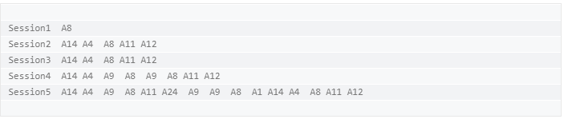
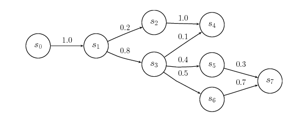
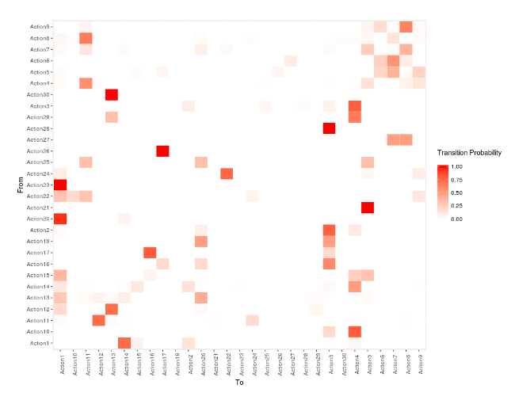
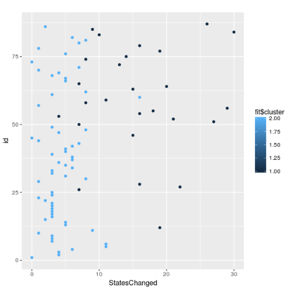
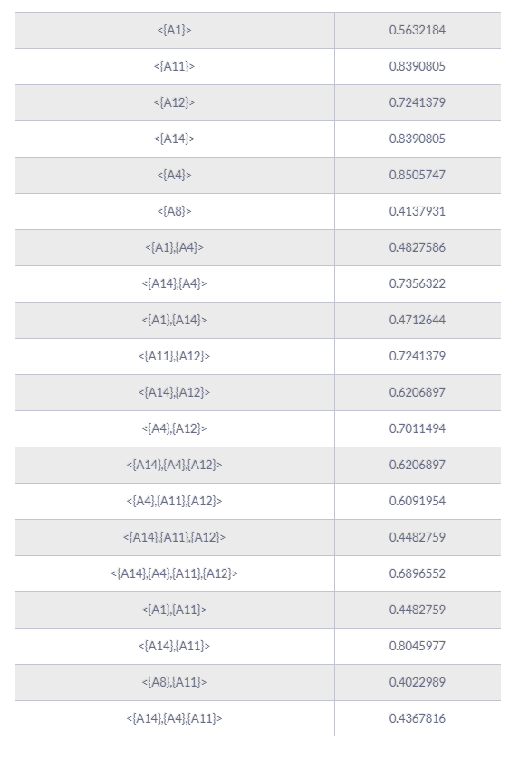

**Overview**
------------

In this post, we cover two key algorithms for mining clickstream data – **Markov Chain**, as well as the **cSPADE** algorithm.  These techniques allow you to leverage the clickstream data to get a 360-degree view of your customers and personalize their overall product experience.

We also focus on the two key problems that these data mining techniques solve:

*   **Predicting customer clicks** to create data-driven customer personas, based on their behavior
*   **Segmenting clickstream data** based on user profiles and the actions performed by these users.

> **Note**: For this post, we assume that you have your clickstream data already collected and stored. For more information on how to collect the clickstream data, you can refer to the **Appendix** at the end of this article.

**Data Preprocessing**
----------------------

The clickstream data that you have collected and stored in your data warehouse is often raw. It requires some refinement before it can be used to perform any analysis. 

In data science, refinement usually involves data processing, cleaning and transforming. The resulting dataset can then be used [for clickstream analytics](https://rudderstack.com/blog/clickstream-analytics-gamechanger-for-ecommerce/).

In our case, we will group the data into sessions. But why is it important to create sessions?

### **Why it is Important to Group Clickstream Data into Sessions**

A session represents a contiguous set of actions performed by a user during the course of a single visit to a site or app. Typically, we use session abstractions in analytical applications such as:

*   Clickstream analysis
*   User choice prediction
*   Frequent item-set mining

The impact of outcomes in each of the above applications is strategic in nature. For example, they might lead to the reorganization of websites or mobile application layouts, information enhancement of SKUs, retraining of recommendation engines, etc.  Such changes cannot happen frequently, or in an unplanned manner.

Therefore, the overall idea is to split clickstreams into chunks of user actions, called sessions, which we can then use for constructing the model. This is important, because it makes no logical sense to model an infinite sequence of events.

### **Defining a Session**

We will define a session as:

*   In case of an application, the time between two consecutive application start events
*   In case of a web page, the time from the entry till the logout or timeout activity (usually 20 minutes of no activity)

We highly recommend checking out our [Sessionization repository on GitHub](https://github.com/rudderlabs/dbt-sessionization) to see how to use the sessions in a practical scenario.

### **Transformation Criteria**

To transform the initially collected event log into actual clickstream data, we need to:

*   Identify the actions or events that are performed by an individual user and group them all together.
*   Split these events further into sub-groups of events, based on the events performed in the same session, as per the session definition above.

Now that we have defined a session and the criteria for transforming, we need to arrange the events of each session in an appropriate time order. We can then move to the actual analysis. 

The dataset we are going to use for the analysis will look like this:

In the above dataset, each row corresponds to a session. The first column contains the session names, while the rest of the columns denote the actions (represented by A8, A14, A9, and so on) performed by the user during that particular session.

**Constructing the Model**
--------------------------

As mentioned previously, we evaluate and use two techniques to build the model in this post:

*   State transitions with a Markov Model
*   Discovery of sequential patterns using cSPADE algorithm

Also, the two key problems we want to solve with this model are:

### **User Clicks Prediction**

In clickstream analysis, it is very useful to predict where the customers are more likely to click next, given their previously followed patterns. This insight can be used to create data-driven customer personas, influenced by their behavior.

### **Clickstream Data Clustering**

Because of the complex nature of the websites and applications these days, it can be difficult to obtain similar clickstreams. Any given user can follow multiple different paths and click sequences. Thus, it can prove to be quite a task to analyze these large numbers of monitored clickstreams.

An easier option in such a scenario would be to group these clickstreams based on their similarity and user profiles. In this way, you can:

*   Find customer segments, and
*   Identify visitors that exhibit similar interests

**Markov Chains**
-----------------

Markov chains work best with sequential data – exactly the type of data that we are dealing with, in this post. 

Let us first quickly get an overview of the Markov process and the Markov Chain.

*   The **Markov process** is a stochastic process satisfying the Markov property of memorylessness. Simply put – it is a random process in which the future is independent of the past, given the present. 
*   A **Markov Chain** is a Markov process that describes the sequence of possible events, in which the probability of each event is completely dependent on the state attained in the previous event.

We can graphically represent a Markov chain as a transition diagram along with the corresponding probabilities, as below:

For clickstream analysis, we usually leverage the concept of Markov Chains. A process X(n) takes the state m(n) from a finite set m at a given time n. 

We derive the order of the Markov chain from the number of states on which the current state of the event depends. For example, a zero-order chain implies that the probability of being in a state in the next step is completely independent of any and all the previous states.

The concept of higher-order Markov Chain leads to more realistic models. However, the number of parameters required for its representation also increases exponentially. Hence, it is extremely crucial to get the right balance here.

### **Fitting a Markov Chain**

As mentioned above, our dataset looks like the following:

For constructing the model, we use the 3rd Order Markov Chain on this dataset. The reasons are quite straightforward:

*   The number of parameters required to represent the Markov Chain are manageable
*   A higher order increases, the parameters required for the representation also increase exponentially. Managing them would require significant computational resources.
*   We would want at least half of the clickstreams to consist of as many clicks as the order of the Markov Chain that should be fitted. It makes no sense to select a 3rd order Markov Chain if the majority of the clickstream consists of only 2 states – so there is no state 3 steps behind to take into consideration.

By fitting the Markov Chain model, we get:

*   The transition probability matrix
*   The lambda parameters of the chain for each one of the three lags
*   The Start and End probabilities, that correspond to the probability that a clickstream will start or end with a specific event.

We can represent the transition probability matrix as a heat map, with Y-axis representing the current state (**From**) and the X-axis representing the next state (**To**). As you can see in the heat map below, the more reddish the color is, the higher probability there is of a given transition. 

For example, the transition from Action23 to Action1 is more probable than the transition from Action21 to Action1.

### **Predicting Customer Clicks**

We can determine the probability of transition, along with predicting clicks. This can be extended to the most common use-case of a web page or an app. We can start from the state with the maximum start probability and follow the probable transitions – and ultimately end up with a data-driven understanding of a given customer’s transition.

### **Clustering the Clickstream Data**

In our case, we will perform [K-Means Clustering](https://en.wikipedia.org/wiki/K-means_clustering) with 2 centers. During clustering, we notice that the average length of clickstreams varies with each cluster. This implies that the algorithm clusters the clickstreams based on the number of actions performed by the user during the given session. 

We can represent the clusters graphically as below:

In the above graph, the Y-axis denotes a unique identifier for each session. The X-axis corresponds to the total number of states changed per session.

There are some other interesting insights in the graph. The lighter shade of blue indicates the users that perform fewer actions, and don’t spend a lot of time on the website or app. 

This could imply that either they achieved their goal easily and had no problem in using the interface or navigating through the website. On the other hand, the dark blue cluster represents the users that performed multiple actions and took much more time navigating the website or the app.

It is very important to note that this interpretation can change completely, based on the data at hand. There is no thumb rule on interpreting the clusters.

It often requires deep technical as well as subject matter expertise to get the context and the interpretation of the clusters right.

**Using cSPADE Algorithm for Mining Clickstream Data**
------------------------------------------------------

An alternative approach to modeling clickstream data as transition probabilities is to represent them as sequential patterns. We can then mine them to determine trends that occur the least number of times a given user’s clickstream data.

The SPADE algorithm can be used to explore, understand and even predict a given customer’s navigation patterns through our website or application.  This algorithm takes the following approach:

*   In the first step, the algorithm calculates the frequency of sequences with only item
*   In the second step, it computes the frequency of sequences with two items…. and so on.

We can use the cSPADE algorithm to extract the pattern sequences having minimum support.

As an example, if we consider our dataset – at least 40% of the clickstreams support the following 22 pattern sequences:

From the above table, we see that for a given sequence pattern X, it is possible to predict the next click by searching for the pattern sequence with the highest support starting with X.  For example, after performing the action A14, the most probable next action is A11, according to the pattern sequence 8 – with a probability of 0.8045.

It is important to note that lowering the support gives us less frequent patterns in our clickstreams. This approach is quite useful in cases where we want to extract pattern sequences that lead to errors or failures in using our product or app.

**In Conclusion**
-----------------

In this post, we explored the Markov Chain and SPADE algorithm for mining our clickstream data. Using the model built using these techniques allows us to:

*   Determine the most frequent product journeys of customers on our website or app in a very data-driven manner
*   Predict the next actions of our customers / users based on their previous activities
*   Extract useful sequential patterns during a session

All the relevant code pertaining to the techniques and methods used in this post can be found [here](https://github.com/blendo-app/ClickstreamAnalysis).

It is worth noting that all these analyses and insights are not of much use, unless they drive some kind of actions or decisions. These insights must be used as a part of the recurring reviewing process to improve the product design, as well as the overall marketing strategy.

**Appendix**
------------

In this section, you can find detailed information on some of the initial tasks that need to be performed while mining your clickstream data.

### **Collecting Clickstream Data**

Collecting clickstream data essentially means capturing all the user activity across a web page or mobile application.

You can use tools like Google Analytics and perform analytics on the event data without worrying about managing the infrastructure – although this is a costly affair. 

Alternatively, you can write a JavaScript library yourself that captures the event data, set up AWS Lambda to expose an API, and then dump the events into Amazon Kinesis. This would require some engineering effort, though. 

The third – and the best – alternative is to use [an open source Customer Data Infrastructure tool like RudderStack](https://rudderstack.com). Not only do they provide a client-side SDK to capture your events, you also get the flexibility to store the events wherever you want.  

> This [Quora post](https://stackoverflow.com/questions/3195773/how-should-i-capture-clickstream-data/3195819) answers the ‘**How should I capture clickstream data**’ question in detail.