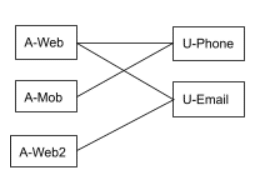
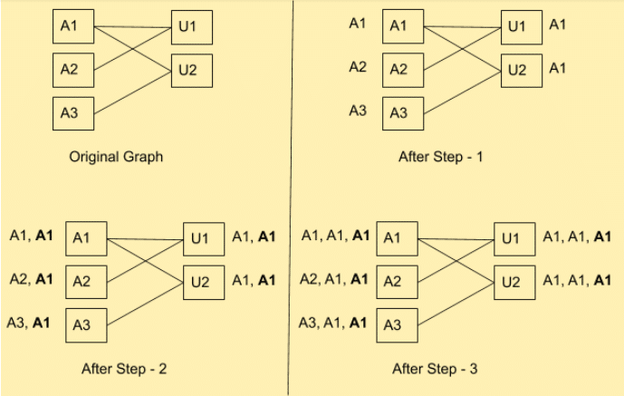
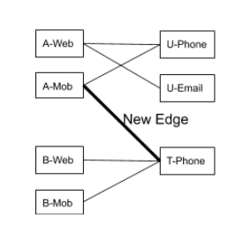

In our previous blog, [The Tale of Identity Graph and Identity Resolution](https://rudderstack.com/blog/the-tale-of-identity-graph-and-identity-resolution/), we described the problem of identity resolution. We used a concrete example of a user visiting an eCommerce site from multiple websites. Specifically, we showed how the app events can be associated with multiple identities and how these identities can be tied together using the `identify()` call. We captured the association using the following identity graph:

The identity graph is stored in a SQL database in the `identify` table as below:

<figure class="wp-block-table"><table><tbody><tr><td><strong>Anonymous ID</strong></td><td><strong>User ID</strong></td><td><strong>Mapped ID</strong></td></tr><tr><td>A-Web</td><td>U-Phone</td><td>Virtual-ID-1</td></tr><tr><td>A-Web</td><td>U-Email</td><td>Virtual-ID-1</td></tr><tr><td>A-Mob</td><td>U-Phone</td><td>Virtual-ID-1</td></tr><tr><td>A-Web2</td><td>U-Email</td><td>Virtual-ID-1</td></tr></tbody></table><figcaption>The <code>Identify</code> table in SQL database</figcaption></figure>

In this blog, we will show how we can associate a virtual ID with all these IDs. This association between (anonymous or user ID) and the virtual ID will let us tie all the events as originating from one end user. The system tags each of these events with the individual IDs.

The Connected Components Algorithm
----------------------------------

It is easy to see that this task is the same as identifying the connected components in the identity graph. Furthermore, this task includes associating a unique ID with each connected component. We generally implement the connected components algorithm using depth-first-search. However, the goal here is to implement this algorithm in SQL.

This [article](https://www.drmaciver.com/2008/11/computing-connected-graph-components-via-sql/) by David R. Maclver shows one way to implement the connected graph components algorithm. The idea is to keep a set of connected components, initially initialized to individual nodes as connected components. After this, you need to recursively merge the components if they have a link between them.

The algorithm requires a JOIN between the table of nodes with itself (self-join) and the table of edges (cartesian product). Unfortunately, self joins and cartesian products can be prohibitively costly to implement in distributed data warehouses. For example, BigQuery considers self joins anti-pattern and strongly discourages it. 

Identity Graphs and ID Resolution: The Proposed Algorithm
---------------------------------------------------------

To address this, we propose an algorithm to find the connected component by propagating IDs across the edges. You will assign each node the ID, which is a minimum of its own ID and its neighbors. If you repeat this step enough times, all the nodes in a connected component will get a minimum node ID in the connected component. You can see that you need to repeat the step as many times as the diameter of the largest connected component.  

The easiest way to do this is to keep two tables for edges and nodes. At each stage, we can join these two tables and update the node IDs. However, as explained earlier, these self joins and cartesian products can be very costly.  

However, in the case of a bi-partite graph, we can simplify this quite a bit. Nodes on the right side can only update the nodes on the left side and vice versa. The following diagram shows the successive steps of this algorithm for the identity graph above:

### How it Works

Each step assigns a node to each node, which is the minimum of its ID and its neighbors. Assuming the ordering `A1<A2<A3<U1<U2`, after step 1: 

*   The node `A1` gets `A1` (minimum of it’s ID `A1` and neighbors `U1`, `U2`)
*   Node `A2` gets `A2` (minimum of it’s ID `A2` and neighbors `U1`)
*   Node `U1` gets `A1` (minimum of ID’s ID and neighbors `A1`, `A2`)
*   and so on

You can see the node IDs after the subsequent steps in the above figure. The ID in bold is the latest ID associated with the node. As shown in the previous figure, above **After-Step-2**, the IDs have stabilized with each node getting assigned the same ID `A1`.

### Code Implementation in SQL

The following SQL code implements this algorithm. We create successive graphs `ID_GRAPH_0`, `ID_GRAPH_1`, and so on. Each table has four columns: 

*   `orig_anon_id`: Anonymous ID in the initial graph
*   `orig_user_id`: User ID in the initial graph 
*   `curr_anon_id`: Anonymous ID at Nth iteration of the update
*   `curr_user_id`: User ID at the Nth iteration of the update

You can create `ID_GRAPH_N+1` from `ID_GRAPH_N` by taking the min as described:
`gist:Veenap/9157c6d59bfe2ac7e7d99de6583be480`

As noted above, you should run this as many times as the largest diameter of the connected component. Users rarely have more than three-four devices and identities (emails, phones). So, it would help if you ran this seven to eight times before the IDs stabilize. Moreover, you would have to run this continuously as new nodes and edges are added to the identity graph. As a result, large connected components that haven’t had IDs spread throughout will eventually do, as we discuss in the next section.

**Incremental Updates**
-----------------------

The system will update the identity graph continuously as new users sign up, or the user forms new associations. The trivial way to keep the identity map up-to-date is to run the above algorithm at regular intervals. Something like once every few hours should be good. 

Unfortunately, that is not the most efficient way as the above code processes the entire graph in every run. Ideally, we should be able to process the new nodes and edges that the user introduces. Also, we should process the nodes/edges/connected components touched by those new edges. The latter is important because a new edge can _connect_ two independent connected components, as shown in the following figure. In this case, the two connected components need to be merged and must be assigned the same ID as shown:

### Using Version Numbers to Improve Efficiency

We address this by assigning a version number with all the edges starting with 1. Since RudderStack loads the data in batches, a monotonically increasing version number is associated with each load. You can also use the following algorithm to use timestamp with minor tweaks.

The Nth run of the ID mapping algorithm only touches nodes with edges with version N (or higher). You need to apply this process transitively. If the algorithm touches a node in the version N run, you need to process all the edges (even the older version ones) and nodes connected to those edges in the next run. This is required to handle the case described in the identity graph above. It is not enough to only process **New Edge**. You need to update all the nodes connected to **New Edge**. Furthermore, you need to update all the other edges from those nodes and their transitive closure.

`gist:Veenap/53a1851f7a3dada547d350640d45404f`

**Profiling**
-------------

We did quick profiling of the base version with the incremental version on an identity graph with 4 million nodes with 1 percent new random edges introduced between every run. The base version requires ~60secs, while the incremental version requires ~10 secs. This means 5-6 times speed-up over the base version.  
We will disclose more detailed profiling of real-life applications in our future blogs.

**Conclusion**
--------------

In this blog, we showed how to achieve ID mapping in a data warehouse efficiently using SQL. This, however, was scratching the surface of the problem of ID mapping. People have worked on developing sophisticated probabilistic techniques to associate IDs using statistical and machine learning approaches. The data warehouses themselves are adding in-house machine learning capabilities. We want to explore that in the future.