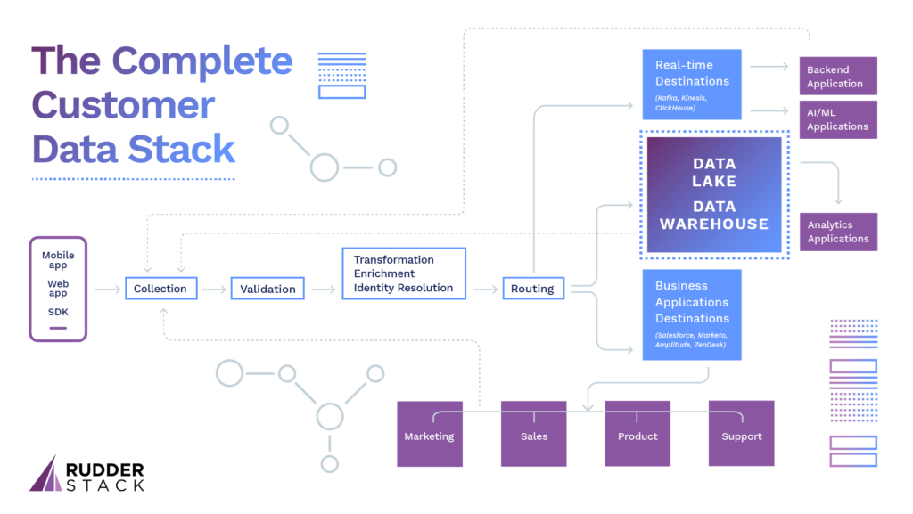
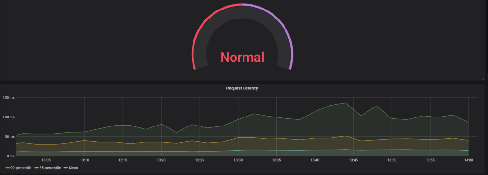
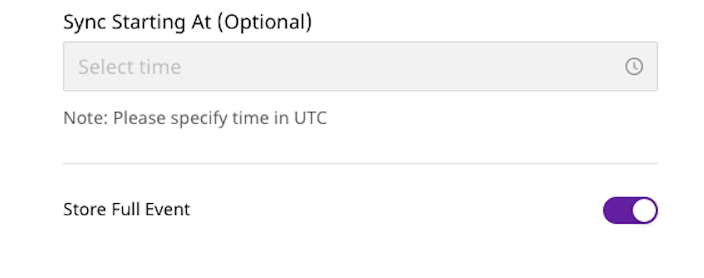
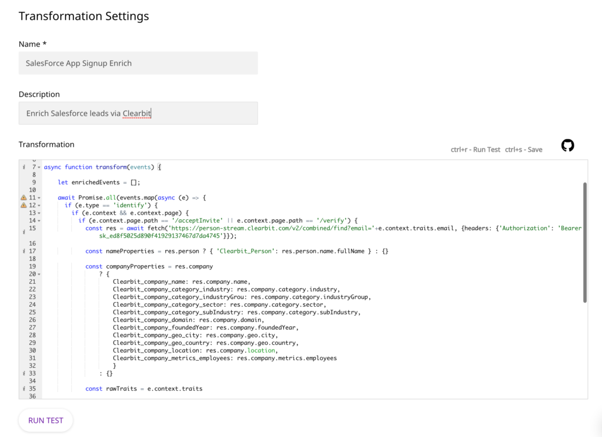
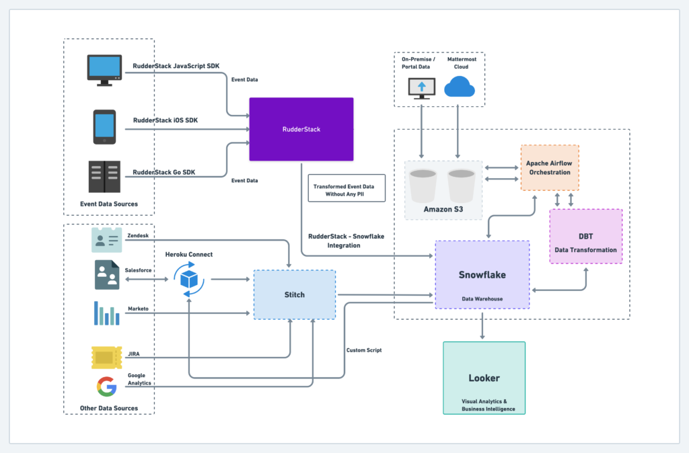

There’s never been a better time to be a data engineer, in large part due to the rapid innovation and rising popularity of modern warehouses and data processing tools. When working with customer data, though, collecting all of your relevant information in one place and making it usable around the organization is a non-trivial challenge.

Customer Data Platforms (CDPs) have tried to solve for data collection and activation, but unfortunately most of them make the problem worse by creating additional data silos and integration gaps. Data engineers often find themselves stuck in the middle, only partially leveraging the power of tools like Snowflake and DBT because other components of the stack don’t integrate with their larger data workflow. 

It’s time for a new approach in the way companies architect their customer data stacks and how CDPs fit into the toolset, and that’s exactly what we’re building at RudderStack. By putting developers, their preferred tools and modern architectures front and center, we’re helping data engineers and their companies discover powerful new opportunities in the way they connect these critical systems and put them to work across the organization. 

Today, we’re excited to announce RudderStack Cloud the most efficient, affordable and sophisticated customer data product for developers. 

RudderStack Cloud: A New Approach to Your Customer Data Stack
-------------------------------------------------------------

RudderStack Cloud makes it easy for data engineers to collect, validate, transform and route customer data to their warehouse, real-time streaming services, and the cloud applications used by teams across the company. 

### Modern Cloud

From the time we opened our first repo, we’ve built our product on Kubernetes for the cloud-native world, focused on extreme scale and fault tolerance. 

With RudderStack Cloud, we’ve created the best of both worlds for developers. Open source foundations, privacy-first architecture and developer-focused tooling make it easy to integrate the product into your existing stack, while maintaining the ease of use that comes with cloud SaaS. 

Running on the modern cloud and not storing data allows us to be much more cost efficient, as reflected in our new pricing model (more at the end of the post).

### Data Warehouse Centric

Scalability and functionality limited warehouses in the past, meaning valuable information like customer cohorts were trapped in 3rd-party tools. 

The warehouse is the CDP of the future, as evidenced by [Tapad’s new integration](https://www.snowflake.com/datasets/tapad-the-tapad-graph/) with Snowflake, which allows you to integrate warehouse data with rich, 3rd party data sources directly. 

In the new approach, RudderStack Cloud allows you to turn your warehouse into a CDP with features like configurable, near-real time sync, and SQL as a Source, which turns your warehouse into a RudderStack Source.

We’ve also built RudderStack Cloud to leverage the more advanced functionalities of modern data warehouses.

To that end, **we’re excited to announce support for semi-structured data via VARIANT type in Snowflake as part of RudderStack Cloud.** Many data engineers send JSON objects via RudderStack as VARIANT in Snowflake to make querying much easier (you can access the entire object as opposed to querying multiple tables). Learn more in the warehouse section below.

### Developer First

We believe that the customer data stack should be owned by the engineering team, which is why our product is always developer-first and integrates with the tools they already use and love. 

Our Schema Monitoring feature is exposed through a REST API, making it easy to integrate with existing data governance workflows. We [expose metrics](https://docs.rudderstack.com/administrators-guide/monitoring-and-metrics) that can be easily consumed by any statsd server and use Grafana to visualize infrastructure health. 

Most importantly, we remain committed to the OSS community and our [OSS product](https://github.com/rudderlabs/rudder-server), with core developers providing daily community support [on Discord](https://discordapp.com/invite/xNEdEGw).

Features in Rudderstack Cloud
-----------------------------

**Sources & Destinations** — RudderStack Cloud has [11 SDKs](https://docs.rudderstack.com/rudderstack-sdk-integration-guides) for collecting web, mobile and server-side event data. This release also includes sendBeacon support for our JavaScript SDK, which can improve speed by up to 30% (a huge win for speed-sensitive eCommerce use-cases). 

You can also ingest data from [cloud application sources](https://docs.rudderstack.com/sources) (like Customer.io) and BI tools (like Looker). You can route ingested data to more than [60 destinations](https://docs.rudderstack.com/destinations), including real-time/streaming destinations like Apache Kafka and Amazon Kinesis, warehouses like Google BigQuery and Snowflake and ML tools like AWS Personalize (not to mention cloud tools like Amplitude, ZenDesk and AppsFlyer). 

**Speed & Scale** — RudderStack Cloud can maintain latency of less than 10 minutes in delivering customer event data to cloud warehouses, with further optimization available via device mode in our SDKs. The platform is [architected](https://docs.rudderstack.com/get-started/rudderstack-architecture) to manage peaks in volume, managing thousands of events per second without the need for any configuration or infrastructure management. 

**HA / Fault Tolerance** — RudderStack Cloud comes with at least 99.99% uptime while a [sophisticated error handling and retry system](https://docs.rudderstack.com/administrators-guide/high-availability) ensures that your data will be delivered even in the event of network partitions or destinations downtime.

**Debugging & Monitoring** — RudderStack Cloud introduces a number of features to help you debug issues with your event data. [Live debuggers](https://docs.rudderstack.com/how-to-guides/live-destination-event-debugger) for both sources and destinations allow you to view and debug your data in real time. Data Replay allows you to re-run historic data into any destination while [detailed logs and metrics](https://docs.rudderstack.com/administrators-guide/monitoring-and-metrics) help you quickly understand the health of your data infrastructure. 

**Segment API Compatible** — RudderStack Cloud is [fully compatible](https://docs.rudderstack.com/how-to-guides/rudderstack-migration-guide) with the Segment API. If you have used Segment to track events in your website or product, you can migrate to RudderStack Cloud by simply updating the configuration of your SDKs. 

**Data Warehouse** — RudderStack Cloud treats your Data Warehouse as a first class citizen among destinations, with advanced features and configurable, near real-time sync. [We currently support](https://docs.rudderstack.com/data-warehouse-integrations) Google BigQuery, Amazon Redshift, Snowflake and ClickHouse as warehouse destinations with more to come soon. 

As part of our advanced integration with Snowflake, we support [VARIANT data types](https://docs.snowflake.com/en/sql-reference/data-types-semistructured.html). Simply toggle on the “Store Full Event” setting in your RudderStack Cloud destination configuration and we will send the entire object for storage as the VARIANT data type in Snowflake.

**Transformations (JavaScript and DBT)** — RudderStack Cloud introduces support of [in-transit transformations](https://docs.rudderstack.com/how-to-guides/adding-a-new-user-transformation-in-rudderstack) written in JavaScript, configured per-destination in our platform. We also support at-rest transformations using DBT. Powerful and configurable [RudderStack models](https://hub.getdbt.com/) built on DBT can be deployed on your data warehouse to perform tasks like identity stitching and sessionization, turning your warehouse into a featured customer data platform.

**Data Governance & Change Management** — RudderStack Cloud introduces [SSO](https://docs.rudderstack.com/administrators-guide/rudderstack-single-sign-on-sso) and User Management for both security and control. With administrative and view-only access, you can limit who sees and interacts with your data infrastructure.RudderStack Cloud also features a sophisticated [Schema Tracking API](https://docs.rudderstack.com/rudderstack-enterprise/rudderstack-events-schema-api) that you can leverage to QA and monitor the schema evolution of your event data.

**Open Source** — RudderStack remains committed to the open source community by keeping the [RudderStack Open Source](https://github.com/rudderlabs/rudder-server) version up to date with RudderStack Cloud.

Customer Case Study: Mattermost
-------------------------------

Data engineering teams at top companies have implemented RudderStack Cloud to handle their high-scale data infrastructure needs. 

Mattermost is an open-source messaging and collaboration platform built for high-trust environments. They handle massive volumes of data generated by their enterprise customers and have built their infrastructure on modern tooling, including Snowflake, DBT and RudderStack Cloud. 

Previously, Alex and his team dealt with the challenge of having a copy of their customer data in a 3rd-party platform. Not only did they have security concerns, but MTU-based pricing and marked-up storage costs meant they could only afford to collect a small percentage of their user event data. 

> With RudderStack Cloud, we’ve removed restrictions on event volume and can send all of the data we want to Snowflake.  We can analyze and act on all of that important customer data and ultimately become a more data-driven business.  
>   
> —Alex Dovenmuehle, Head of Data Engineering, Mattermost

In the process of migrating to Snowflake, which decouples storage and compute, they re-evaluated their customer data infrastructure and wanted to take a similar approach: decoupling the data pipeline from storage and removing the 3rd party platform from the equation. 

RudderStack Cloud enabled Alex and the data engineering team to achieve ubiquitous data capture across devices and fully leverage Snowflake as their owned, central repository of customer data. 

Read the full case study [here](https://rudderstack.com/blog/mattermosts-data-stack-explained-how-they-leverage-unlimited-data-for-customer-analytics/).

Getting Started With RudderStack Cloud
--------------------------------------

We’ve launched all new pricing. RudderStack Cloud starts at $750/month for 25 million events and includes all of our key features. As you scale into billions of monthly events, you can transition seamlessly into our enterprise edition. 

Interested in RudderStack cloud? [Sign up for a free 14-day trial](https://app.rudderlabs.com/signup?type=freetrial) or get in touch with our team.
