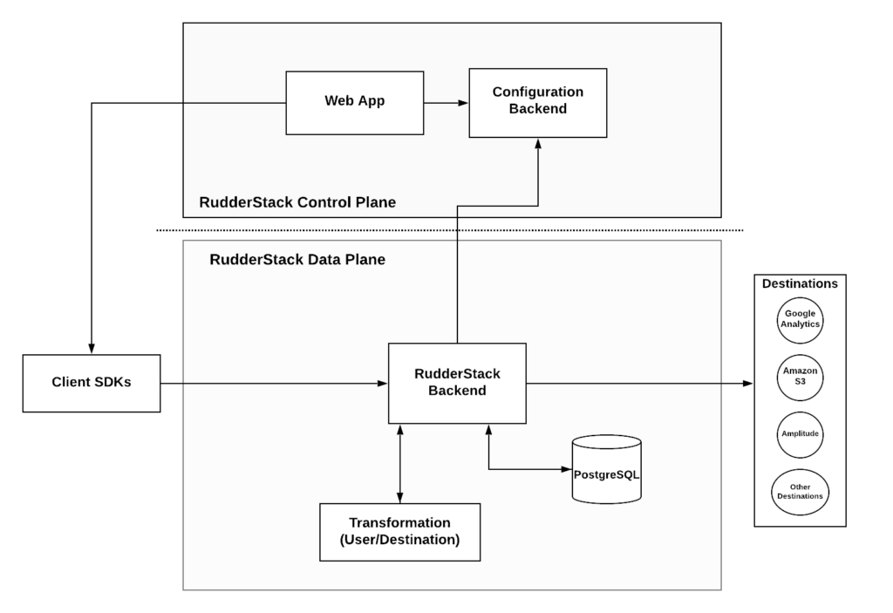

[RudderStack](/) is an open-source platform for collecting and routing your customer event data (commonly known as [customer data infrastructure](https://rudderstack.com/blog/building-a-customer-data-platform-on-your-data-warehouse/) or CDI platform). RudderStack is enterprise-ready, with a special focus on data privacy and security. This blog talks more about RudderStack and RudderStack Transformations that allow you to customize your customer data platforms.  

We started building RudderStack because, as data engineers ourselves, we found that existing CDI solutions lack crucial attributes that today’s data-driven enterprises need. Most solutions have a trade-off between flexibility and complexity. On the complete opposite side of the spectrum, extensibility and functionality are sacrificed on the altar of usability for cloud SaaS products.  

At RudderStack, we are building a data platform that can offer the environment a data engineer needs. We aim to provide a platform that addresses the unique challenges of everyday business, together with operational peace of mind. We want RudderStack to:  

*   Be **extensible** and **customizable**. A data engineer should be able to deal with various issues and requirements
*   Be easy to **deploy**, **manage**, and **monitor**

Towards the above goals, we have implemented and delivered as part of the core platform, _RudderStack Transformations_. It is a mechanism where a data engineer can define and deploy custom logic which gets executed on the stream of events that flow inside RudderStack.  

The Architecture
----------------

At RudderStack, we believe that being able to manipulate the event data is an integral part of any data platform, and we wanted to treat this functionality as a first-class citizen of our product. We have architectured this platform to reflect this very belief.

The above diagram shows a high-level architecture of RudderStack. The underlying mechanism on the BackEnd or Data Plane is responsible for implementing the integrations with the destinations. Also, this same mechanism is responsible for user transformations.   

By implementing a single mechanism responsible for both executing user transformations and integrations with destinations, we manage to:

*   Simplify the architecture
*   Simplify implementing and debugging custom logic
*   Make it easier to reason around performance as there aren’t many moving parts that can add overhead

If you wish to learn more about the implementation details, please visit our [Github repository](https://github.com/rudderlabs/rudder-server) or join our [Discord channel](https://discordapp.com/invite/xNEdEGw), where our engineering team is available.  

Deploying RudderStack Transformations
-------------------------------------

Deploying _RudderStack Transformations_ is an easy process, and it happens from within the RudderStack Control Plane or UI. You can write transformations in JavaScript. The environment allows you to test and debug these transformations by executing the transformation on sample events. You can see the whole process in the following visual example.

What you can do with RudderStack Transformations
------------------------------------------------

_RudderStack Transformations_ is the way to add custom logic to your Customer Data Platform. To this end, we added support for a rich language like Javascript. This means that you can implement complex scripts that can be applied to an individual event or on batches. The following sections discuss some of the use cases RudderStack users have implemented so far.  

### Working with PII Data

Developers often embed PII data in events either accidentally (e.g., developer error) or on purpose. However, there are often strong reasons to avoid sending PII to the downstream cloud or on-prem destinations. Even for internal destinations like data-warehouse, storing PII can lead to security challenges.  At the same time, it is crucial to be able to address any possible edge case in terms of how the data appears and how it is stored. With _RudderStack Transformations,_ it is possible to implement complex PII scanners and masks. You can also create a notification system that can act on the event level and notify you when it detects something.  

### Event Sampling and Aggregation

Having access to all your events is useful, but not all applications need to have access to this level of data granularity. However, you can sample your data when delivering to certain applications such as analytics tools. This functionality is even more useful when these data receiving services charge you based on volume. Similarly, you might prefer to pre-aggregate your data before you deliver them into a visualization tool and simplify their interaction with the data.  

### Hunting Down the _Nulls_

Errors in your data are inevitable- event schemas might change, developers introduce errors, or sometimes fields need decommissioning. Being able to detect data anomalies and react on them closely from the backend can save a lot of the time of a data engineer who’s trying to debug a broken data pipeline. With _RudderStack Transformations, you can detect common_ errors such as _null_ values and correct early on the data pipeline.   

### Schema Transformations

Many times, you want to transform data into different representations. In one system, you might have only one field for the name and the surname. In another, you would like to have two separate fields. You may also want to extract and break down UTM parameters from a URL. Being able to transform the schema of the events is very important in maintaining a realistic data infrastructure for any company, and _RudderStack Transformations_ provide all the functionality needed to do that.  

The above are just some everyday use cases that we have encountered so far, and they demonstrate the versatility of _RudderStack Transformations_. You can find templates for these cases on our [Github Repository for _RudderStack Transformations_](https://github.com/rudderlabs/sample-user-transformers).  

We Want You to Contribute
-------------------------

As we said in the opening of this post, our goal at RudderStack is to build the next-generation data platform that can address all the challenges data engineers face today. Our core assumption is that, in such a complex and open problem, one can provide a robust solution only by having a strong community of people who shares the same problems and vision.  

Hence, instead of delivering every possible function as a new feature, we provide the infrastructure that you can deploy and run functions to transform your data.   

On this [Github Repository for _RudderStack_ transformations](https://github.com/rudderlabs/sample-user-transformers), you can find various templates. These are community provided templates for common use cases like the ones we mentioned earlier in this post. We encourage you to participate, create issues, make pull requests, and share the knowledge.