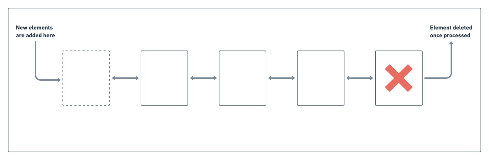
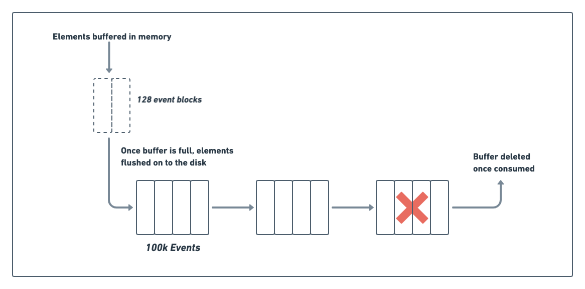
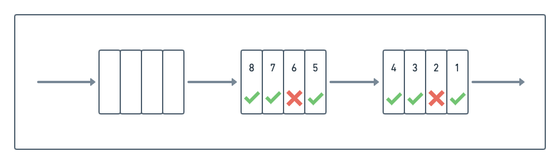
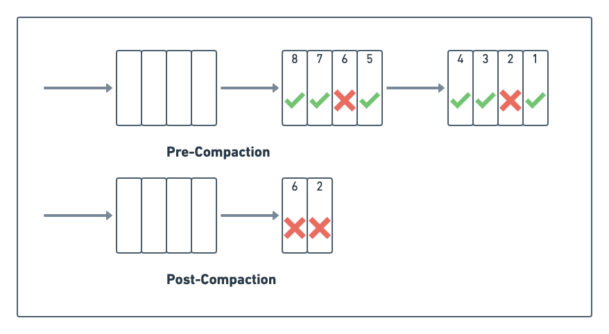
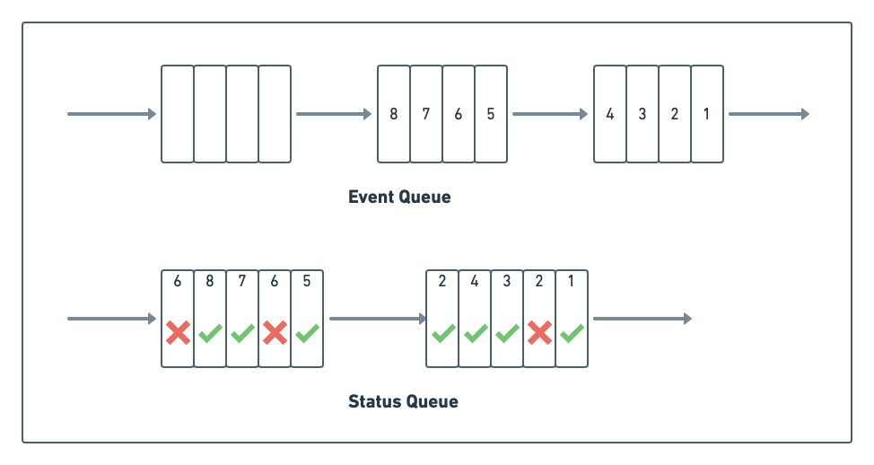

**Overview**
------------

In our [previous post](https://rudderstack.com/blog/why-rudderstack-used-postgres-over-apache-kafka-for-streaming-engine/), we discussed why Apache Kafka wasn’t the right solution for RudderStack’s core  streaming/queueing engine. Instead, we built our own streaming engine on top of PostgreSQL. This article discusses the internals of our implementation using the queueing system in more detail.

**Queueing Systems**: An Introduction
-------------------------------------

The core concept behind any queueing system is trivial. A CS101 implementation involves a linked list of items. A queueing system adds elements (or, in our case, events) to one end while consuming them from the other, as shown in the figure below. Once the system consumes an event, one can remove it from the list.

For using a queueing system in practice, though, especially in a complex system like RudderStack, it must address several challenges. 

**Challenge 1: Persistence in Queueing System**
-----------------------------------------------

Firstly, the system needs to persist the queue on disk for resiliency and to handle system failures. Unfortunately, the minimum storage unit in a disk-based system is a block anywhere from 4 KBs to 64 KBs. 

Furthermore, it is often desirable for performance reasons to read & write in units of multiple blocks, often as large as a few MBs.  It is not practical to store individual events in the disk as shown in basic CS101 implementation in the previous section.

You can address this problem by batching events in the memory and flushing the whole batch to the disk, as shown below. In our case, we batch in units of ~128 events. We found the ideal batch size to provide a good balance between I/O time and the client **acknowledgment (ACK)** latency through testing. We don’t send an ACK to the client unless the event persists to disk. Furthermore, we can’t have the clients hanging too long for an ACK.

On the consumer side, we can process much bigger batches to avoid the overhead of doing small I/O. For this case, we create on-disk segments of 100K events, which the system processes together. Once the system processes a segment of batches, one can delete it (see the diagram below), in most cases:

**Challenge 2: Processing Order** of Queues
-------------------------------------------

In the CS101 example, events are consumed in order, from the top of the queue, which makes deleting them trivial. In practice, though, events may have to be processed out of order. 

For example, if we fail to deliver an event, we mark it as **failed** and block further events from the user. In the meantime, the other unrelated events present in the queue after this failed event can be processed. This process could lead to a scenario (shown in the following diagram) where some events have been processed (marked with a green tick) while others (marked with a red cross) are waiting to be processed:

This dynamic of inconsistent event delivery makes reclaiming space complicated. While we could wait for all the events in a block to be processed before deleting it, this is not ideal. A single unprocessed event can prevent the entire block from being reclaimed, leading to space overage. 

### Processing Order – Compaction

We address this problem by running what we call **compaction**, where the system compacts multiple, partially processed blocks into one block. 

During the compaction process, the system removes already-processed events, while it retains the unprocessed events. As you can see in the diagram below, the process has compacted the two leading processed blocks into a single block:

You can run the compaction algorithm periodically or by triggering. For example, once there are enough **uncompacted** blocks or both, as in our case – we run compaction every 30 minutes. However, we do this only if there are at least two blocks with at least 80 percent processed jobs. This logic ensures that we can reclaim enough space during compaction. At the same time, it also ensures we don’t run it too often (as compaction slows down the system).

In a normal steady-state, all jobs succeed, and the compaction job handles blocks that don’t have any pending jobs, while the main processing jobs handle unprocessed blocks. As a result, there is little to no contention between the compaction job and the main processing job.

**Challenge 3: In-place Status Update** with Status Queue
---------------------------------------------------------

In the above diagram, we showed events marked as successful or failed in place as the system processes them. Unfortunately, updating blocks in place is inefficient because of the underlying disk fundamentals. 

It would require us to read the block from the disk (incurring a random I/O), update in memory, and sync it back (incurring another random I/O). The two random I/Os incurred in this process can take anywhere from a few milliseconds to hundreds of milliseconds. These I/Os would be a bottleneck in our high throughput event processing pipeline.

We address this problem by not updating in-place and keeping the event status in a separate queue instead. As the system processes events, it appends the success/failure status and other event metadata (like event ID, failure reason, etc.) to a separate queue. 

It’s important to note that the system may process an event multiple times. For example, if the event fails the first time, the system will retry it, resulting in two separate entries in the status queue.

Marking a status incurs sequential I/O into the status queue, which can be orders of magnitude faster than a random I/O for an in-place update. However, this approach’s downside is that we need to access two separate blocks to get the job status and identify the next job that the system needs to process.

In practice, though, the system would process current blocks (the status block and the event block) as well as cache them in memory, so these operations don’t require disk I/O.

**Conclusion**
--------------

In this post, we discussed the three main design principles behind our queue implementation using PostgreSQL. Each block in the diagram shown above is stored as a separate table in PostgreSQL. The tables/blocks are numbered as `<queue_name>_job_1`, `<queue_name>_job_2`, etc., where `queue_name` is a unique identifier for a queue. We have multiple queues inside of RudderStack.

The statuses are stored in separate tables `<queue_name>_job_status_1`, `<queue_name>_job_status_2`, etc. Once a particular table or a sequence of tables has been processed, they are compacted into a single block (or no block if all jobs are successful). This compaction runs in a separate thread. 

The queries to find unprocessed jobs in the main thread also find processed jobs during compaction, and they are all implemented in SQL. The SQL interface has also been a great debugging tool for inspecting and updating the jobs. For example, we sometimes have to force retry jobs which have aborted, or vice-versa, which can be easily done in SQL.

Implementing these concepts is certainly interesting, but we will let you dig into the actual code yourself in our [GitHub repository](https://github.com/rudderlabs/rudder-server/tree/master/jobsdb).