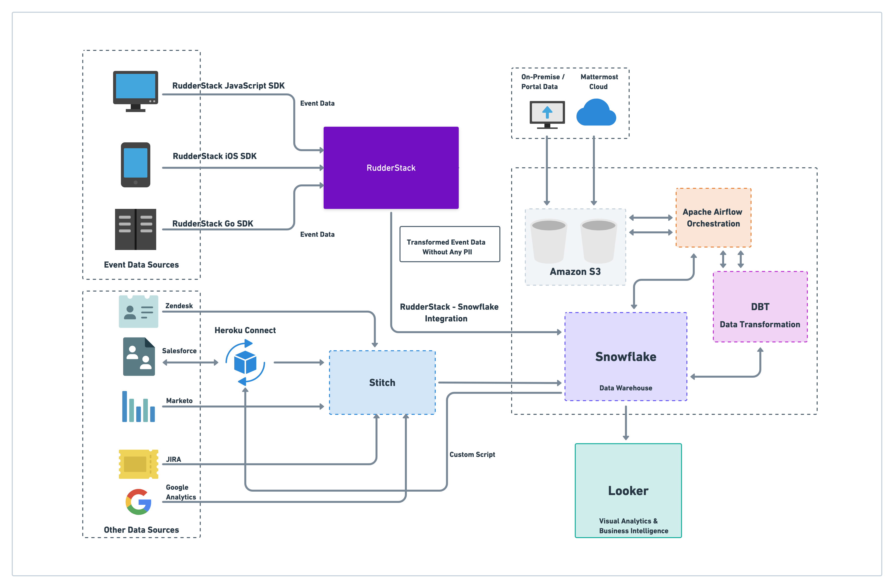

**Overview**
------------

This post looks at **Mattermost**’s customer data stack, which allows them to seamlessly leverage unlimited, real-time data across multiple sources to drive various analytics use-cases. We also look at how this data stack aligns with their open-source values and complies with their strict data privacy and security requirements.

**Who is Mattermost?**
----------------------

**Mattermost** is an open-source messaging and collaboration platform that is a popular alternative to enterprise business communication tools like **Slack**. It is built for high-trust environments, and the deployment is fully self-hosted and brings together all enterprise-wide communications into one place. 

As you’d expect from an open-source tool, they offer hundreds of third-party integrations and connect to popular DevOps and developer workflow tools.

**How Mattermost Use Real-time Customer Data**
----------------------------------------------

Mattermost is a highly data-driven company. According to **Alex Dovenmuehle**, Head of Data Engineering at Mattermost, one of the key use-cases of tracking and collecting real-time event data is to perform effective customer journey mapping. 

Real-time events, Alex says, allow teams at Mattermost to understand better how the customers navigate through the product and use it in general. These insights are then used to segment their audiences and build user cohorts. They also run A/B tests on various product-related features and measure their overall impact on the conversion and customer retention rates.

For their internal use-cases, the Mattermost teams make extensive use of data models, visual dashboards, and reports to track various aspects of their performance and overall business health. This includes financial forecasting, tracking their KPIs, and key product usage metrics.

**Mattermost’s Data Stack**: An Overview
----------------------------------------

*   Cloud – **AWS**
*   Data Collection and Synchronization – **[RudderStack](http://www.rudderstack.com) SDKs, Stitch Data, Heroku Connect, Custom Scripts**
*   Warehouse : **Snowflake**
*   Data Transformation and Enrichment : **RudderStack Transformations, DBT**
*   BI and Data Querying Toolset : **Looker**
*   Job Orchestration : **Apache Airflow**

**How Data Flows Through Mattermost’s Data Stack**
--------------------------------------------------

Here’s how the data flows through Mattermost’s customer data stack:  

*   Mattermost leverages **RudderStack**’s [web](https://docs.rudderstack.com/rudderstack-sdk-integration-guides/rudderstack-javascript-sdk), [mobile](https://docs.rudderstack.com/rudderstack-sdk-integration-guides/rudderstack-ios-sdk), and [server](https://docs.rudderstack.com/rudderstack-sdk-integration-guides/rudderstack-go-sdk) SDKs to collect user events in real-time and route them to their data storage infrastructure. For routing, they utilize the RudderStack’s integration for **Snowflake**, their data warehouse.
*   Once all the data is dumped into the warehouse, they use **Apache Airflow** for job orchestration and scheduling. For data enrichment and transformation, they leverage **DBT** to convert all raw data across various sources into an aggregated data stream.
*   For business analytics and BI use-cases, Mattermost uses **Looker** to build visual dashboards and reports on top of the DBT data models.

Here’s a visualization of Mattermost’s data stack: 

**Data Collection and Storage**
-------------------------------

A large chunk of data collected by Mattermost comes in user events, which drive most of their analytics and other downstream use-cases. To collect these events in real-time from their web and mobile apps, they use RudderStack’s [JavaScript](https://docs.rudderstack.com/rudderstack-sdk-integration-guides/rudderstack-javascript-sdk) and [iOS](https://docs.rudderstack.com/rudderstack-sdk-integration-guides/rudderstack-ios-sdk) SDKs, respectively. For the server-side events, they use the [Go](https://docs.rudderstack.com/rudderstack-sdk-integration-guides/rudderstack-go-sdk) SDK.

Alex noted that with RudderStack, Mattermost overcame event volume limitations—a problem they faced with their previous vendor. Because of the vendor’s pricing model, they could capture only 2% of their user event data, which meant missing out on valuable customer insights. With RudderStack, Mattermost collects 100% of their event data, giving them rich insights into their customer journeys. 

Like their high-trust customers, Mattermost is very data privacy and security-focused. Hence, all the events that are tracked by RudderStack are stripped off any **PII** (**Personally Identifiable Information**) before being sent to the data warehouse. They’ve simplified this cleansing process through RudderStack’s Transformation feature, which allows them to strip sensitive information (name, email, etc.) on the event stream in-transit.

> Learn how RudderStack Transformations can be used to [protect the PII](https://rudderstack.com/blog/protect-personally-identifiable-information-pii-using-rudderstack/) in your event data.

### **Other Data Sources**

Apart from customer event data, Mattermost also collects data from various other sources related to marketing messages (**Marketo**), website metrics (**Google Analytics**), customer support activity (**Zendesk**), and various project management components (**JIRA**) for their internal use-cases. The data coming from their on-premise and cloud solutions goes into **Amazon S3**, and then into the data warehouse.

For storing and processing their Salesforce data, Mattermost uses **Heroku Connect** – a popular data integration and synchronization service. Mattermost sends all the sales data to their data warehouse through Heroku Connect, and syncs the processed and enriched data back to Salesforce through custom scripts. This way, their sales teams always have the most up to date insights on customers and users.

Mattermost uses **Stitch**, a popular ETL solution, to collect the data from all these cloud sources, then dump it into their data warehouse.

**Data Warehousing, Orchestration and Enrichment**
--------------------------------------------------

For handling multiple high-volume data workloads, Mattermost uses **Snowflake** as their data warehouse. Snowflake allows them to decouple the storage from compute usage in their pricing structure instead of other alternatives like **Redshift**, which bundles the two together. Alex noted that the flexibility of scaling compute usage according to the needs of various teams is key for managing their stack and infrastructure costs.

For job scheduling and orchestrating, Mattermost uses **Apache Airflow’s** capabilities for dynamically instantiating pipelines. Alex also appreciates Airflow’s integrations, timely alerting, logging, and monitoring mechanisms. 

Finally, Mattermost uses **DBT** (Data Build Tool) to transform and enrich the data in Snowflake. Alex and the team leverage DBT to define data sources and test the results of their transformations. They also use DBT’s modular SQL queries, which they can update and execute quickly and easily.

**Activating the Data for Cutting-Edge Analytics**
--------------------------------------------------

When it comes to leveraging data models for business intelligence and visualization, Mattermost uses **Looker** on top of the DBT models. This approach of decoupling data modeling from data visualization allows them to hide any complexities within the data model. It also makes the data easily accessible to the users for quick exploration, dashboarding, and reporting.

Also, since the DBT data models contain aggregated data, the Looker views are comprehensive, enriched, and accurate. This allows their team to make the little connections between the data, which usually go unnoticed, which is often where they find the most powerful insights. 

Along with the ability to import or export visualizations outside Looker’s dashboard, teams within Mattermost can also use custom webhooks to build third-party visual workflows, eliminating the need to use any other external applications.

**In Conclusion**
-----------------

According to Alex, the main drive behind building Mattermost’s data stack was to architect an infrastructure that could bring together all their data in one place, complemented by the tools that allow their users to operate on the data without getting into unnecessary technical complexities. 

Today, Alex has helped Mattermost set up a robust customer data stack that allows them to get an end-to-end view of their customer journeys. They can also translate this view into useful insights to build a product that improves the user experience and, in turn, boosts their business.

## Try RudderStack Today

Start building a smarter customer data pipeline. Use all your customer data. Answer more difficult questions. Send insights to your whole customer data stack. Sign up for [RudderStack Cloud Free](https://app.rudderlabs.com/signup?type=freetrial) today.

Join our [Slack](https://resources.rudderstack.com/join-rudderstack-slack) to chat with our team, check out our open source repos on [GitHub](https://github.com/rudderlabs), subscribe to [our blog](https://rudderstack.com/blog/), and follow us on social: [Twitter](https://twitter.com/RudderStack), [LinkedIn](https://www.linkedin.com/company/rudderlabs/), [dev.to](https://dev.to/rudderstack), [Medium](https://rudderstack.medium.com/), [YouTube](https://www.youtube.com/channel/UCgV-B77bV_-LOmKYHw8jvBw). Don’t miss out on any updates. [Subscribe](https://rudderstack.com/blog/) to our blogs today!