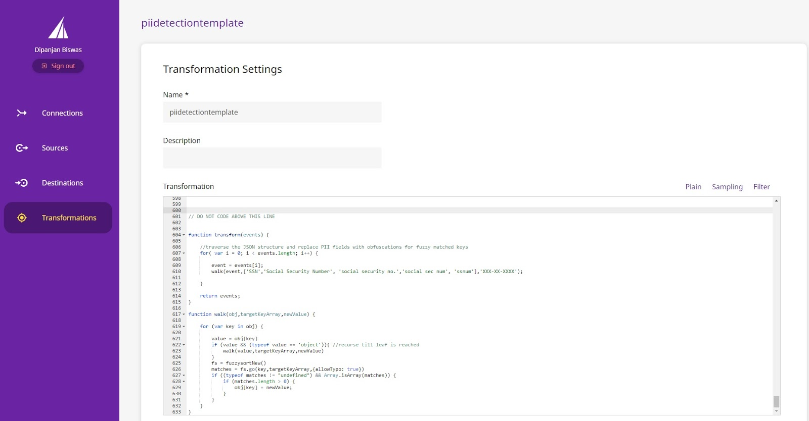
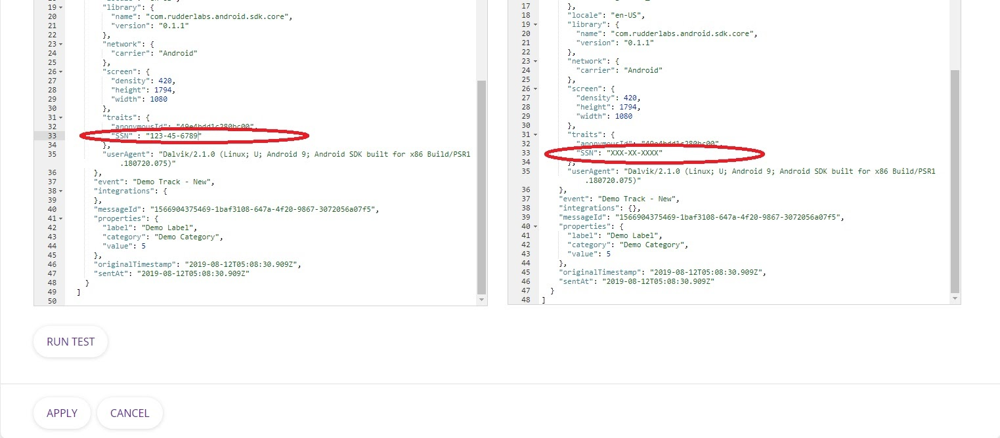
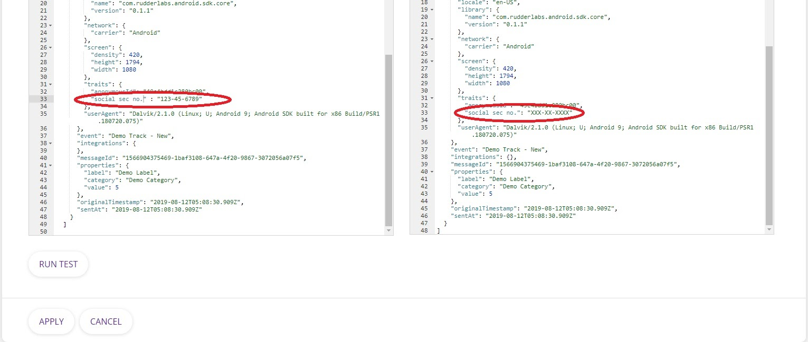

Introduction
------------

**Personally Identifiable Information (PII)** is the information that may be used to identify and track an individual. GDPR mandates software companies to encrypt any PII and ensure that they protect the users’ identity from any misuse. As a result, In a post-[GDPR](https://gdpr-info.eu/) world, all organizations need to detect and mask/obfuscate/delete PII data flowing through their information systems. Refer to this [article](https://www.csoonline.com/article/3215864/how-to-protect-personally-identifiable-information-pii-under-gdpr.html) for more information on PII and how to protect it. 

One typical reason for PII data leak is human error. Developers add various user-centric attributes as part of the “traits” structure in a message. Due to this, one might inadvertently include a PII event that gets forwarded to the destination. This could be almost a disaster from the data privacy perspective.

At [RudderStack](https://rudderstack.com/), we simplify the process of performing PII checks and incorporating corrective actions on the streaming data. Hence, we have provided template PII Detection and Masking code on [GitHub](https://github.com/rudderlabs/sample-user-transformers). Developers/administrators can introduce this code as a user transformation in their RudderStack installation via the Config Plane. This transformation will protect human PII data leak oversights from resulting in serious non-compliances.

You can mask/obfuscate PII within RudderStack, as a result, you eliminate:

*   The need to encrypt such data for GDPR compliance
*   Risks associated with a potential data breach
*   The need to search through and delete data in the event of withdrawal of consent

Implementation
--------------

First of all, copy the code from GitHub into the `Transformation` window under `Transformation Settings` for a user transformation:  

The code in question leverages the [fuzzysort](https://github.com/farzher/fuzzysort) implementation. The following code block demonstrates the implementation:
`gist:Veenap/7bca65b131e525353f30bdee8e1d6b08`

### PII Substitution Logic

The `transform` method is the entry-point for any user transformation. It takes an array of `event` objects as an argument and returns an array of transformed `event` objects.

So, in the sample above, we iterate through each event in the array and invoke the `walk` method. The `walk` method takes three arguments:

*   The object itself which has to be traversed
*   List of keywords (i.e., field names) for which fuzzy matching is to be performed
*   The substitution value

You can include all variations of all target field names in a single list and pass that as an argument. Furthermore, the values of all fields such as SSN/Social Security Number/Credit Card Number/First Name/Last Name would get replaced with a single masked value, XXX-XX-XXXX. In contrast, the requirement might be to have different substitution values for different fields. In that case, you can call `walk` multiple times with different lists to match. The `walk` method recurses through the object hierarchy. So, as part of the recursion, the actual substitution takes place only at the `leaf` nodes. A leaf is a primitive data type node.

You can choose to use different variations of methods available in the library and described in fuzzysort. The sample implementation uses the `go` method and specifies `allowTypo` as `true`. So, the code would consider that a word with a single transposed letter as a valid match. As a result, whenever the code finds a match, it replaces the value of the matched key with the substitution specified.

### Sample PII Detection and Masking Transformation in Action

The following screenshots show the transformation in action. The first screenshot shows an exact match with one of the keywords specified. Furthermore, the second screenshot shows a fuzzy match where the field name does not exactly match any of the keywords supplied.  

Conclusion
----------

Template PII Detection and Masking code is a handy tool to integrate PII detection and masking into your RudderStack installation. Because of this, we have made it available as a part of our open-source sample transformations collection. You can choose to vary the degree of complexity/flexibility you want in your detection and masking code and modify the walk event accordingly.

To explore RudderStack and offerings for your business with RudderStack, [request a demo](https://rudderstack.com/request-a-demo/).