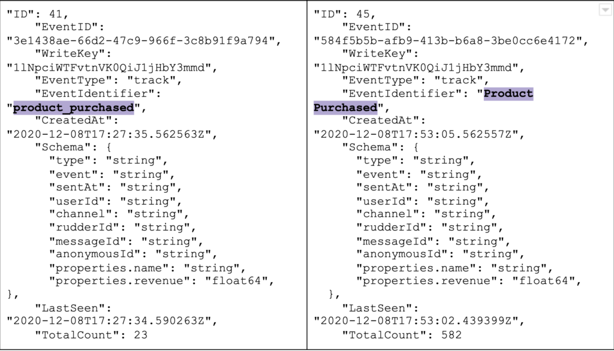
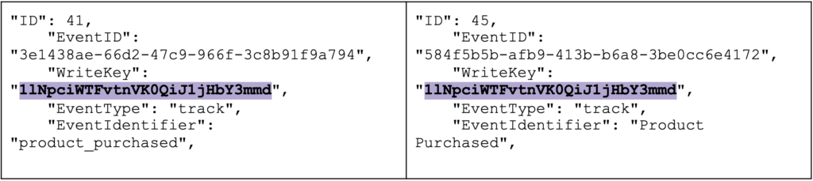
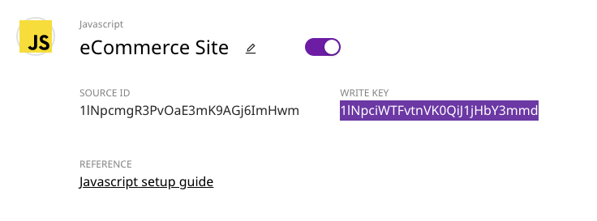
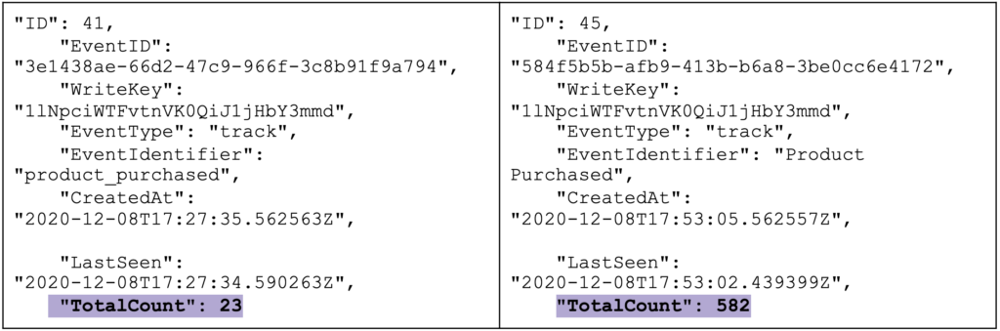
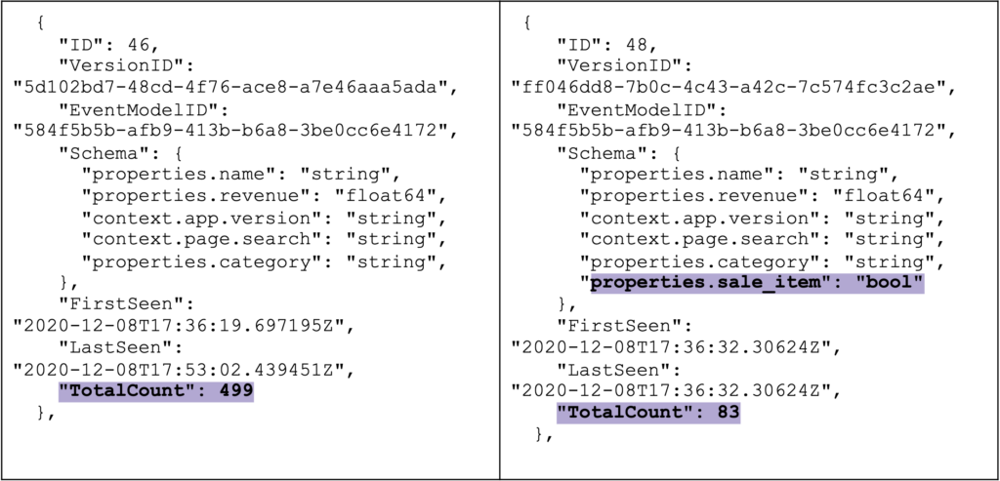

---

title: "RudderStack’s Data Governance API"

date: 2020-12-10T00:00:00+05:30

featureImg: ../assets/markdown/datagovernanceapi.blog.rs.png

category: 

author: Eric Dodds

authorPic: ../assets/author/Eric-Dodds.png

authorPosition: 

authorDescription: "Eric leads our Customer Success team and has a long history of helping companies architect customer data stacks and use their data to grow."

slug: "rudderstacks-data-governance-api"

---

You can generate hundreds of event types across your websites and apps to understand better how customers interact with your product and what drives activation. You capture these events in a specific format. This format generally includes the event name, the corresponding properties/traits, and the event’s metadata. Your product and marketing teams use these events. After this, rely on the consistency of their formats to effectively analyze customer behavior or drive campaigns, personalization, etc. 

In this post, we detail RudderStack’s Data Governance API. Further, we explain how it helps to troubleshoot the challenges that you can face with customer events. We also look at how to leverage the Data Governance API in a step-by-step process of investigating data inconsistency.

## **Problems with the Spreadsheet to Instrumentation Workflow**

A typical workflow for event tracking begins with the product manager. The product manager defines the events they want instrumented in their site or application in a spreadsheet. He then sends these events to the engineering team for implementation. This is a simple process and not necessarily bad. However, spreadsheets are very prone to human error (typos, etc.). Furthermore, spreadsheets make it difficult to capture rich semantics such as units, acceptable ranges for numeric fields, capitalization for categorical fields, etc. 

When multiple product managers build the spec in a spreadsheet, and multiple engineers are using the sheet to instrument from, there is almost always some data hygiene problem. 

This problem happens mainly due to typos, inconsistencies, or even misinterpretation across teams.

The following are some of the common errors we have seen our customers deal with:

*   Missing fields
*   Capitalization errors (e.g., one event sets the product name to lowercase, while another one doesn’t)
*   Unit errors (e.g., one event tracks revenue in 100 dollar units, while other tracks in dollars)_._

These inconsistencies lower the quality of analytics and can create a backlog of cleanup work. The problem is even more difficult to manage in mobile environments where fixing events requires pushing an upgraded version of the app.

Another important precondition for successful event tracking is validating ingested events to ensure that they are not malformed or missing the required parameters. A common approach to do this is to dump all the events into a database (like Snowflake) or an S3 bucket. After this, one can manually verify a random sample in a staging environment. Some teams even take the time to write test scripts to speed this process. 

Unfortunately, only verifying a sample is not enough to capture all of the discrepancies in a production environment. Based on our customers’ feedback, we’ve built a solution that makes it easier to validate and track events consistently. 

youtube: fs3Nkzm-NqY

## **Understanding RudderStack Data Governance API**

RudderStack Data Governance API offers complete access to all your events and their metadata programmatically. This includes important information such as the event payload schema, versions of event payload, data types, etc. 

A typical event you send through RudderStack looks similar to the following example:

Let’s use a real-life example to illustrate the usage of the Data Governance API. 

Let’s say a product manager notices an inflow of inconsistent data related to product purchase events like the one above. He wants help figuring out what’s going wrong, where. By leveraging the Data Governance API, our data engineering team can investigate the problem. They can narrow down the specific nature and source of the problem. After this, they can use that information to update instrumentation or leverage RudderStack’s Transformations feature to clean the incoming events. 

Here’s an example of the process we could use to investigate the issue: 

### **Step 1: Getting all event models in the RudderStack data plane**

Event models are the distinct events that you send through RudderStack. For example, suppose you have a purchase flow that tracks **product page view**, **product added to cart**, and **product purchased** events. As a result, you would have three event models returned from the event model endpoint of the Data Governance API. 

We want to retrieve all models for our particular use case to see if there are multiple distinct product purchased events. To do this, we need to invoke _schemas/event-models_ to fetch all of the event models from our data plane. Note that this will pull event models from every source.  

Here’s a sample request to pull event models: 

In our case, the following two event models are returned in the response. 

    **_Note that we have truncated and placed the responses in the examples used throughout this post side-by-side for clarity._**

In the returned payloads, we notice that two distinct event models refer to the same event (product purchased). However, they have different **EventIdentifiers** (commonly referred to as the event name). 

Specifically, we can see that one event is named **product_purchased,** and the other event is named **Product Purchased**. This is a very likely cause of the problems the product manager is experiencing, so we need to dig deeper. 

### **Step 2: Identifying the source of various event models**

The next thing we want to check in our investigation is the source of the different product purchased events. We will use this information to determine if they are coming from different SDKs. When we look at the **WriteKey** for each event, we notice that these events are coming from the same source: 

This narrows our investigation to this particular source. Still, if these events had come from different sources, we might want to pull all event models from those sources individually to determine if there is variance by source. 

In that case, we would need the write key from each source. For example, we might want to look at all event models from the JavaScript SDK source running on our eCommerce site. 

Here’s a sample request to pull the event models from this specific source:

### **Step 3: Counting the quantity of event models to determine the amount of each event type**

Now we know that there are two event models for the product purchased event, and they both come from one source. It would be helpful to know each event’s relative quantity to determine if one is more prevalent than the other. 

In the same response payload, notice that the **/event-models** endpoint also returns the total count of events. Here, we can see the **product_purchased** model is far less prevalent than the **Product Purchased** model. This suggests that there might have been a mistake in instrumentation or QA. 

### **Step 4: Identifying differences in schema versions for a single event model**

We’ve identified the potential source of the problem at the event model level. We might want to investigate variances in the schemas of individual events. In this case, we want to see if there are inconsistencies in the payloads associated with the primary event, **Product Purchased**. 

To do this, we can use the **/_event-versions_** endpoint, which requires the **EventID** from the event model you want to investigate. 

Here’s a sample request to pull schema versions for the **Product Purchased** event, which has an **EventID** of **584f5b5b-afb9-413b-b6a8-3be0cc6e4172**. 

The response, in this case, returns two schema versions. Note that the versions are numbered and include a **VersionID**, which can be useful for additional investigation, logging, and troubleshooting. 

The first difference we notice between these events is that the more recent version of the event (**ID 48**) has an additional property called **sale_item**. Secondly, the more recent event has a much lower total count than the previous version. This suggests that someone updated instrumentation to include additional information about an item’s sale status on the product purchased event. 

Note also the **FirstSeen** and **LastSeen** values, which can be extremely helpful for triangulating the timeline and sequence, led to the change in the schema. 

At this point, we’d connect with our product managers and developers doing instrumentation to determine the source of the problems. We would likely leverage Transformations in RudderStack to update the name of the **product_purchased** event to **Product Purchased** while fixing the original instrumentation. 

### **Leveraging additional diagnostics available via the Data Governance API**

The steps above allowed us to gather incredibly valuable diagnostics about both events and versions of individual event schemas. We can leverage all of this information to find and fix issues. 

The Data Governance API, though, includes even more granular features for more complex investigations and use cases. Here’s a quick overview: 

#### **Event model metadata and event version metadata**

The event **_event-model/{EventID}/metadata_** endpoint provides additional details on the payloads associated with a distinct event model. First, the response includes event samples and a total count for the model, so that we can see samples of the payload. We also see how many times the model has come through the system. 

One of the most useful parts of the response from this endpoint, though, is the **FrequentValues** data. A master schema is a combined set of keys from all versions of the event model. For each key in the **master schema**, the API provides the value and frequency of that value expressed as a decimal value. These can be useful for investigating issues related to key-value pairs, especially in events with large payloads. 

For example, if we pull metadata information for the **Product Purchased** event, the **FrequentValue** in the response would show that the **properties.name** key is present in 100 percent of events (represented by **1**). However, the **properties.sale_item** key is present in only 14 percent of events (represented by **.14**).  

If we wanted the same metadata on a specific version of a distinct event model, we could pull it from the **/event-version/{VersionID}/metadata** endpoint. This will produce the same response, but for a single version of an event model, not all versions combined. 

#### **Key counts**

In some situations, we may want to simply pull a count of keys for an event model to understand total volume. Using the **event-model/{EventID}/keys-count** endpoint, we could retrieve counts for all keys across all versions of a distinct event model. 

For example, if we wanted to count keys for the **Product Purchased** event, the response might look like this. The response will reveal that the **properties.sale_item** key has a low volume compared to other keys: 

#### **Missing keys**

Lastly, we might find it useful to track changes in schemas when new versions of events do not include previously present keys. This could indicate that there is missing data or data corruption. The most common use case is to pull the most recent **VersionID** for a particular event model from the **event-versions** endpoint, then pass that **VersionID** to the **_event-version/{VersionID}/missing-keys_** endpoint. 

No matter which **VersionID** you use, the response will include any keys present in the **master schema** that are NOT present in the event version passed to the endpoint. As noted above, the **master schema** is a schema that combines all values from all schema versions of events. 

For example, let’s say someone instrumented a **Product Purchased** event that removed the **properties.sale_item** key. This means the most recent version of the event would not include that property. 

Our response from the **/missing-keys** endpoint would be **properties.sale_item**. This is because that key was present in previous events, and thus the **master schema**, but not present in the **VersionID** that we passed to the endpoint. 

## **Implementing Processes and Alerts for Data Governance Workflows**

Event inconsistenices could be differences in event versions, missing keys, and so on. Once you learn where and how the inconsistencies in an event occur, there are multiple ways to enact data governance: 

*   Create alerts for missing keys that should be present
*   Create Transformations in RudderStack to validate schemas, fix faulty incoming data, or transform data in payloads

One of our users ([isvictorious](https://github.com/isvictorious) on GitHub) leveraged the Data Governance API to invert the data-governance-by-spreadsheet process. Instead of relying on error-prone human input, he built (and open sourced!) a[ Google Sheet plugin](https://github.com/isvictorious/rudderstack_master) on RudderStack’s Data Governance API that populates spreadsheets with actual data from the system. He shares those sheets with product managers to validate schemas and prioritize data hygiene work. (And yes, you can[ grab a copy of the sheet](https://docs.google.com/spreadsheets/d/1g9Tkul62uc_6f2uCu-nmW3nZGj_DbvITs_RSvhJJLUk/edit?usp=sharing).)

## **What’s Next? : The Data Governance API Roadmap**

Though useful in its current state, we’ve been hard at work with customers to improve the Data Governance API. In the coming months we will provide you the ability to block events programmatically. We’re also working on a UI that will expose some of this functionality for teams that don’t want to manage the entire process programmatically. Lastly, we’ll provide a re-streaming service that will allow you to re-run blocked events. 

Start building a better, warehouse-first CDP that delivers complete, unified data to every part of your marketing and analytics stack by signing up for[ RudderStack Cloud Free](https://app.rudderlabs.com/signup?type=freetrial) today. Join our[ Slack](https://resources.rudderstack.com/join-rudderstack-slack) to chat with our team, check out our open-source repos on[ GitHub](https://github.com/rudderlabs), and follow us on our socials:[ Twitter](https://twitter.com/RudderStack),[ LinkedIn](https://www.linkedin.com/company/rudderlabs/),[ dev.to](https://dev.to/rudderstack),[ Medium](https://rudderstack.medium.com/),[ YouTube](https://www.youtube.com/channel/UCgV-B77bV_-LOmKYHw8jvBw).
