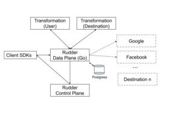

How to Setup RudderStack
------------------------

RudderStack can easily be set up in a dockerized environment. We also support Terraform for AWS EC2 while support for Azure and GCP is coming soon. Terraform setup will be covered in a separate post

### Pre-Req

Install the latest docker (v19+) and docker-compose (v1.24+)

### Steps

*   Clone [https://github.com/rudderlabs/rudder-oss](https://github.com/rudderlabs/rudder-oss)
*   Run “**docker-compose up**” to bring up all the services (described below)
*   Go to [http://localhost:3000](http://localhost:3000/) to configure sources and destinations.
*   Add a new source from the dropdown for Android/iOS source definitions. Note down the **writeKey**
*   Configure your Google Analytics destination with the right **trackingID** (can be obtained from Google Analytics)
*   We have bundled a shell script that can generate test events. Get the “writeKey” from our app dashboard and then run the following command:
    *   **“./generate-event <writeKeyHere>”**

“Generate-event” script generates a sample event and sends it to the backend container that is running in docker.    Based on our destination configuration the backend will transform the event and forward it to the configured destination.

*   Login to your Google Analytics account and verify that events are delivered in the correct order.

Overall Architecture
--------------------

The following is a  brief overview of the major components of RudderStack:

### RudderStack Control Plane

The UI to configure the sources, destinations, etc. of RudderStack Control Plane consists of:

*   **Config backend:** This is the backend service that handles the sources, destinations, and their connections. User management and access based roles are defined here.
*   **Customer web app:** This is the front end application that enables the teams to set up their customer data routing with RudderStack. These will show you high-level data on event deliveries and more stats. It also provides access to custom enterprise features.

### Rudderstack Data Plane

> Data plane is our core engine that receives the events, stores, transforms them and reliably delivers to the destinations. This engine can be customized to your business requirements by a wide variety of configuration options. Eg. You can choose to enable backing up events to any S3 bucket, the maximum size of the event for the server to reject malicious requests. Sticking to defaults will work well for most of the companies but you have the flexibility to customize the data plane.

The data plane uses Postgres as the store for events. We built our own streaming framework on top of Postgres – that’s a topic for a future blog post. Reliable delivery and order of the events are the first principles in our design.

### RudderStack Destination Transformation

> Conversion of events from RudderStack format into destination-specific format is handled by the transformation module. The transformation codes are written in Javascript.

The following blogs provide an overview of our transformation module:

<figure class="wp-block-embed-wordpress wp-block-embed is-type-wp-embed is-provider-rudder-labs">
<blockquote class="wp-embedded-content" data-secret="bViCF8bZyq"><a href="https://rudderlabs.com/transformations-in-rudder-part-1/">Transformations in Rudder: Part 1</a></blockquote><iframe title="“Transformations in Rudder: Part 1” — Rudder Labs" class="lazy lazy-hidden wp-embedded-content" sandbox="allow-scripts" security="restricted" style="position: absolute; clip: rect(1px, 1px, 1px, 1px);" data-lazy-type="iframe" data-src="https://rudderlabs.com/transformations-in-rudder-part-1/embed/#?secret=bViCF8bZyq" data-secret="bViCF8bZyq" width="600" height="338" frameborder="0" marginwidth="0" marginheight="0" scrolling="no"></iframe><noscript><iframe title="&#8220;Transformations in Rudder: Part 1&#8221; &#8212; Rudder Labs" class="wp-embedded-content" sandbox="allow-scripts" security="restricted" style="position: absolute; clip: rect(1px, 1px, 1px, 1px);" src="https://rudderlabs.com/transformations-in-rudder-part-1/embed/#?secret=bViCF8bZyq" data-secret="bViCF8bZyq" width="600" height="338" frameborder="0" marginwidth="0" marginheight="0" scrolling="no"></iframe></noscript>
</figure>

<figure class="wp-block-embed-wordpress wp-block-embed is-type-wp-embed is-provider-rudder-labs">
<blockquote class="wp-embedded-content" data-secret="ZtzXShm2nh"><a href="https://rudderlabs.com/transformations-in-rudder-part-2/">Transformations in Rudder: Part 2</a></blockquote><iframe title="“Transformations in Rudder: Part 2” — Rudder Labs" class="lazy lazy-hidden wp-embedded-content" sandbox="allow-scripts" security="restricted" style="position: absolute; clip: rect(1px, 1px, 1px, 1px);" data-lazy-type="iframe" data-src="https://rudderlabs.com/transformations-in-rudder-part-2/embed/#?secret=ZtzXShm2nh" data-secret="ZtzXShm2nh" width="600" height="338" frameborder="0" marginwidth="0" marginheight="0" scrolling="no"></iframe><noscript><iframe title="&#8220;Transformations in Rudder: Part 2&#8221; &#8212; Rudder Labs" class="wp-embedded-content" sandbox="allow-scripts" security="restricted" style="position: absolute; clip: rect(1px, 1px, 1px, 1px);" src="https://rudderlabs.com/transformations-in-rudder-part-2/embed/#?secret=ZtzXShm2nh" data-secret="ZtzXShm2nh" width="600" height="338" frameborder="0" marginwidth="0" marginheight="0" scrolling="no"></iframe></noscript>
</figure>

If you are missing a transformation, please feel free to add it to the repository.

### RudderStack User Transformation

RudderStack also supports user-specific transformations for real-time operations like aggregation, sampling, modifying events, etc. The following blog describes one real-life use case of the transformation module

<figure class="wp-block-embed-wordpress wp-block-embed is-type-wp-embed is-provider-rudder-labs">
<blockquote class="wp-embedded-content" data-secret="1PsqPduCp8"><a href="https://rudderlabs.com/customer-case-study-casino-game/">Customer Case Study: Casino Game</a></blockquote><iframe title="“Customer Case Study: Casino Game” — Rudder Labs" class="lazy lazy-hidden wp-embedded-content" sandbox="allow-scripts" security="restricted" style="position: absolute; clip: rect(1px, 1px, 1px, 1px);" data-lazy-type="iframe" data-src="https://rudderlabs.com/customer-case-study-casino-game/embed/#?secret=1PsqPduCp8" data-secret="1PsqPduCp8" width="600" height="338" frameborder="0" marginwidth="0" marginheight="0" scrolling="no"></iframe><noscript><iframe title="&#8220;Customer Case Study: Casino Game&#8221; &#8212; Rudder Labs" class="wp-embedded-content" sandbox="allow-scripts" security="restricted" style="position: absolute; clip: rect(1px, 1px, 1px, 1px);" src="https://rudderlabs.com/customer-case-study-casino-game/embed/#?secret=1PsqPduCp8" data-secret="1PsqPduCp8" width="600" height="338" frameborder="0" marginwidth="0" marginheight="0" scrolling="no"></iframe></noscript>
</figure>

### Client SDKs

The client SDKs provide APIs collecting events and sending it to the RudderStack Backend.