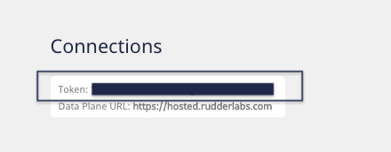
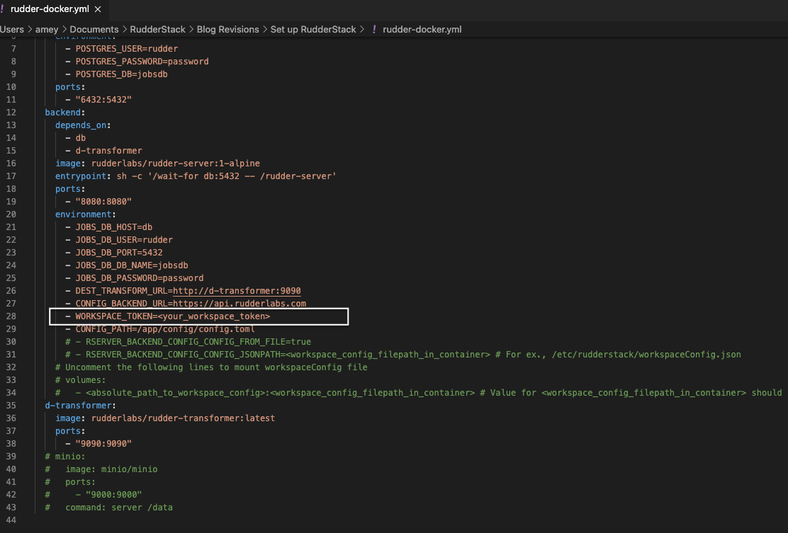
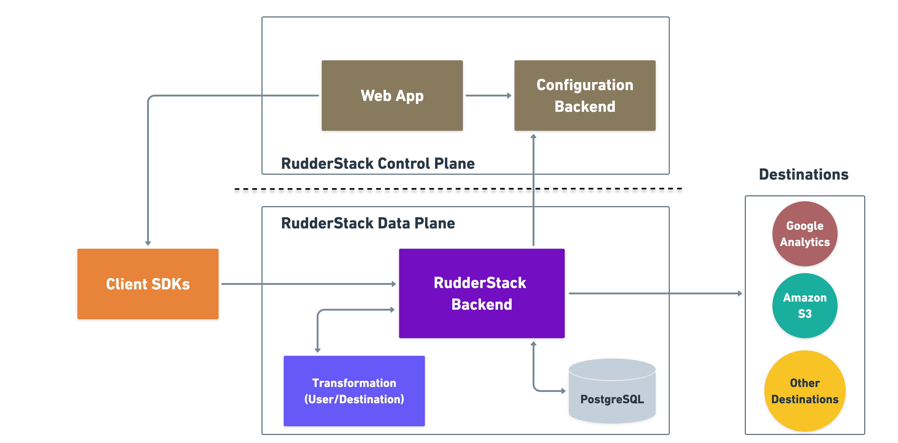

RudderStack is an open-source **customer data pipeline **tool. It collects, routes, processes data from your websites, apps, cloud tools, and data warehouse. With RudderStack, you can build efficient data pipelines that connect your entire customer data stack and leverage your warehoused data to trigger your analytics and other activation use-cases.

Some of the key features of RudderStack include:

*   **Complete flexibility**: Unlike most commercial systems that charge you based on the event volume, RudderStack lets you collect all of your event data without worrying about overrunning your budget.
*   **Warehouse-first architecture**: Most modern companies are building their CDP on top of a data warehouse. RudderStack treats your data warehouse as a first-class citizen among your destinations. It offers advanced features and configurable, real-time sync to safely collect and route your events to your data warehouse.
*   **Built for developers**: RudderStack is built API-first and easily integrates with the tools that you already use and love.
*   **User-specified event transformation**: RudderStack offers a powerful JavaScript-based transformation framework that lets you transform and enhance your in-transit events before routing them to your warehouse or other preferred destinations.
*   **High Availability**: RudderStack’s sophisticated error handling and retry system ensures all of your event data will be delivered despite any network or destination downtime.

For more information on RudderStack, feel free to join our [Slack channel](https://resources.rudderstack.com/join-rudderstack-slack) and start a conversation. We’ll love to hear from you!

## How to set up RudderStack

The easiest and fastest way to get started with RudderStack is using the Docker setup. However, if you wish to use RudderStack in production environments, we strongly recommend using our [Kubernetes Helm charts](https://docs.rudderstack.com/installing-and-setting-up-rudderstack/kubernetes).

The steps for setting up RudderStack using Docker are as follows:

*   Sign up on the [RudderStack app](https://app.rudderlabs.com/signup). You can easily set up and configure your event data sources and destinations through the RudderStack dashboard. RudderStack self-hosts these configurations and does not charge you for it.  \
 
**Note**: If you want to host your own source and destination configurations, you can use the open-source [RudderStack Config Generator](https://docs.rudderstack.com/how-to-guides/rudderstack-config-generator). However, note that this open-source dashboard lacks features such as user-defined transformations and live event debugging, which are present in the RudderStack-hosted dashboard.
*   Then, copy the workspace token at the top of the dashboard page, as shown:

 

*   Next, download the **docker-compose** file <code>[rudder-docker.yml](https://raw.githubusercontent.com/rudderlabs/rudder-server/master/rudder-docker.yml)</code>.
*   Open this file, and replace <code>&lt;your_workspace_token> </code>with the workspace token that you have copied above:

*   Finally, navigate to the location where you want to set up RudderStack and run the command `docker-compose -f rudder-docker.yml up`
*   To verify if the setup is successful, send test events to your destination by following this [guide](https://docs.rudderstack.com/installing-and-setting-up-rudderstack#how-to-send-test-events).

## RudderStack Architecture

RudderStack's architecture consists of 2 major components:

*   **Control Plane**: This component handles the source and destination configurations and the user-specified connections. \

*   **Data Plane**: This is the RudderStack backend - the core engine that collects, transforms, and routes the events to the specified destinations. 

Here’s a broad visual representation of  RudderStack’s architecture:

For more details on the architecture, check out our [documentation](https://docs.rudderstack.com/get-started/rudderstack-architecture).

## RudderStack Transformations

RudderStack’s Transformations module allows you to transform and enrich your in-transit events into a destination-specific format, before routing them to the desired destination. These transformation codes are written in JavaScript. 

We recently released our Transformations API that makes it easier for you to write custom transformation functions for your business-specific use-cases. With this API, you can also reuse specific blocks of JavaScript code (called **libraries**) by simply importing them in the desired transformation using the module name, thus reducing your engineering work.

## RudderStack Integrations

RudderStack currently supports more than 80 integrations, with newer sources and destinations added to the catalog almost every week.

### Event Streams

RudderStack Event Streams allow you to track and collect event data from your websites and applications in real-time. This feature includes client-side SDKs for website, mobile and server-side event tracking, as well as integrations with some third-party platforms like Looker, PostHog, and Customer.io.

Read more about this feature in our [docs](https://docs.rudderstack.com/rudderstack-event-streams).

### Cloud Extract

With [RudderStack Cloud Extract](https://docs.rudderstack.com/cloud-extract-sources), you can seamlessly build ELT pipelines from your cloud applications to your data warehouse. RudderStack also gives you the ability to choose what data you want to ingest, and specify the sync time when the data should be loaded into the warehouse.

### Warehouse Actions

RudderStack’s [Warehouse Actions](https://docs.rudderstack.com/warehouse-actions) feature lets you leverage the enriched warehouse data as a source for your entire customer data stack. This way, you can send the warehoused data to your preferred customer tools.

### Support for 80+ Destinations

With support for over 80 third-party tools and destinations, RudderStack reliably routes all the tracked customer events to your preferred destinations for various activation use-cases like analytics, attribution, marketing, CRM, and personalization. Check out all our supported destinations [here](https://docs.rudderstack.com/destinations).

## Try RudderStack Today

Start building a better, warehouse-first CDP that delivers complete, unified data to every part of your marketing and analytics stack. Sign up for[ RudderStack Cloud Free](https://app.rudderlabs.com/signup?type=freetrial) today.

If you haven’t already, sign up for [RudderStack Free](https://app.rudderlabs.com/signup?type=freetrial) today. Start using a smarter customer data pipeline that builds your customer data lake on your data warehouse. Use all your customer data. Answer more difficult questions. Send insights to your whole customer data stack.

Join us on [Slack](https://resources.rudderstack.com/join-rudderstack-slack) to chat with our team, explore our open source repos on [GitHub](https://github.com/rudderlabs), subscribe to [our blog](https://rudderstack.com/blog/), and follow us on our socials: [Twitter](https://twitter.com/RudderStack), [LinkedIn](https://www.linkedin.com/company/rudderlabs/), [dev.to](https://dev.to/rudderstack), [Medium](https://rudderstack.medium.com/), [YouTube](https://www.youtube.com/channel/UCgV-B77bV_-LOmKYHw8jvBw). Don’t miss out on any updates. [Subscribe](https://rudderstack.com/blog/) to our blogs today!
