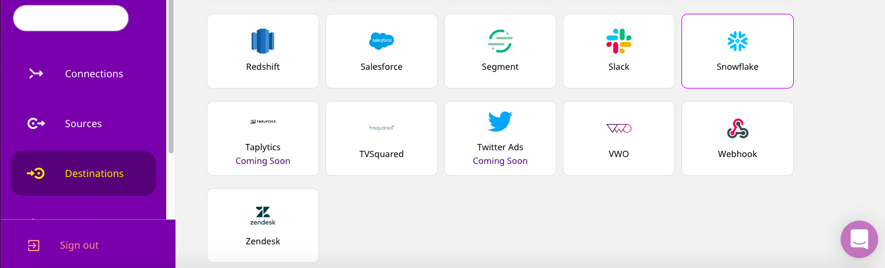
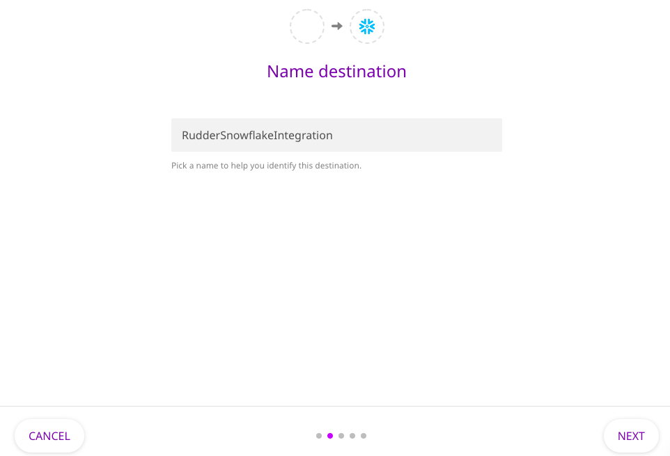
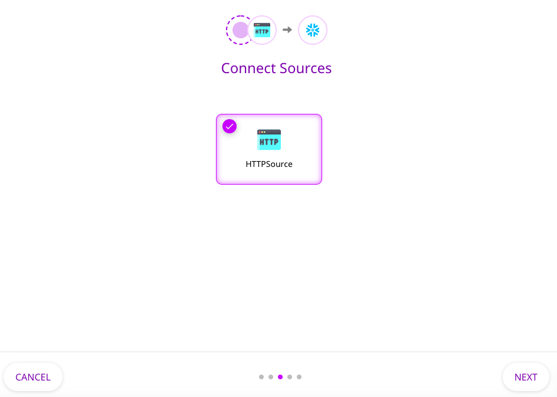
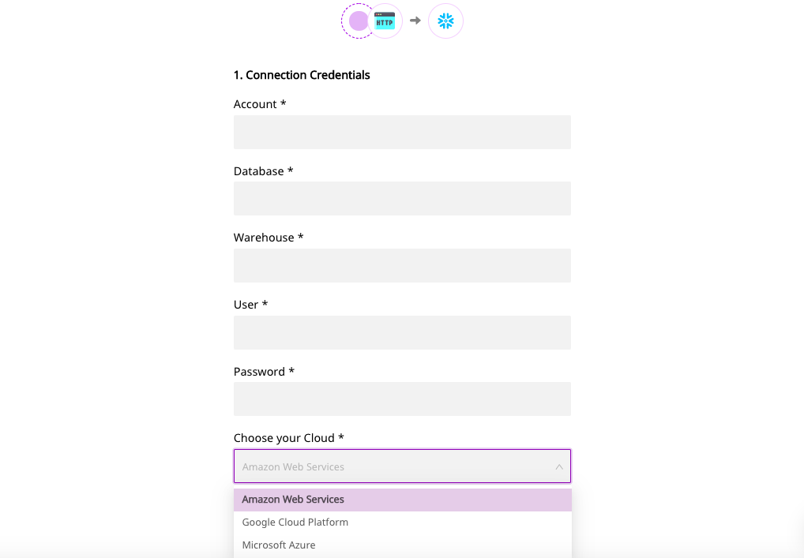
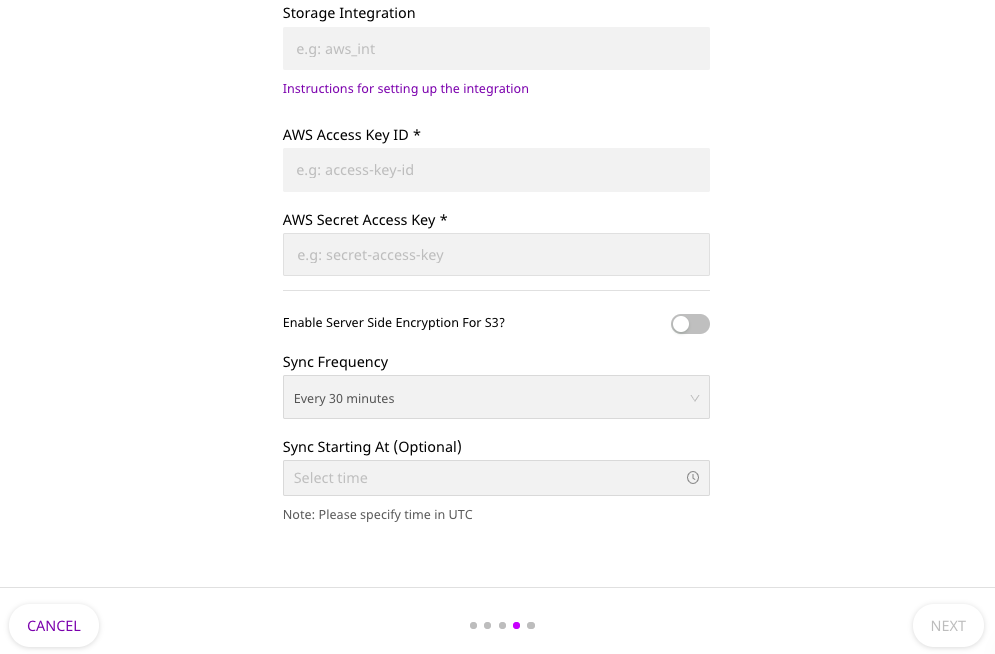
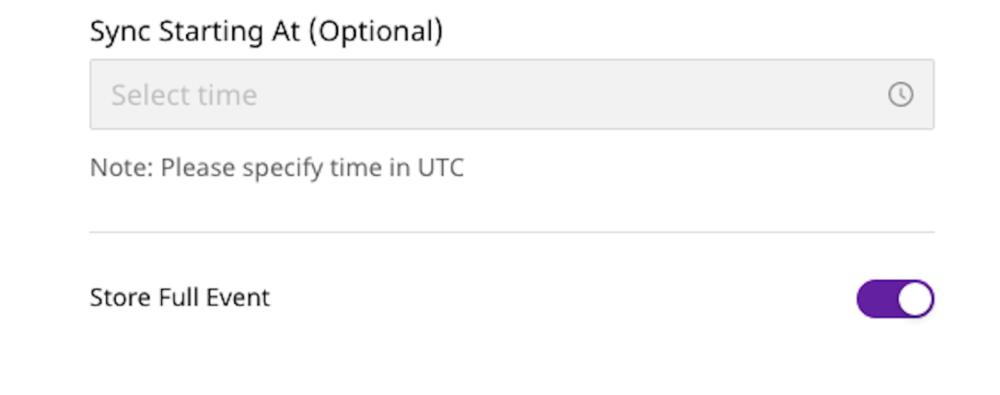
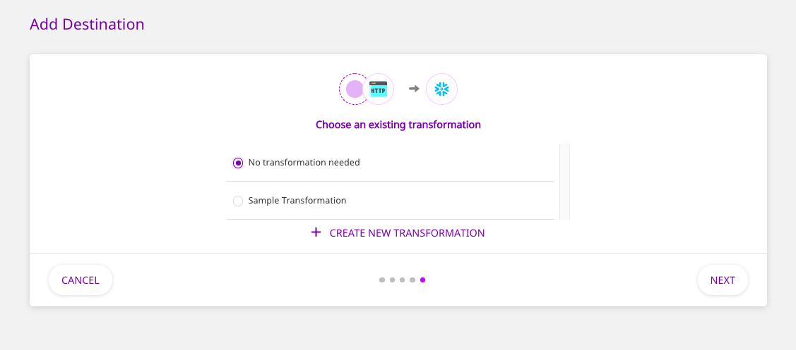
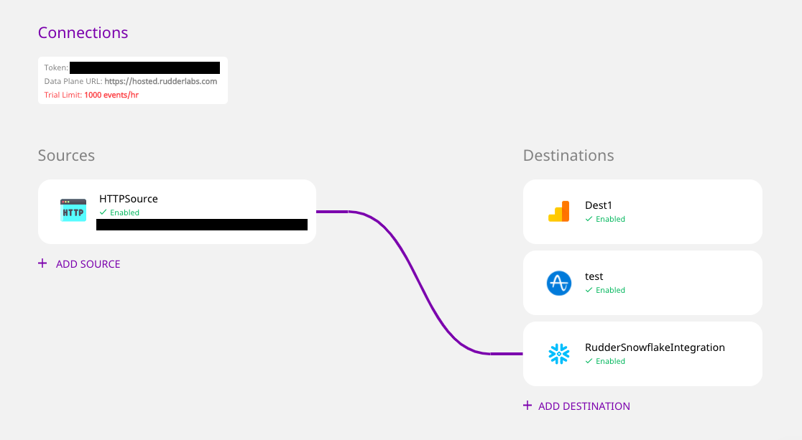
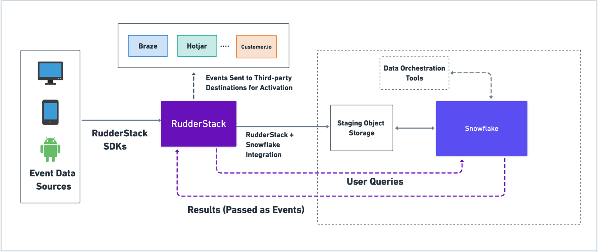

In our [previous post](https://rudderstack.com/blog/the-stack-of-the-future-building-a-warehouse-first-cdp-on-snowflake-using-rudderstack/), we described the stack of the future and why the top data engineering teams are building warehouse-first customer data platforms (CDPs) to feed their companies rich, comprehensive customer data. In this guide, we’ll show you how to build your own warehouse-first CDP on [Snowflake](https://www.snowflake.com/) using RudderStack, including a step-by-step walkthrough to setting up RudderStack on top of Snowflake and an overview of the architecture. Lastly, we’ll look at how to enable a few common CDP use-cases. 

**Setup and Walkthrough**
-------------------------

In this section, we’ll walk through how to set up the RudderStack-Snowflake integration. The process is simple and should only take a few minutes.

1.  1\. Log into your RudderStack Cloud dashboard.
2.  2\. Navigate to **Destinations** in the left panel, select **Snowflake**, and click on **Configure**.

3.  3\. Enter the name you want to assign to this integration, and click on **Next**.

4.  4\. Select the data sources you want RudderStack to route to Snowflake. (If you haven’t configured a source already, follow this [guide](https://docs.rudderstack.com/how-to-guides/adding-source-and-destination-rudderstack).)

5.  5\. Enter the relevant connection credentials and the staging object storage settings, as shown:

  

RudderStack uses staging object storage for two reasons. First, it does not persist any customer data except for transient processing. Second, having staging object storage is helpful if you want to replay any historical data again to your Snowflake warehouse.

6.  6\. You can also set the data sync frequency and the time at which the data will be synced to Snowflake in these connection settings, as shown. Click on **Next** once you have entered the required configuration settings.

7.  7\. To enable sending semi-structured data to Snowflake, you can enable the **Store Full Event** option, as shown below. RudderStack will send the entire object for storage as the VARIANT data type in Snowflake.

8.  8\. Finally, you can also choose to add a sample JavaScript transformation for your event data, or create your own custom transformations. Choose the appropriate option as required, and click **Next**.

**That’s it!** The connection should now be active, and visible on your RudderStack Cloud dashboard.

We’ve also detailed this entire process in the following GIF: 

https://cdn-std.droplr.net/files/acc\_253797/QHDShF

**Architecture Overview** 
--------------------------

For simplicity, we can split the technical components of the architecture into three major categories:

### **Data Collection and Delivery**

RudderStack has [**over 10 SDKs**](https://docs.rudderstack.com/rudderstack-sdk-integration-guides) for your web, mobile, and server-side sources to help you collect and unify your customer event data in real-time. You can also ingest data from cloud applications like Customer.io and BI tools like Looker (with more integrations on the way). RudderStack is also Segment API compatible, meaning you can ingest data from Segment and send data to Segment, making migration much easier. 

Once your customer data is flowing into RudderStack, the events are then delivered to your Snowflake warehouse through the RudderStack-Snowflake integration, which allows for a configurable, near real-time data sync. RudderStack is built to efficiently handle and manage event volume peaks and, of course, Snowflake can handle peaks without any problem. This means you can send multiple thousands of events per second without any additional tweaks to your infrastructure.

RudderStack also supports sending semi-structured data to Snowflake via the VARIANT data type. This allows you to access the entire JSON object at once, eliminating the need to deal with complex table joins that frequently haunt many querying use cases.

#### **Coming Soon – Warehouse-as-a-Source**

RudderStack Cloud will also soon support Snowflake as a data source. As seen in the diagram above, you can then run user queries on Snowflake via RudderStack and pass the results as events back to RudderStack. This enables sending Snowflake-enriched customer event data to your third-party marketing and analytics destinations for more advanced activation use-cases.

### **Data Warehouse**

In our previous post, we’ve detailed why Snowflake is an ideal data warehouse for your CDP. Snowflake logically separates its storage and compute resources, while still integrating them natively. This is a game-changer, because it helps you reduce your overall data storage and processing costs significantly. Let’s take an example: while you want to store all of your event data, you generally work only on the more recent data. Snowflake’s storage-compute separation lets you load and process only the data that you need and charges you accordingly. At the same time, it also gives you the long-term storage you need for your historical data.

Snowflake’s support for semi-structured data types and columnar object storage also proves to be quite useful for data teams when it comes to managing and activating your customer data.

Finally, Snowflake’s near-zero administration and maintenance, coupled with secure and governed data access lets you focus on making data-driven decisions without worrying about the infrastructure.

With RudderStack, you can also implement advanced features such as sessionization and identity stitching by using at-rest data transformations which can be deployed on your Snowflake warehouse, allowing you to turn your warehouse into a full-featured CDP.

### **Data Activation**

#### Unified view of the customer across the organization

Once your customer data is in Snowflake, you can act on it to get crucial insights for actionable decision-making. You can run querying tools that leverage your Snowflake data to [build effective data models](https://www.snowflake.com/workloads/data-science/), or [run self-service BI tools on top of Snowflake](https://docs.snowflake.com/en/user-guide/ecosystem-bi.html) to generate visual dashboards and reports. Snowflake also allows you to set up sharing and collaboration on the live data residing in your warehouse, with the appropriate data governance policies automatically applied. This eliminates your customer data silos and enables you to securely share your customer data with different stakeholders across your organization.

#### Putting the data to work with other downstream cloud tools

Using RudderStack means that every data point you send to Snowflake can simultaneously be sent to other downstream tools for additional activation. You can run customer engagement programs through tools like [Braze](https://www.braze.com/), perform product analytics through tools like [Mixpanel](https://mixpanel.com/) and [Iterable](https://iterable.com/), or leverage attribution tools like [Apps Flyer](https://www.appsflyer.com/).

**CDP Use-Cases**
-----------------

### **Customer Journey Analysis**

Customer Journey Analysis is a very effective way of seeing your product through your customers’ eyes. It is a data-driven approach to analyzing and influencing your customers’ product journeys, and thereby boosting conversions, customer engagement, and their overall lifetime value.

RudderStack and Snowflake combine perfectly to give you all the data you need for rich and insightful analysis of your customer journeys.

A typical customer journey analysis with RudderStack and Snowflake involves three key stages:

#### **Data Collection**

A customer journey, in essence, involves weaving together all the cross-platform touchpoints that your customers interact with over time. RudderStack’s cross-platform SDKs capture all the relevant customer events across all of your digital touchpoints. The SDKs capture the user information required for behavioral analysis using the **identify**, **page**, **track**, and **group** API calls.

#### **Data Storage**

Most of the customer data required for intensive customer journey analysis resides in Snowflake and is sent there through the RudderStack-Snowflake integration. In addition, Snowflake also collects and stores data from other sources such as email and various cloud-based tools – think of all the customer messages coming via Intercom or Customer.io, for example.

Snowflake then unifies your customer data and makes it ready for your analysis.

#### **Data Analysis**

The last stage of this process involves analyzing the enriched customer data to get rich insights, usually via a business intelligence tool that leverages **SQL joins**. 

A typical example of this would be using a SQL join to unify a user’s browsing activities around a product – such as viewing a product page (RudderStack’s **page** method), signing up (**track**), adding a product to wishlist or cart (**track**), etc., to build a complete product journey for that user.

Or, you could join the events associated with email sends, opens, and clicks with a specific user or email ID to get a better understanding of how email flows impact user onboarding.

### **Behavior-Based Messaging**

While customer journey analysis helps you understand how your customers are using your product, it is equally important to know how to update your customer journey and use it to your advantage. That’s where behavior-based messaging comes into play.

With behavior-based messaging, you can deliver relevant, engaging messages and notifications to your customers as soon as they perform certain actions while using your product.

Let’s say you work in a SaaS company. Your analytics team leverages all the unified customer data residing in Snowflake and learns that new users who don’t use a particular product feature have a very high chance of churning out. Your product team would naturally want to engage with such users and prompt them to use the feature.

To do this, you can use RudderStack to send all your customer behavior data residing in Snowflake to downstream marketing automation tools like Braze or Customer.io. With these tools, you can build a segment of audiences who have not used that particular product feature and use their marketing automation capabilities to trigger personalized messages for these users – asking them to try the feature.

**Start Building Your own Warehouse-First CDP on Snowflake using RudderStack**
------------------------------------------------------------------------------

In this post, we detailed how modern, warehouse-first CDPs built on cloud data warehouses like Snowflake with RudderStack allow you to effectively capture, analyze, and productize your data. 

While RudderStack allows for seamless data capture across all your data sources, you can go beyond the traditional use-cases of a typical data warehouse with Snowflake. By mobilizing and activating your data in a secure and robust manner, Snowflake allows you to unlock the full potential of your data, without creating any data silos.  
RudderStack and Snowflake combine to give you the data platform for a perfect CDP. [Sign up for a 14-day free trial](https://app.rudderstack.com/signup?type=freetrial) of RudderStack Cloud, and build the warehouse-first CDP that delivers complete, unified data to every part of your marketing and analytics stack.