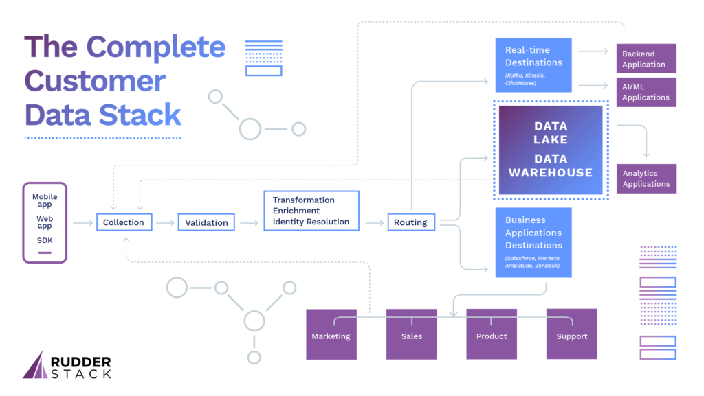

Overview
--------

_In this article, we break down the ideal architecture for “the complete customer data stack” from the perspective of the data engineer. With new customer data software tools being launched every day and unclear definitions around terms like “customer data platform,” we make the argument that these individual tools are always part of a much more comprehensive customer data stack that should be managed by IT and engineering._ 

In business software, terms like “unified customer data” and “360º view of the customer” are hot marketing buzzwords. Executives and, of course, salespeople say that these new tools are the best thing since sliced bread.

When it comes to engineering and IT organizations, though, most developers don’t think of fancy marketing software when they consider the subject of unified customer data. Instead, they think about unified data in the context of the data flows, storage, and processing that form their entire customer data pipeline. 

This disparity in perspective is the unfortunate result of vendors selling to marketing and sales departments and implementing for them. Still, because the entire system isn’t considered, the result is often more siloed data (the opposite of what was promised). 

In this article, we make the case that the customer data functionality sold by all vendors _is just one component (or “use case”) within a broader system for customer data infrastructure –_ the comprehensive set of tools and functions that collect, manage & activate customer data. 

One of our customers described this well when explaining RudderStack as part of their stack: 

> _“This isn’t about the success of RudderStack as an individual service, but the success of this entire effort to get our customer data infrastructure right, which means building data-driven workflows, making smarter decisions based on data and building prediction models for retention and engagement. Not every effort is directly related to the tool, but the tool is a big part of the system we are building.”_

These systems are complex, touch multiple business and technical systems both internally & externally and have use cases spanning the organization, from marketing to product to support (and even finance). 

We believe that IT and engineering teams are best equipped to build this customer data stack.

First, Let’s Define ‘Customer Data’
-----------------------------------

At the risk of pointing out the obvious, at the highest level, any data associated with a customer is customer data, and this concept predates the internet or even computers. 

Before the advent of computers, businesses used to keep a ledger book of all transactions mostly for accounting & planning purposes. With the advent of computers, the ledger was digitized and stored in databases, but the concept and use cases remained the same.

From those initial days, we have come a long way. Customer relationship management tools (CRMs) like Salesforce were the first “customer data platforms” that reached into multiple parts of the organization. However, as the ability to collect data from every customer touchpoint has become increasingly possible, the concept of a repository of customer records with a UI isn’t enough to meet the needs of truly data-driven companies. 

Customers are interacting with businesses in more ways than ever before. It’s not just retail stores, but websites, mobile apps, call centers, ticketing systems, and more. Business systems have proliferated to manage and create value from all of the data. Amazingly, a typical mid-sized company uses anywhere from 10-50 tools across their departments to interact with their customers. This includes home-grown systems as well as third-party SaaS solutions. 

As any data engineer knows, the most common challenge in the modern environment is that this information about customers is siloed within the tools. Bringing all that data together to create a complete customer “view” is a non-trivial engineering problem. 

The solution isn’t a single tool or function, but a comprehensive “customer data stack.”

Based on years of experience building, running, and consuming the output of various pieces of this infrastructure, we’ve mapped out the key components required to build a comprehensive, scalable system that serves the needs of an entire company (what we call “the complete customer data stack”). 

Note that there isn’t one vendor who solves every piece of the puzzle. Every company uses multiple tools. Many companies attempt to build these systems from scratch. In contrast, others leverage tools like Segment, [RudderStack](https://rudderstack.com/), DBT, Lytics, and others to manage the key components of their data pipeline (especially those that are complicated and/or expensive to build and run). 

Also, note that this architecture is somewhat “aspirational.” Not every company has implemented or is implementing every component of the stack. Requirements for the customer data stack vary depending on the business model and stage of the company. At scale, though, truly data-driven businesses will need the functionality of every component on some level.

Let’s dive in and break down the key building blocks of the complete customer data stack.

Components of the Complete Customer Data Stack
----------------------------------------------

Here is a diagram that includes all of the key components of a complete customer data stack, from data collection through all of the primary use cases. Below, we break down the function and concerns around each key component.

### Data Collection

This is the starting point. Customer data is spread across multiple systems across multiple points in the customer journey, and the first job of a customer data stack is to collect it. Customer data comes in many forms, but a few of the most common types are: 

*   User behavior and clickstream events on web & mobile apps (clicks, page views, product searches, account creation, etc.)
*   Transactional events in backend systems (financial, etc.) 
*   Transactional data from customer SaaS apps for marketing, sales and support (emails, tickets, chat, etc.)
*   Data from internal applications for marketing, sales, and support
*   Structure data from external platforms (Google Ads, Clearbit, etc.)

Beyond these, customer data can also come from key pieces of the engineering stack:

*   Data Warehouses: Many companies run ETL and ELT jobs from their transactional systems into a warehouse and often include “computed” values.
*   AI/ML systems: Companies are increasingly deploying AI/ML systems to compute customer scores, personalized product recommendations, and more. The output of these systems also produces “unique customer data.” 

The goal of the collection component is to ingest data from all of these systems. Some data is “pulled” via APIs (e.g., from SaaS sources) while others (e.g., events) are more pushed-based—SDKs are deployed on all the sources, and those SDKs push the events via an API. Bringing data from databases like warehouses introduces additional engineering challenges. The simplest approach is to run a SQL query, but that doesn’t scale well when the volume of events. [Change Data Capture (CDC) techniques](https://en.wikipedia.org/wiki/Change_data_capture#:~:text=In%20databases%2C%20change%20data%20capture,taken%20using%20the%20changed%20data.) are alternate solutions to address this volume problem.

No matter the use case, any scalable customer data stack needs to address the challenge of data collection in terms of complexity and scale.

### Data Validation

Validation is a critical component of the stack because some of the data, particularly event streams coming from mobile/web apps, is often dirty & buggy because of human error, ad-blockers, browser imperfections, developer errors, DoS attacks and more. Dirty data impacts the downstream functionality severely. Thus, it needs to be dealt with carefully or blocked completely, depending on the use case. 

Validation is often rule-based, but increasingly companies are using AI/ML systems for “learning” the event pattern from historic data and blocking events that don’t match that pattern.

The validation step may also involve calling external APIs. One common validation is email verification—making sure that the email address in a customer event is correct—and this usually involves calling an email validation API.

No matter the use case, the data stack’s validation component is key to feeding the company with clean data, so it needs to be robust and flexible. 

### Transformation, Enrichment & Identity Resolution

Once raw data is collected and validated, it often needs to be transformed in some way before being sent to downstream applications. Here are some common use cases: Enriching user records with additional internal data (e.g., complete user profile) or external data (e.g., job title, company name, company size, etc.). This is a massive trend in marketing and sales and often requires tapping into an API service, internal or external. 

*   Removing PII or other sensitive customer data points
*   Sampling & filtering events (often to reduce cost in downstream applications consuming the data)
*   Mapping labels or headers for unified warehouse tables or communication between downstream SaaS tools

Another important function of the transformation component is identity resolution—mapping all the different identities a user may have (anonymous cookies, device IDs, advertising IDs, email addresses, etc.) into a canonical identifier. Tying all these identities together is a key step in combining all the data about a customer into a unified customer profile. (Add citation)

Depending on the business’s complexity and needs, transformations can be as simple as a few lines of code or require complex use cases for each downstream destination. One thing to keep in mind is that as the volume and complexity of the transformations scale, so does the potential for latency in getting the data to downstream destinations. 

### Routing Component of the Customer Data Stack

Data routing is probably the simplest to explain, but it is by no means simple to implement. The customer data that is collected is typically sent to multiple downstream destinations. These destinations include the data warehouses as well as other external/internal applications (many of which have their own APIs). 

The routing component needs to take care of reliably delivering the message to every destination and handling any failures. Even with clean data (from the validation component), failures are common-place in customer data pipelines. For example, the cloud destinations may be down; warehouses may be undergoing maintenance, etc. The data should not be lost or reordered during this process (if you’re interested, we wrote out our solution to this challenge [in a separate post](https://rudderstack.com/blog/building-a-reliable-customer-data-infrastructure/)).

The routing module also often takes care of batching data for certain destinations. For example, many times, the events must be batched before loading them into a data warehouse. 

The best routing solutions should have bulletproof failure handling, the ability to manage spikes in scale, and support real-time (or as close to real-time) loading as possible. 

### Warehouse

The warehouse is the “center-piece” of the customer data stack. One of the CDI stack’s primary goals is to bring the data into one central location so that the data can be analyzed, reported on, and used across the company. In other words, no matter the source, downstream use case, or end-user in the company, the warehouse should be the central hub and source of truth for all customer data. 

Data warehouses are useful far beyond being a source of truth, though. They are vital to key data engineering functions. Some interesting use cases include creating user cohorts (i.e., users who have visited a checkout page but didn’t purchase) and taking action on those cohorts (i.e., sending coupons or discount codes to those users). 

It’s worth noting that these functions are often marketing-driven and have caused a significant proliferation of the third-party “CDP” tools we mentioned above, which, unfortunately, are often siloed from the broader CDI stack.

These warehouse use cases require the data to be in a single place and require a sophisticated query interface on top of that data. 

The scalability and cost of the entire stack are also important considerations. The cloud-native data warehouses like Snowflake, BigQuery, or Redshift are perfect for this use case. 

The good news for data engineers building customer data infrastructure is that today’s modern warehouses are perfectly suited to serve as the center-piece of the stack. The technology has become more advanced and easier to use and will continue to do so. 

### Business Applications

In addition to dumping the data into a warehouse, the customer data stream also needs to be sent to other applications so that teams can take action on it. 

The engineering team manages the initial destination routing, as we mentioned above. Still, it is important to consider these downstream applications as a component of the system, in large part because the data they collect and produce themselves often needs to be routed back through the system through the collector. In many cases, these systems are both destinations and sources. As sources, they require management as part of the collections component.  

Companies that manage on-prem systems (like Siebel CRM) need to push data to and pull data from those applications.

While the engineering team rarely manages the third-party SaaS apps used by other teams, they are a very important component of the customer data stack. They often drive insights and customer experiences that optimize the product, marketing, and sales. As mentioned above, many also ‘produce’ data that the system needs to collect. 

Here are a few common downstream SaaS apps: 

*   Product analytics tools like Amplitude and Mixpanel
*   Marketing automation, analytics and testing tools like Marketo, Customer.io, Google Analytics, and VWO
*   Advertising platforms like Facebook, Google Ads, and Lotame
*   Sales systems like Salesforce and HubSpot 
*   Support systems like Intercom and Zendesk

As SaaS apps for every part of the organization have exploded, managing this piece of the puzzle has become increasingly challenging. The good news is that the tooling around data transfer for third-party apps is getting better (and something we’re actively building here at RudderStack to make your job as a data engineer easier). 

### Real-time Destinations for AI/ML

Companies are increasingly deploying sophisticated AI/ML applications for lead scoring, product recommendation, UI personalization, etc. 

Take AWS Personalize as an example. Amazon Personalize is a real-time personalization and content recommendation product under the hood that uses the same machine learning recommendation system that runs on Amazon.com. 

To train the AWS Personalize model, one has to send a feed of customer behavioral events (e.g., products they have searched for, clicked on, added to cart, etc.). The output of that model is then available over an API, which, when supplied with a user, can suggest the products that are most likely to interest them. Companies with data-science expertise often develop products like AWS personalize inhouse.

A key function of the customer data stack is to enable these real-time applications by getting data into them and ingesting the results that come out of them. The “real-time” part is critical because your users want to see recommendations and personalization based on what they are doing “right now,” not what they did days or even hours ago.

Conclusion: Why IT and Engineering Need to Own the Customer Data Stack
----------------------------------------------------------------------

Even in a high-level breakdown of the ideal customer data stack, it’s clear that building and managing the architecture, pipeline, and actual data flows is complex, multifaceted work that impacts every part of the organization. The stakes are made even higher when you consider the implications of data security, especially in highly regulated industries. 

There are tools like CDPs, ML models, and enrichment services that perform individual functions well and can sometimes be managed by individual teams. Having multiple high-performance parts separated doesn’t mean you have a functional, high-performance engine. 

The teams best suited to rise to the occasion and build the engine are IT and engineering. In our experience, when companies acknowledge the immense challenge of fully leveraging customer data and involve IT and engineering directly in the building, management, and optimization of the customer data stack, silos are broken down, teams collaborate, and the organization as whole moves faster and achieves better results.