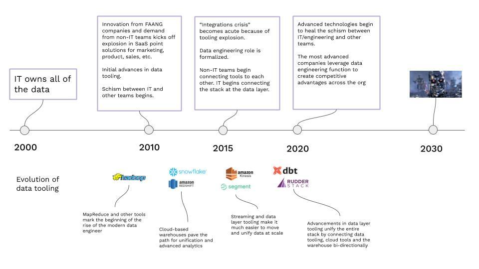
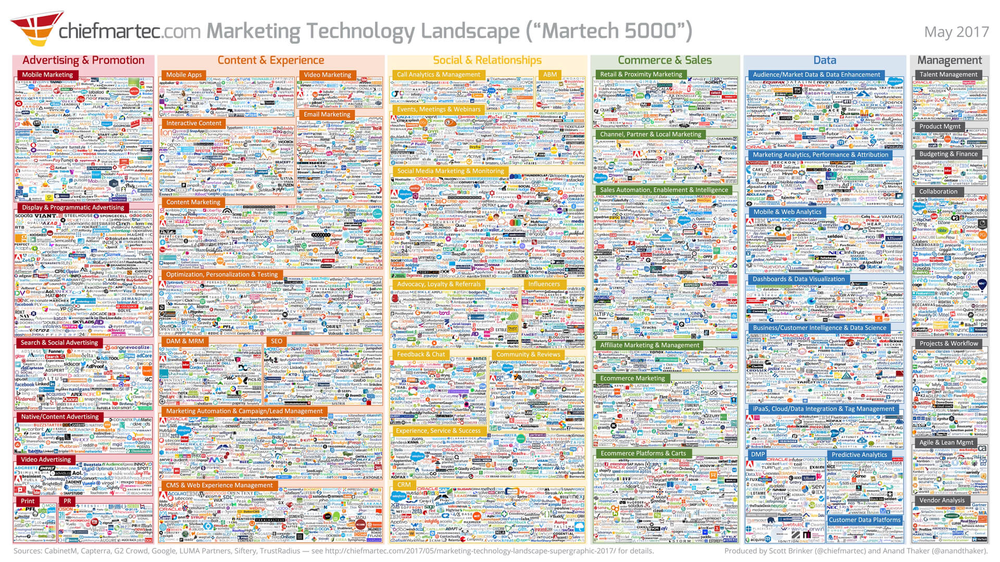
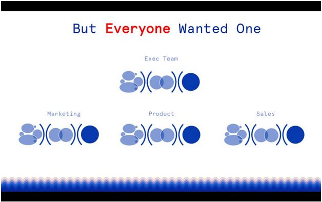
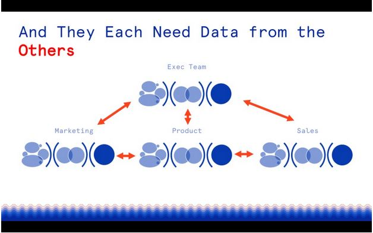

Earlier this year, Tomasz Tunguz[ gave a presentation](https://www.linkedin.com/pulse/five-important-trends-data-one-megatrend-powering-them-tomasz-tunguz/) on five trends in data and the "megatrend" that is powering them all. He makes the case (and we would agree) that the megatrend driving "changes in data design philosophy and tooling" is "the rise of the data engineer." This blog discusses the history of data engineering megatrend over the past 20 years.

But how did we get here? The actual work of dealing with data has been around for a long time (think DBAs). Though as a unique discipline, data engineering is relatively new. Google Trends shows the term starting to pick up steam in 2016, and recently it has hit near peak popularity. 

 

Engineers specialize as needs arise. Today, the data is available in surplus due to massive digitalization. Hence, there is a rapid growth in the need for data engineering and the related data infrastructure. As a result, people and tooling are required to perform the job. 

That rapid growth over the last 15-20 years, though, has created interesting dynamics within organizations and between teams that produce and consume data. 

## **A Brief History of Data Teams and Tooling **

**The Rise of the Data Engineer** - _click to open in a new tab_

### **20 Years Ago: IT Owns Everything**

20 years ago, IT owned everything related to data tooling, and in most cases, the data itself. Teams outside IT used data in their work. However, dealing with the data and infrastructure wasn't part of their workflow or responsibility. Teams like marketing, sales, etc., interacted with the data through systems like ERPs and Crystal Reports. This arrangement made sense then. There was a minimal crossover between the IT's data and data tooling skillset, and other teams’ skillsets performing specific functions. 

### **2000 to 2010: The Beginning of the Schism Between IT and Other Teams**

By the end of the decade, though, the curve of mass digitization had begun to create demand for more data. Also, the use of that data across entire businesses increased. Further, we began to see a desire for **access to** and in many cases **control over** that data by non-IT teams. 

The lack of tooling, processes, and precedent to meet those desires marked the beginning of a schism between IT and other teams within the company. The classic example is marketing's immense appetite for data, and IT's seeming inability to satisfy that hunger with enough of the right data quickly. Despite other teams’ perception, IT was still innovating the future by building early pipeline infrastructure, leveraging in-memory databases, custom integrations, and early ETL solutions. However, the technology and cost still couldn’t keep up with demand. So, though still critical to the core business, IT began to be viewed as a rate-limiter for data-hungry teams. 

Navigating the relationship between IT/engineering and other teams was (and, in many cases, is) hard—the book The Phoenix Project articulates this well. Some companies fared better than others, but even today, 10 years later, this schism’s impact is felt across industries. 

### **2010 to 2015: The Data Engineer is Born, and Everyone Gets Their Own Software**

The early to mid-2010s was an incredible time in the world of data as both IT and non-IT teams and the software companies that supported each responded to rapidly changing needs and digitization in general. 

This innovation was primarily driven by the FAANG companies (Facebook, Amazon, Apple, Netflix, and Google) and their pioneering use of customer data across disciplines, from marketing to product to data science. 

This period saw the birth and rise of significant data-focused technologies. Building on the foundations laid by technologies like Google's Map Reduce and Hadoop, we saw the beginnings of RedShift and Snowflake, advanced data workflow tooling, and wider adoption of "the cloud". (Remember when that was the new hot term?). Now commonplace, these tools were significant advances for IT/engineering as far as data flows and unification. 

Even with those advances, though, the gap between IT/engineering and other teams, though, was still wide open. The FAANG companies had engineering resources to spend on building data products that serviced internal teams and/or buy expensive early solutions. But the companies trying to follow in their footsteps didn’t have the resources. 

The software industry happily rose to the occasion and began to satisfy the needs of non-IT teams. Their cure came in two flavors: powerful all-in-one suites and point solutions. Both these flavors gave non-IT teams partial or full control over their data and tooling along with actual usage and activation of that data. (IT/engineering was capable of building for many of these use cases, and in many cases, they tried. However, the incredible amount of demand and changing nature of that demand proved to be a distraction from the more important role of building software and managing core data infrastructure needs.) 

This boom in the software industry created the now-famous explosion of the "mar-tech" landscape, which grew from 150 tools to 5,000 by 2017 (and even more exponential growth in recent years). Software companies built both as comprehensive suites and best-of-breed point solutions, which we'll come back to later in the post. 

**Mar-tech Landscape** - _click to open in a new tab_

These tools meant non-IT teams could move faster and create more value in their respective disciplines. However, as Tunguz points out, using more tools doesn't mean all your problems are solved. The boom, in fact, created additional problems. These problems became universally and painfully apparent by around 2015. A few big problems were the creation of data silos and the rise in security concerns. Every team had their own data; however, in separate, third-party systems.  

The initial response to that pain came about with early data layer tooling like Segment and Snowplow. These tools disaggregated the data layer from software systems. Still, wide adoption didn't begin until market-wide pain became acute, which also began to happen around 2015. 

### **2015 to 2020: The Rise of the Data Engineer and Data Tooling**

The wide availability of data created a demand for a new breed of analytics: self-serve analytics. The vision was compelling—enable any team to get any data they want, themselves. 

The reality, though, wasn't that simple. Data engineers had the ability to collect data into a flexible, centralized warehouse and layer on analytics tools. However, the actual process of collecting all of the data proved to be extremely difficult. Due to the proliferation of individual tools and datasets across multiple teams, centralized self-serve analytics remained a challenge. 

It turned out that the technological advances in both non-IT software and data tooling were literally industry-changing. However, these advances created a sort of **crisis of integration**.

Non-IT teams faced a similar problem. Having point solutions was great for individual teams. However, the inability of those tools to talk to each other was problematic. The classic example here is connecting the dots between marketing software and sales software (and don't forget the warehouse!), which became a huge industry in and of itself. 

 

These pain points forced teams and entire businesses to wrestle through the decision between disconnected "best of breed" tooling for individual teams and software "suites" that centralized everything but was far less advanced (think Salesforce Marketing Cloud vs. Salesforce + Marketo). Both pathways created problems for IT/engineering. Best-of-breed tools created more silos, but enterprise suites played by their own database rules and weren't warehouse-friendly. 

As organizations wrestled with these problems, the discipline of data engineering was born (or re-born). Furthermore, the quest to unify and make use of all this data began. 

As expected, the industry for data tooling responded to these needs, and this period saw massive advancements in technology and adoption. Tools like Airflow, Spark, Kafka, and Segment simplified collecting, moving, and working with data. 

Which brings us to today...

## **2020 and Beyond **

Many of the trends mentioned above are still playing themselves out. The central theme is consistent, though. Empowering teams with the best tooling while maintaining a unified, flexible data layer has become a central technical and operational challenge for almost every business. Hence, data engineers are at the center of the action. 

The irony is that, in many ways, we're back to where we started, where the skillsets needed to architect and operate data stacks that solve all of these problems reside in the IT/engineering discipline. 

Said another way, the data problem is, by nature, a technical problem. 

This is the reason Tunguz points out that "data engineers are the change agents in a decade-long process that will revolutionize data." 

Most forward-thinking companies deprecate the schism between IT/engineering and other teams. Also, data engineers are valued as key partners for almost every team. They help create a competitive advantage. Thanks to incredible new data tooling, teams don't have to make careful decisions about which tool to use. They can try any tool because data engineers have everything collected and connected at the data layer and in the warehouse. 

The next decade is a truly exciting time for data-driven companies. We're excited to be building products for the developers at the center of the action. 

## Try RudderStack Today

Start building a smarter customer data pipeline. Use all your customer data. Answer more difficult questions. Send insights to your whole customer data stack. Sign up for [RudderStack Cloud Free](https://app.rudderlabs.com/signup?type=freetrial) today.

Join our [Slack](https://resources.rudderstack.com/join-rudderstack-slack) to chat with our team, check out our open source repos on [GitHub](https://github.com/rudderlabs), subscribe to [our blog](https://rudderstack.com/blog/), and follow us on social: [Twitter](https://twitter.com/RudderStack), [LinkedIn](https://www.linkedin.com/company/rudderlabs/), [dev.to](https://dev.to/rudderstack), [Medium](https://rudderstack.medium.com/), [YouTube](https://www.youtube.com/channel/UCgV-B77bV_-LOmKYHw8jvBw). Don’t miss out on any updates. [Subscribe](https://rudderstack.com/blog/) to our blogs today!
