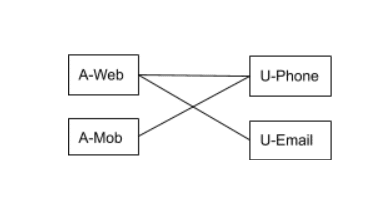
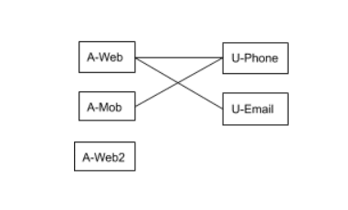
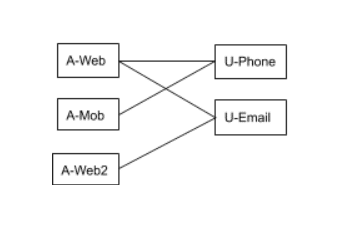

In our previous article on [Game Analytics for Mobil](https://rudderstack.com/blog/rudderstack-case-study-casino-game-analytics/)e, we showed how to build an open-source analytics solution using [RudderStack](http://www.rudderstack.com). As highlighted in the article, understanding users is crucial to every analysis. Hence, it is essential to tie the events or activities to the individual users generating those events. Analytics platforms help collect this data. Unfortunately, this is not trivial in the world where users often browse anonymously or use multiple identities (e.g., email, phone) with the same product or access from different devices and channels. The problem of ID resolution is to able to tie these different identities together whenever possible in a privacy-preserving way. An identity graph helps to understand these relationships better.

This blog is a part of a two-part series on this topic. The first part describes the problem, while the second part describes possible approaches to solve it.

A Real-Life Scenario
--------------------

To motivate the problem further, consider a sample journey of a user on an eCommerce platform. 

*   The user comes to the website on this laptop, browses certain products _anonymously_, and drops off without making a purchase.
*   He installs the eCommerce application on his mobile device, logs in by providing his _phone number_ but leaves without making a purchase.
*   The user comes back on the website and makes a purchase. During this checkout process, he registers with his _email_ and provides his _phone number_ to receive notifications.

### Different User Identifiers

Let’s say the eCommerce platform is using a CDP such as RudderStack to collect all the user activity data. Also, the eCommerce platform uses RudderStack dumps this data into a warehouse, such as Snowflake. Every event is associated with a _user identifier_. The user identifier could either be explicitly set by the application or auto-assigned by RudderStack or both. For example, in the above event sequence, the following identifiers will be used:

*   **Step 1**: Since the user hasn’t provided any user identifier, RudderStack will associate an `anonymousID`. Let’s say `A-Web`: `A` stands for anonymous. After this, RudderStack will save this ID as a cookie. All events will be associated with the `A-Web`. RudderStack will dump the events in the data warehouse with `A-Web` as the user ID.
*   **Step 2**: Similar to the above, RudderStack will create an ID in the mobile device. Let’s call it  `A-Mob` and save it in local storage. All events before the user signing up will be associated with `A-Mob`. Once the user logs in with his phone number (`U-Phone`_)_, we will be able to associate the two identifiers. We will know that the ID `A-Mob` and the phone number `U-Phone` belong to the same user entity.

> **Note**: RudderStack doesn’t automatically capture the phone – the eCommerce application would have to explicitly set it via the `identify()` call and pass the ID `U-Phone`. The `identify()` call forms an association between the two IDs, `U-Phone` and `A-Mobile`. RudderStack can, in turn, save this association into the data warehouse.

*   **Step 3**: Similar to Step 2, RudderStack will associate the events with the automatically assigned ID `A-Web`. Later, when the user provides the email (`U-Email`) and phone number (`U-Phone`), RudderStack will associate those with the ID `A-Web` using the `identify()` call.

The Identity Graph
------------------

The following diagram captures the association formed by the above IDs. The `identify()` call creates the edge in a graph, as explained earlier. The diagram indicates that these two IDs are known to be associated with the same end-user. The nodes represent identities, while the edges represent associations between IDs. For example, we know that `anonymousID` assigned by RudderStack (`A-Web`) and the user email address (`U-Email`) are the same when the user logs in with his email.

One should be able to associate all the web events (collected in steps 1 and 3) and the mobile-events (collected in step 2) as originating from the single end-user. One way to achieve that is to create a mapping between all these individual IDs (`A-Web`, `A-Mob`, `U-Phone`, and `U-Email`) into a single virtual user ID. You can associate all the events with this virtual user ID. You can do this by doing a JOIN between the event table (which has the individual IDs) and the ID to the virtual ID mapping table.

The Identity Graph is not Static
--------------------------------

This identity association can evolve over time. Let’s say the user comes to the same eCommerce site on a third device – his office desktop. If he does not sync the cookies between his laptop and office desktop, the system will associate the third ID with him. Let us call this third ID `A-Web2`.

At this point, we don’t know if this ID (`A-Web2`) is associated with the same person. However, once he logs in with this email, the association will be formed, as shown in the updated graph below.

Assigning Virtual IDs
---------------------

The goal of ID resolution is to take an identity graph as above and associate virtual user IDs with all the nodes. This association is such that nodes that are connected to each other either directly or indirectly (via intermediate nodes) are assigned the same virtual ID.

  
You can achieve this by running the connected component algorithm on the identity graph. A connected component algorithm starts from a random node and runs a graph traversal algorithm (such as depth-first-search or breadth-first-search) to identify all the nodes reachable from the start node. Since all these nodes are connected, the system needs to assign them the same virtual user ID. The algorithm then repeats starting from another node not touched in the previous traversal and so on. This method is pretty efficient and scales linearly with the size of the graph.

Conclusion
----------

In the case of most real-life applications, the graph can be huge with tens or even hundreds of millions of nodes. For example, one of RudderStack’s customers has ~80 million nodes (corresponding to ~40M users). Also, this number is scaling rapidly. At that volume, the customer typically stores the ID graph in a data-warehouse such as Snowflake/Redshift. Users can also choose to store this high-volume data on a data lake like S3 or HDFS. The preferred option, in that case, is to run the connected component algorithm using a query language. Warehouses natively support these query languages, which are usually some variant of SQL.

  
SQL, however, is not a procedural language and does not have native support for basic abstractions such as looping and branching. The SQL dialect these warehouses support is often an even further restricted version. These dialects do not support self JOINs, cartesian products, and so on. As a result, the SQL dialects make it nonobvious to implement the connected component algorithm.

  
That’s for now 🙂 In the next blog post, we will discuss a solution for finding connected components using SQL.