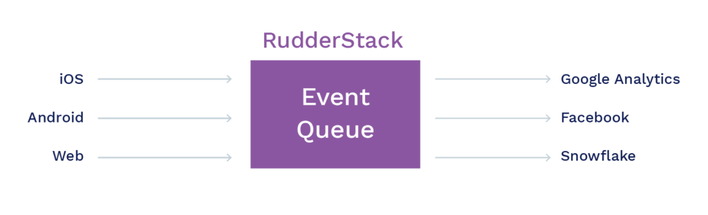
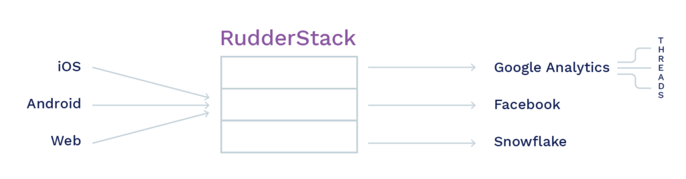
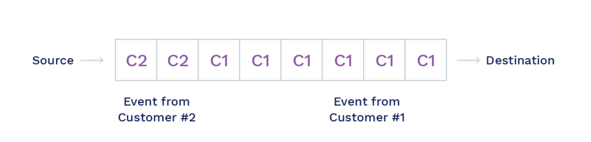
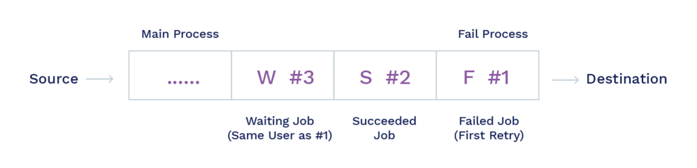
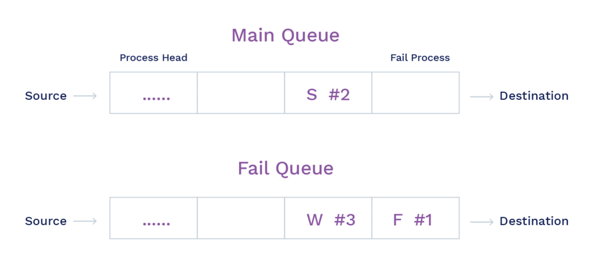

**Overview**
------------

In this post, we answer the all-important question – “Why we did not prefer Apache Kafka over PostgreSQL for building RudderStack”. We discuss some of the challenges with using Apache Kafka over our implemented solution that uses PostgreSQL.

**RudderStack is a Queue**
--------------------------

At its core, RudderStack is a queuing system. It gets events from multiple sources, persists them, and then sends them to different destinations. Persisting the events is crucial because RudderStack needs to be able to handle different kinds of failures. 

Let’s consider an example here – a destination could be down for any length of time due to some reason. In such a scenario, RudderStack should ideally retain the events and then retry sending the events when that destination is functional once again.

Naturally, a popular choice of tool for building such a queuing solution would be Apache Kafka. Kafka provides features such as persistence, ordering, de-duping, extreme performance, horizontal scalability, etc. that any queuing system would need. 

A simple Kafka-based system looks something like this:

In our queueing system, we would need to create a separate topic per destination. Events from the sources can be queued into destination-specific topics, while one consumer consumes events from the destination topics. The consumer itself might be spreading the work of sending events across multiple threads for parallelization. 

A separate topic per destination is ideal because if a specific destination is unavailable (e.g., downtime), we do not want to block the events for other destinations. However, as we will see in the next section, failures can be of other types too, leading to complications with this setup.

While this architecture looks simple enough, Apache Kafka comes with its own set of challenges, which we will focus on in the following sections.

**Management Challenges**
-------------------------

Apache Kafka is not the easiest product to deploy and distribute. Moreover, its dependency on Apache Zookeeper – a distributed configuration and synchronization service – makes it quite a [management challenge](https://medium.com/@anuradha.neo/kafka-is-not-the-best-anymore-meet-pulsar-9eb435c9fc0b).

We did not want to ship and support a product in which we were not experts ourselves.

**Licensing Issues**
--------------------

Licensing was another issue with Apache Kafka. We wanted to release the entire code under an open-source license (AGPLv3). However, the core of Apache Kafka managed by the Apache Foundation is released under the [Apache-2 license](https://www.apache.org/licenses/LICENSE-2.0). In addition, the version actively managed by Confluent is only available under a non-OSI license (Confluent Community License). 

Some specific Kafka features like kSQL (which is very useful for debugging jobs) are not available under the Apache License.

One of the key features for the queueing system we built was the ability to peek into the pending events, and update their state, i.e. set their failure state to retry. Implementing this was not possible with an OSS license.

**Handling Multiple Customers**
-------------------------------

In our hosted, multi-tenant offering, we have multiple customers on the same RudderStack instance. While they can use the same architecture as above with a topic per destination, it can lead to a situation where a large flurry of events from one customer blocks events coming from another customer, as shown in the diagram below: 

Ideally, we would want to keep the customers separate so that we can provide the per-customer QoS guarantees.

The way to do this is to create a separate Kafka topic per destination/customer combination. Unfortunately, Kafka doesn’t scale well with the number of topics. This would eventually become a hindrance our customer-base grows. Our friends at Segment faced a similar issue and wrote a [blog about it](https://segment.com/blog/introducing-centrifuge/).

**Error Handling**
------------------

Error handling becomes complex with the data in Kafka. If an event fails to deliver, we wanted to adopt the following workflow:

*   Record some metadata like the error code, the number of times it has failed, etc.
*   Put it back on top of the queue for subsequent retrying.
*   Block further events from that user to preserve the order till the event is successfully delivered (or it is aborted).  
    

The following diagram shows an example of a ‘logical’ state of the system at any point:

Event #1 has failed and must be retried. Along with the event, we also want to keep track of the number of times it was retried, the failure error code, etc. Event #3 is from the same end-user, so it cannot be sent until Event #1 succeeds or aborts. However, Event #2 is unrelated and should be processed and succeeded.

As seen in the figure above, the queue is processing the events and marking them as succeeded (S), failed (F), or waiting (W). A separate process (or a sweep of the main process) can start from the top. The queue is always in a consistent state, so if there is a crash, we can always start from the top.

Unfortunately, it is not trivial to implement the above logical semantics using Apache Kafka. Kafka does not allow the events to be updated, so we cannot mark the top event as failed, or associate any metadata with it. 

Removing the event and queueing it back (at the end) doesn’t work either, as this will break the ordering constraints – event #3 will end up before event #1, as seen in the example above. 

### Use of Two Queues

Another solution is to use two queues – the main queue and a failed queue. The failed jobs and the skipped jobs (from the same user ID) from the main queue can be put in the failed queue. This is demonstrated in the following diagram:

The issue with this approach is that this only works for the first failure. How do we handle the failures occurring in the Fail Queue? We still have to update the metadata and re-queue the event, so we will need a second fail queue to store failed events from the 1st fail queue. 

We want to retry events a few dozen times before expiring the event, so this is not a great solution as well.

**Debuggability**
-----------------

Being able to query the events as they wait in the queue and/or update the metadata (around failures) to force immediate retrying is a great debugging feature that we were building at RudderStack. Having a SQL-like query interface to the persisted event helped a lot with that.

While Kafka’s kSQL provides the query interface, it does not allow for updates. Furthermore, there are licensing issues with kSQL, as we noted earlier.

**In Conclusion**
-----------------

In this post, we looked at some of the reasons why we decided to build our own queuing library, instead of adopting a Kafka-based solution. We will write a blog about the implementation but if you are curious, you can explore the implementation on [GitHub](https://github.com/rudderlabs/rudder-server)

With our queueing system powered by PostgreSQL, we could easily change the logic for ordering the events as well as debugging them. In addition, we had complete visibility over all the events coming from a source, user or a destination just by running a SQL query – something that was not possible with Apache Kafka.

To know more about RudderStack and its features, check out our [website](https://rudderstack.com). You can also track our progress on [GitHub](https://github.com/rudderlabs/rudder-server).