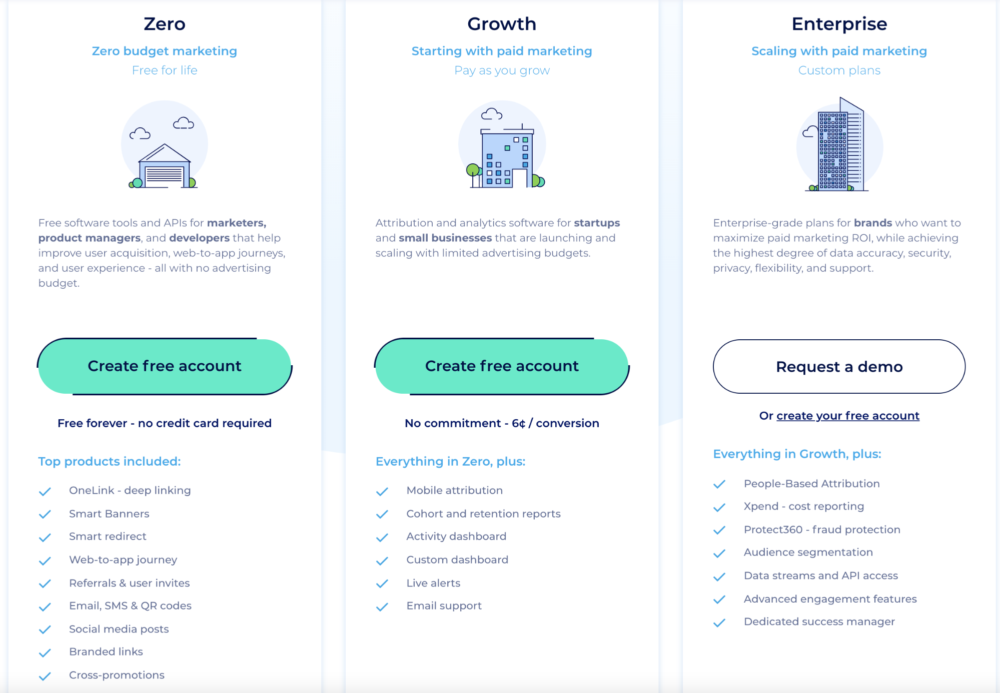
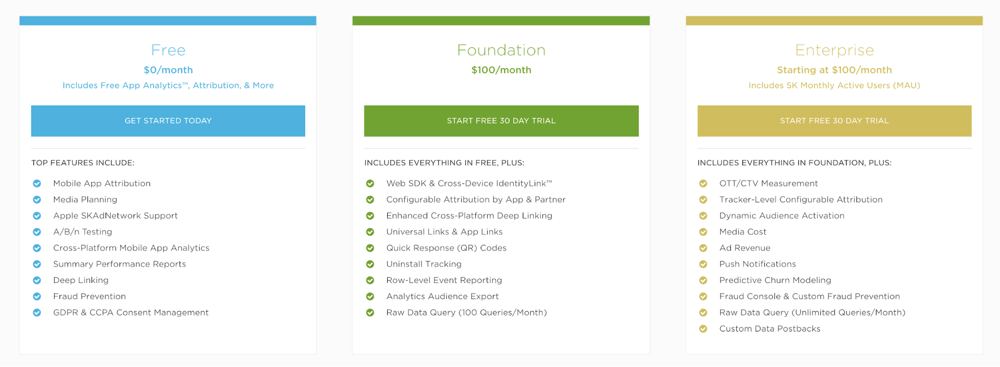
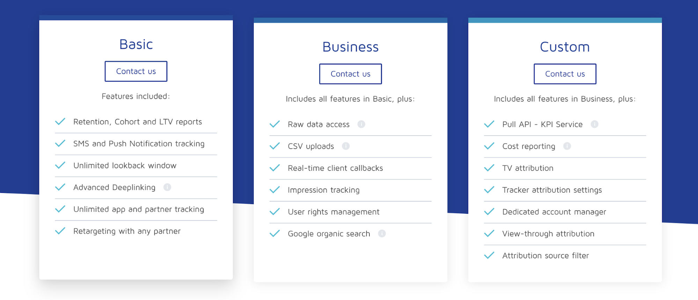
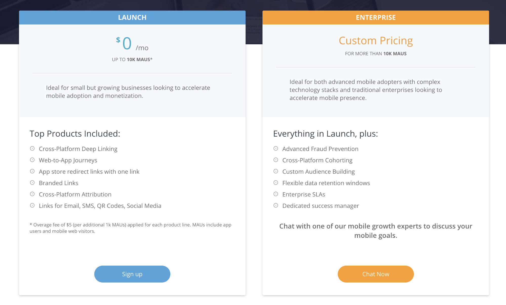

Modern businesses are heavily reliant on multi-channel strategies such as marketing campaigns, targeted messaging, etc., to understand the impact of their marketing efforts on their ROI. These strategies also help them understand the customer journey better and optimize it to deliver a better product experience.

Mobile attribution is a great technique that allows marketers to evaluate how, where, and when a user interacts with their brand. 

Before we dive into the comparison, let’s take a quick look at what mobile attribution entails.

## What is Mobile Attribution?

Simply put, mobile attribution is a marketing strategy of identifying the mobile marketing tactics that contribute the most to sales, conversions, and customer engagement. It helps marketers to determine the exact channels and messages that have the greatest impact on a customer’s decision to convert or take the next step in their product journey.

With mobile attribution, businesses can efficiently track their user’s journey - from installing an app via clicking a mobile ad or an SMS link to deciding on whether to use the product or not. Each user action corresponds to a data point that the attribution model can utilize to enable them to understand the best possible marketing channel for their product. 

Different components play a vital role in implementing mobile attribution - cookies, website tags, and UTM parameters are some of them.

## Understanding Attribution Models

An attribution model is essentially a rule or set of rules used to determine the effect of different marketing channels or customer touchpoints (or data points) on a sale or conversion. It operates on a ‘credit’ principle, where the model ‘credits’ - or distributes - a value across different user touchpoints, depending on how important their role was in the conversion process.

There are different types of attributions models:

*   First touch, or First interaction attribution
*   Last touch, or Last interaction attribution
*   Last non-direct click attribution
*   Multi-touch attribution
    *   Linear attribution 
    *   Time decay
    *   Position-based attribution

This section will quickly look at these attribution models and understand the pros and cons of each.

### First-Touch Attribution

In a first-touch attribution model, the first point of contact that led to the user conversion is assigned full credit. This type of attribution largely comes from organic searches and helps marketers understand how the customer was introduced to their product.

**Pros**: Very simple and straightforward to implement

**Cons**: Ignores the effects of potentially important marketing channels that come in later, for instance, ad retargeting. 

### Last-Touch Attribution

In this model, only the final point of contact that led the user to the target will be given 100 percent weightage. This is the default attribution model used in many platforms like Google Analytics.

**Pros**: Like the first-touch attribution, this too is very simple and straightforward to implement. If the non-converting points hold no value to the business, this is the best attribution model to consider.

**Cons**: As this model ignores all the other points which may have influenced the user to convert, it may not give you a complete insight into the user’s journey.

### Last Non-Direct Click Attribution

As the name suggests, this model gives full weightage to the last click that does not redirect the traffic, eliminating any ‘direct’ interactions right before the conversion happens.

**Pros**: More insightful than the last-touch attribution model, as it eliminates direct clicks.

**Cons**: Like the previous models, this model assigns all the weightage to a single touchpoint and ignores any previous meaningful interactions.

### Multi-Touch Attribution

In this model, we assign varying weights to different customer touchpoints. This gives us multiple channels to look at whenever a user interacts with your product or campaign. Multi-touch attribution models can further be categorized into the following types:

*   Linear attribution
*   Time Decay attribution
*   Position-based attribution

#### Linear Attribution

In this model, all the touch points leading to the conversion are given equal weightage.

**Pros**: Easiest among the multi-touch attribution models.

**Cons**: The touchpoints which might have a greater impact on the conversion are not given the correct weightage.

#### Time Decay

This model is similar to the linear attribution model, except that the points that are closer to the conversion time are assigned progressively more weightage.

**Pros**: The weightage is given to the points that drive the conversion. This is particularly useful in case of a long sales cycle.

**Cons**: This model doesn’t help understand the actual reason that led to the conversion. The cost of implementation of this model is also high as compared to others.

#### Position-Based Attribution

In this model, the majority of the weightage or the credit is split between the first interaction touch point and the point when the conversion occurs. The rest of the weightage is then split amongst the other touchpoints.

**Pros**: Useful for businesses that have multiple customer touch points in the journey prior to the conversion.

**Cons**: Meaningful interactions that happen in between are not given more weightage.

Considering all of the above models, a big task for marketers is to select the most appropriate mobile attribution platform for their use-case.

## Different Mobile Attribution Platforms 

 
There are many mobile attribution tools that you can leverage to get a broader understanding of what helped you get customers based on their behavior patterns. In fact, you can use more than one mobile attribution platform for your use-case. You also don’t need to write specific SDKs for every platform, but simply use [RudderStack](https://rudderstack.com/) directly as it will take care of routing the event data to all the platforms you want to use.

## Choosing the Best Mobile Attribution Tool

In this section, let’s take a quick look at some of the considerations for choosing your mobile attribution platform.

### Attribution

Obviously, being able to deliver the most efficient mobile attribution is the most important requirement. The main types of attribution you want to decide on for choosing a platform are user acquisition, multi-touch, user retargeting attributions. All platforms mentioned above provide these attributions. However, note that Kochava only provides a report for multi-touch attributions, but you cannot see the whole journey. Branch has a great people-based attribution.

### Fraud Detection

Over-attribution and fraudulent data are some of the issues you are most likely to come across. Therefore, it is important to select a mobile attribution tool that addresses them comprehensively. All the platforms mentioned above have superb fraud detection capability. That said, in our opinion, Adjust has the best ecosystem for both fraud detection and prevention.

### Dashboard

Cohorts and retention reports are present in all the mobile attribution platforms. Tools like AppsFlyer and Kochava offer pivot tables to get a summarized view of your data and have a very friendly UI. Some tools also have an audience-building functionality in their dashboards, which is quite important for many businesses.

### Security and Privacy

A data breach is a potentially dangerous issue when dealing with user data - impacting your users’ privacy. Thus, your attribution platform needs to take utmost care of your data’s security. Tools like Adjust and AppsFlyer have a great security layer.

### Integration with platforms

The ability to integrate with external apps is very important in a mobile attribution platform, as one tool or app might not have all the features you want for your use-case.

### Infrastructure

Some attribution tools like Adjust use their private cloud infrastructure, while some use a third-party cloud infrastructure like AWS. This is, again, an important consideration when choosing an attribution platform given the data privacy and security aspects discussed before. 

### Pricing

Some of the attribution platforms offer a free plan with limited features. For instance, here are the plans for AppsFlyer:

Here’s what Kochava offers:

Some other tools require you to get a quote from their sales team to use their product. For instance, check out Adjust’s pricing page:

Here’s what Branch offers:

Most businesses opt for either one (or more than one) of these attribution tools. 

The following platforms are considered to be the best in delivering highly accurate and efficient mobile attribution while ensuring complete flexibility and data privacy:

*   Adjust
*   Appsflyer
*   Kochava
*   Branch

## Summing it all up

Given the vast number of mobile attribution tools out there, it can sometimes be difficult to choose the platform specific to your use-case, application, and project. No ‘perfect’ attribution tool exists - you need to choose the best one depending on your marketing requirements.

For instance, most independent developers opt for tools like Kochava as it is free to use and ideal for their limited use-cases. On the other hand, tools such as Branch offer great deep-linking features and can be a great solution for eCommerce apps, making them ideal for marketing professionals. They also prefer tools such as Adjust and AppsFlyer, which are quite feature-rich but can be quite costly independent developers.

Ultimately, the choice of tool should depend on what you want to do with it, and not the other way around!

## Try RudderStack Today

If you haven’t already, sign up for [RudderStack Free](https://app.rudderlabs.com/signup?type=freetrial) today. Start using a smarter customer data pipeline that builds your customer data lake on your data warehouse. Use all your customer data. Answer more difficult questions. Send insights to your whole customer data stack.

Join us on [Slack](https://resources.rudderstack.com/join-rudderstack-slack) to chat with our team, explore our open source repos on [GitHub](https://github.com/rudderlabs), subscribe to [our blog](https://rudderstack.com/blog/), and follow us on our socials: [Twitter](https://twitter.com/RudderStack), [LinkedIn](https://www.linkedin.com/company/rudderlabs/), [dev.to](https://dev.to/rudderstack), [Medium](https://rudderstack.medium.com/), [YouTube](https://www.youtube.com/channel/UCgV-B77bV_-LOmKYHw8jvBw). Don’t miss out on any updates. [Subscribe](https://rudderstack.com/blog/) to our blogs today!
