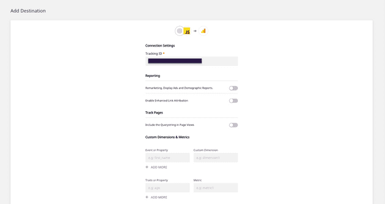

**[RudderStack](https://rudderstack.com/)** is an open-source **Customer Data Pipeline** that helps you track your customer events from your web, mobile, and server-side sources and sends them to your entire customer data stack in real-time. We have also open-sourced our primary GitHub repository - [rudder-server](https://github.com/rudderlabs/rudder-server).

This blog will help you quickly integrate your Jekyll site with RudderStack using our [JavaScript SDK](https://github.com/rudderlabs/rudder-sdk-js) and get started with tracking real-time user events and send them to your preferred destinations.

Instrument event streams on your Jekyll site by following three simple steps: 


1. Integrate the Jekyll Site with RudderStack JavaScript SDK and set up the tracking code

2. Set up a tool or warehouse destination in RudderStack to route all the event data in real-time

3. Deploy your Jekyll site and verify the event stream 


## Pre-Requisites

Before getting started, you need to ensure your Jekyll site is installed and set up. If you haven’t done it yet, visit the [official Jekyll installation doc](https://jekyllrb.com/docs/installation/) to get started.


## Step 1: Integrating Your Jekyll Site with RudderStack JavaScript SDK


### Creating a Source in RudderStack

You need to set up a JavaScript source in your RudderStack dashboard that will track events from your Jekyll site. Follow these steps to set up the source:

1. Log into your [RudderStack dashboard](https://app.rudderstack.com/). If you’re new to RudderStack, [sign up here](https://app.rudderlabs.com/signup?type=freetrial).

2. On login, you should see the following dashboard:


3. Note down the **Data Plane URL**. You will need this URL to integrate your Jekyll site with RudderStack.


4. Create a Source by clicking on the **Add Source** option. You can also click on the **Directory** option in the left nav bar and select **Event Streams** under **Sources**, as shown. Next, select **JavaScript**.


 


5. Add a name for JavaScript Source and click on **Next**.


 


6. Your JavaScript source is now configured and ready to track events. Note the** Write Key **associated with this source. You will need it to set up the RudderStack integration with your Jekyll site. 


### Integrating Your Jekyll Site with RudderStack

Integrate RudderStack JavaScript code with your Jekyll Site and set up the tracking code following steps given below:


1. Jekyll has an extensive theme system that helps customize your site's presentation. **Minima** is Jekyll’s default theme. You can check your default theme using the following command:  

     
`bundle info --path minima`

 The following command opens an explorer window showing the theme files and directories.


    `open $(bundle info --path minima)` 

2. Next, create** <code>[rudder.html](https://github.com/rudderlabs/rudder-analytics-jekyll/blob/main/rudder.html)</code></strong> inside the <code>_includes</code> folder in the<code> minima</code> theme folder (<em>Location: C:\Ruby30-x64\lib\ruby\gems\3.0.0\gems</em>) to include the following script:


Turn on screen reader support

`gist: 9ce1cd62bf315f2c50a27ffa3a448965`

**Create rudder.html file**

**Note**: _If you have installed any other theme (other than minima), you will have to make changes to the files of that theme._


3. Now go to <code>_includes/<strong>[head.html](https://github.com/rudderlabs/rudder-analytics-jekyll/blob/main/head.html)</strong></code> of your theme folder and add the command given below:

    ```
    

    ```


**Important: _You can refer to our sample Jekyll site present in our [RudderStack Jekyll site repository](https://github.com/rudderlabs/rudder-analytics-jekyll) for more information on modifying these files._**


## Step 2: Creating a Destination Tool in RudderStack for Routing Your Jekyll Site Events 


RudderStack supports over [80 third-party tools](https://rudderstack.com/integration/) and platforms to which you can securely send your tracked events. In this section, we will route the Jekyll Site events to [Google Analytics](https://docs.rudderstack.com/destinations/google-analytics-ga). To add Google Analytics as a destination in RudderStack, follow the steps given below: 


1. In the left navigation bar of your RudderStack dashboard, click on **Destinations** and select **Add Destination**. Since we have already configured a source, you can simply click on the source and click on the **Add Destination** option, as shown:

**Note**: You can use **Connect Destinations** option if you have already configured a destination in RudderStack and want to send your event data to that platform.


2. Next, choose **Google Analytics** as your Destination.


3. Add a name to your destination and click on **Next**, as shown:


4. Now, connect the **JavaScript** source that we have already configured in Step 1.


5. On the **Connection Settings **page, configure your Google Analytics destination with your Google Analytics** Tracking ID** and other optional settings, as shown below. Then, click on **Next**.





6. You can also transform your events before sending them to Google Analytics. For more information on this feature, check out our [documentation](https://docs.rudderstack.com/adding-a-new-user-transformation-in-rudderstack) on **User Transformations**.

7. Great job! Google Analytics is now configured as a destination. You should now see the following source-destination connection in your dashboard: 


## (Alternate) Step 3: Create a Warehouse Destination for Your Jekyll Site Events

**Important:** _Before you configure a data warehouse as a destination in RudderStack, you will need to set up a new project in your data warehouse. Also, you need to create a new RudderStack user role with the relevant permissions._

_Follow our [documentation](https://docs.rudderstack.com/data-warehouse-integrations) to get step-by-step instructions on how to do it for your preferred data warehouse._

We will configure a **[Google BigQuery warehouse destination](https://rudderstack.com/integration/bigquery/on)** for this tutorial to route all the events from our Jekyll Site. You can set up a BigQuery project with the required permissions for the service account by following [our documentation](https://docs.rudderstack.com/data-warehouse-integrations/google-bigquery).

Once you have set up the project and assigned the required user permissions, follow the instructions given below:

1. From the Destinations Directory, select **Google BigQuery**:


2. Assign a name to your Destination and click on **Next**.


3. Connect to **JavaScript source** from which we will track our Jekyll Site events. Then, click on Next.


4. Specify **Connection Credentials**. Add **BigQuery Project ID** and the **Staging Bucket Name**. You can refer to these [instructions](https://docs.rudderstack.com/data-warehouse-integrations/google-bigquery#setting-up-google-bigquery) to get this information.


5. Lastly, copy the contents of the private **JSON file**. For more information on how to do this, refer to our [documentation](https://docs.rudderstack.com/data-warehouse-integrations/google-bigquery#setting-up-the-service-account-for-rudderstack).

That’s all! You have successfully set up BigQuery as a warehouse destination in RudderStack.


## Step 3: Deploying Your Jekyll Site and Verifying the Event Stream

We have successfully configured our event source and destination. Let’s verify if our event stream works correctly. To do so, let’s deploy our Jekyll Site application and test if the events are tracked by the **JavaScript** **source** and delivered to our **Google Analytics** **destination**. 


Follow these steps to find: 


1. On your Terminal or cmd, navigate to the folder containing your Jekyll Site.

2. To deploy the app, run` bundle exec jekyll serve `command, as shown:


3. Open your Jekyll site by visiting the server address mentioned in the cmd or [http://localhost:4000](http://127.0.0.1:4000/) on your browser. 


4. Next, verify if `rudder-analytics.js` (RudderStack’s JavaScript SDK) has loaded correctly. To do this, go to your browser’s **Developer tools** and navigate to the **Network** tab. The following screenshot highlights this option for Google Chrome:


5. Check if RudderStack can track the different pageviews and clicks by clicking on the **Live Events** tab of your JavaScript source on the RudderStack dashboard page:

**Note**: _After deploying your app, there can sometimes be a lag before events start sending and are visible in your dashboard and destination. Don’t worry. All events are captured and sent; just be aware that they can take a few minutes to show up._


6. Brilliant! RudderStack has successfully tracked and captured the events:


7. Next, let’s check if the events are sent to our Google Analytics destination. Go to your Google Analytics dashboard and navigate to the **Realtime** - **Events** option. 


As you can see, we have one active user on our Jekyll site, and the track event is visible too. This shows that the event has been tracked and delivered successfully. Similarly, you should also receive the event in your Google BigQuery warehouse.


## Summary

Website analytics help companies gain a macroscopic understanding of how users interact with multiple features on your site. This ensures that the website is up and running and performs in the best way possible, and results in a better end-user experience. RudderStack helps you achieve this securely. 


In this post, we learned how to instrument real-time event data on your Jekyll site using RudderStack. We integrated the Jekyll site with RudderStack JS SDK and set up the tracking code. We also integrated Google Analytics as a destination in RudderStack to route all event streams in real-time and also verify successful delivery of the event streams. 


## Try RudderStack Today

Start using a smarter customer data pipeline that builds your customer data lake on your data warehouse. Use all your customer data. Answer more difficult questions. Send insights to your whole customer data stack.

Join our [Slack](https://resources.rudderstack.com/join-rudderstack-slack) to chat with our team and follow us on social: [Twitter](https://twitter.com/RudderStack), [LinkedIn](https://www.linkedin.com/company/rudderlabs/), [dev.to](https://dev.to/rudderstack), [Medium](https://rudderstack.medium.com/), [YouTube](https://www.youtube.com/channel/UCgV-B77bV_-LOmKYHw8jvBw). Don’t miss out on any updates. [Subscribe](https://rudderstack.com/blog/) to our blogs today!
