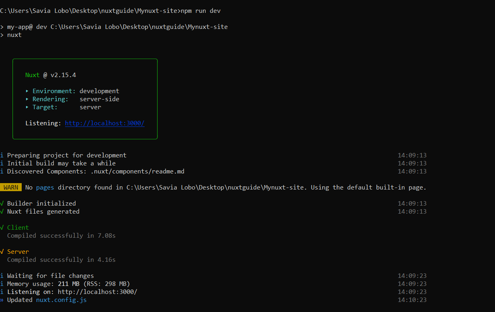

**[RudderStack](https://rudderstack.com/)** is an open-source **Customer Data Pipeline** that enables you to track events from your web, mobile, and server-side sources and send them to your whole customer data stack in real-time. We have also open-sourced our primary GitHub repository - [rudder-server](https://github.com/rudderlabs/rudder-server).

This blog is a guide that will help you to easily integrate your [Nuxt.js](https://nuxtjs.org/) app with RudderStack using our [JavaScript SDK](https://github.com/rudderlabs/rudder-sdk-js). This integration allows you to track real-time user events and send them to your preferred destinations.

You can instrument event streams on your Nuxt.js app using the following three key steps: 


1. Integrate Nuxt.js app with RudderStack JavaScript SDK and set up the tracking code

2. Set up a tool or warehouse destination in RudderStack to route all the event data in real-time

3. Deploy your Nuxt.js app and verify the event stream 


## Pre-Requisites

We assume you have installed and set up your Nuxt.js app. If you haven’t, visit the [official Nuxt.js documentation](https://nuxtjs.org/docs/2.x/get-started/installation/) to get started.


## Step 1: Integrating Your Nuxt.js app with RudderStack JavaScript SDK


### Creating a Source in RudderStack

First, you will need to set up a JavaScript source in your RudderStack dashboard that you will use to track events from your Nuxt.js app. Follow these steps to set up the source:

1. Log into your [RudderStack dashboard](https://app.rudderstack.com/). (If you’re new to RudderStack, [sign up here](https://app.rudderlabs.com/signup?type=freetrial))

2. On successful login, you should see the following dashboard:


 


3. Make a note of the **Data Plane URL**. You will need this URL to integrate your Nuxt.js app with RudderStack.


 


4. Next, create a Source by simply clicking on the **Add Source** button. You can also click on the **Directory** option in the left nav bar and select **Event Streams** under **Sources**, as shown. Then, select **JavaScript**.


 


5. Assign a name to your Source and click on **Next**.


6. Your JavaScript source is now configured and ready to track events. **Note the Write Key associated with this source**. You will need it to set up the RudderStack integration with your Nuxt.js app. 


### Integrating Your Nuxt.js app with RudderStack

Integrate RudderStack with your Nuxt.js app and set up the tracking code following steps given below:

1. Modify the `nuxt.config.js` file in your app’s folder to include the following script:


```
    script: [
      {
        hid: 'Rudder-JS',
        src: 'http://cdn.rudderlabs.com/v1/rudder-analytics.min.js',
        defer: true
      },
      {
        hid: 'rudder-js',
        innerHTML: `
        rudderanalytics = window.rudderanalytics = [];
        var  methods = [
            'load',
            'page',
            'track',
            'identify',
            'alias',
            'group',
            'ready',
            'reset',
            'getAnonymousId',
            'setAnonymousId'
        ];
        for (var i = 0; i < methods.length; i++) {
              var method = methods[i];
              rudderanalytics[method] = function (methodName) {
                    return function () {
                                       rudderanalytics.push([methodName].concat(Array.prototype.slice.call(arguments)));
                    };
                  }(method);
        }
        rudderanalytics.load("YOUR_WRITE_KEY", "DATA_PLANE_URL");
        rudderanalytics.ready(()=>{
          console.log("We are all set");
        });
        //rudderanalytics.page();
        `,
        type: 'text/javascript',
        charset: 'utf-8'
      }
    ],
```


 


```


```


**Important: You can refer to our sample Nuxt.js app present in our [RudderStack Nuxt.js repository](https://github.com/rudderlabs/rudder-analytics-nuxt) for more information on modifying these files.**


## Step 2: Creating a Destination Tool in RudderStack for Routing Your Nuxt.js app Events 


RudderStack supports over [80 third-party tools](https://rudderstack.com/integration/) and platforms to which you can securely send your tracked events. In this tutorial, we will route the Nuxt.js app events to [Google Analytics](https://docs.rudderstack.com/destinations/google-analytics-ga). To add Google Analytics as a destination in RudderStack, follow the steps given below: 


1. In the left navigation bar of your Rudderstack dashboard, click on **Destinations** and select **Add Destination**. Since we have already configured a source, you can simply click on the source and click on the** Add Destination** option, as shown:

**Note**: You can use Connect Destinations option if you have already configured a destination in RudderStack and want to send your event data to that platform. 


2. Next, choose **Google Analytics **as your Destination.


3. Add a name to your destination and click on **Next**, as shown:


4. Now, connect the **JavaScript** source that we have already configured for this tutorial.


5. In the **Connection Settings**, configure your Google Analytics destination with your Google Analytics** Tracking ID** and other optional settings, as shown below. Then, click on **Next**.


6. You can also transform your events before sending them to Google Analytics. For more information on this feature, check out our [documentation](https://docs.rudderstack.com/adding-a-new-user-transformation-in-rudderstack) on **User Transformations**.

7. Voila! Google Analytics is now configured as a destination. You should now see the following source-destination connection in your dashboard: 


## (Alternate) Step 3: Create a Warehouse Destination in RudderStack for Your Nuxt.js app Events

**Important:** _Before you configure a data warehouse as a destination in RudderStack, you will need to set up a new project in your data warehouse. Also, you need to create a new RudderStack user role with the relevant permissions._

_Follow our [docs](https://docs.rudderstack.com/data-warehouse-integrations) to get detailed and step-by-step instructions on how to do it for your preferred data warehouse._

We will set up a **[Google BigQuery warehouse destination](https://rudderstack.com/integration/bigquery/on)** for this tutorial to route all the events from our Nuxt.js app. You can set up a BigQuery project with the required permissions for the service account by following [our documentation](https://docs.rudderstack.com/data-warehouse-integrations/google-bigquery).

Once you have set up the project and assigned the required user permissions, follow these steps:

1. From the Destinations Directory, select **Google BigQuery**:


2. Add a name to your Destination and click on **Next**.


3. Connect to **JavaScript source** from which we will track our Nuxt.js app events. Then, click on Next.


4. Specify the **Connection Credentials**. Enter the **BigQuery Project ID** and the **Staging Bucket Name**. You can refer to these [instructions](https://docs.rudderstack.com/data-warehouse-integrations/google-bigquery#setting-up-google-bigquery) to get this information.


5. Lastly, copy the contents of the private **JSON file**. Find more information on how to do this in our [documentation](https://docs.rudderstack.com/data-warehouse-integrations/google-bigquery#setting-up-the-service-account-for-rudderstack).

That’s all! You have successfully set up BigQuery as a warehouse destination in RudderStack.


## Step 3: Deploying Your Nuxt.js app and Verifying the Event Stream

We have successfully configured our event source and destination. Let’s verify if our event stream works correctly. To do so, let’s deploy our Nuxt.js application and test if the events are tracked by the **JavaScript** **source** and delivered to our **Google Analytics** **destination**. 


Follow these steps to find: 


1. On your Terminal or cmd, navigate to the folder containing your Nuxt.js app.

2. To deploy the app, run` npm run dev` command, as shown: 





3. Open your Nuxt.js app by visiting the URL [http://localhost:3000](http://localhost:3000/) on your browser. 


4. To verify if `rudder-analytics.js` (RudderStack’s JavaScript SDK) has loaded correctly, go to your browser’s **Developer tools** and navigate to the **Network** tab. The following screenshot highlights this option for Google Chrome:


5. Check if RudderStack can track the different pageviews and clicks by clicking on the **Live Events** tab of your JavaScript source on the RudderStack dashboard page:

**Note**: After deploying your app, there can sometimes be a lag before events start sending and are visible in your dashboard and destination. Don’t worry. All events are captured and sent; just be aware that they can take a few minutes to show up.


6. Brilliant! RudderStack has successfully tracked and captured the events:


7. Next, let’s check if the events are sent to our Google Analytics destination. Go to your Google Analytics dashboard and navigate to the **Realtime** - **Events** option. 


We can see one active user on our Nuxt.js app, and the track event is visible too. This shows that the event has been tracked and delivered successfully. Similarly, you should also receive the event in your Google BigQuery warehouse.


## Summary

Monitoring in-app data is crucial to understand the real performance of your app and the user behavior. The insights you gain from this monitoring enable you to update your app to your customers’ needs. Continuously adapting your app to maintain likeability is an important trait of a successful app. RudderStack helps you achieve this securely.

In this tutorial, we learned how to instrument real-time event data on your Nuxt.js App using RudderStack. We integrated the Nuxt.js app with RudderStack JS SDK and learned how to set up the tracking code. We also set up Google Analytics as a destination in RudderStack to route all event streams in real-time and also verify successful delivery of the event streams. 


## Try RudderStack Today

Start using a smarter customer data pipeline that builds your customer data lake on your data warehouse. Use all your customer data. Answer more difficult questions. Send insights to your whole customer data stack.

Join our [Slack](https://resources.rudderstack.com/join-rudderstack-slack) to chat with our team and follow us on social: [Twitter](https://twitter.com/RudderStack), [LinkedIn](https://www.linkedin.com/company/rudderlabs/), [dev.to](https://dev.to/rudderstack), [Medium](https://rudderstack.medium.com/), [YouTube](https://www.youtube.com/channel/UCgV-B77bV_-LOmKYHw8jvBw). Don’t miss out on any updates. [Subscribe](https://rudderstack.com/blog/) to our blogs today!
