[RudderStack](https://rudderstack.com/) is an open-source **Customer Data Pipeline** that allows you to track and send real-time events from your web, mobile, and server-side sources to your entire customer data stack. Our primary repository - [rudder-server](https://github.com/rudderlabs/rudder-server) - is open-sourced on GitHub.

With RudderStack’s open-source [Gatsby plugin](https://github.com/rudderlabs/gatsby-plugin-rudderstack), you can easily integrate your Gatsby site with RudderStack, and track and capture customer events from it in real-time.

To instrument real-time event streams on your Gatsby website using RudderStack, we need to follow these four steps:

1. Instrument your Gatsby website with RudderStack using the Gatsby plugin
2. (Optional) Set up the RudderStack tracking code for your website
3. Create a tool/warehouse destination in RudderStack for your Gatsby site’s event data
4. Deploy your Gatsby site and verify the event stream

## Pre-Requisites

This post assumes you have already installed and set up your Gatsby website. If you haven’t done so, we recommend following the [official Gatsby documentation](https://www.gatsbyjs.com/docs/tutorial/part-zero/) to get started.

## Step 1: Instrument Your Gatsby Website with RudderStack Using the Gatsby Plugin

### Create a Source in RudderStack

Before you instrument your Gatsby site with RudderStack, you will need to set up a JavaScript source in your RudderStack dashboard, which will track and capture events from your website. To do so, follow these steps:

1. Log into your [RudderStack dashboard](https://app.rudderstack.com/). If you don’t have an account, please sign up.

2. Once you have logged in, you should see the following dashboard:

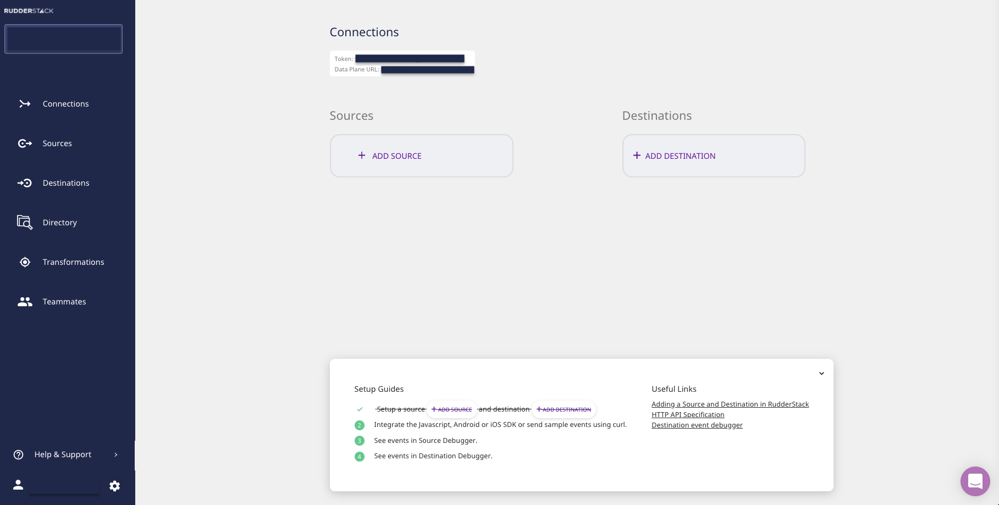

3. Note the **Data Plane URL**, which is required to instrument your Gatsby site with RudderStack. 

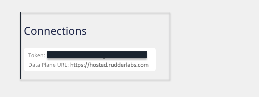

4. The next step is to create a source. To do this, click on the **Add Source** button. Optionally, you can select the **Directory** option on the left nav bar and select **Event Streams** under **Sources**.  
 
For the Gatsby plugin, we will set up a simple **JavaScript** source.

 

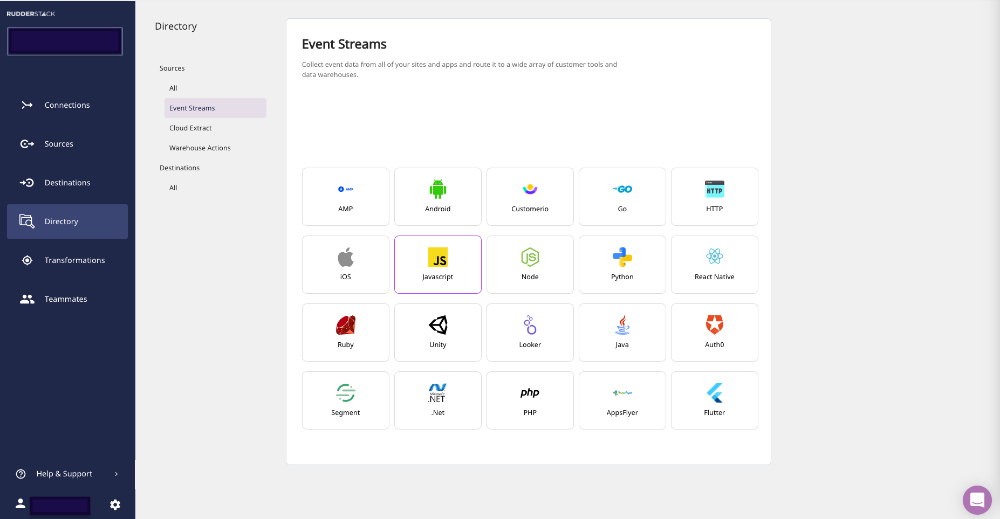

5. Assign a name to your source, and click on **Next**. 

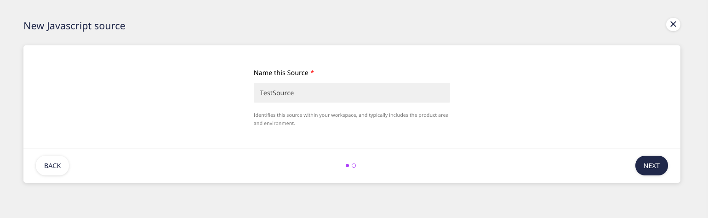

6. Your event source is now configured. Note the **Write Key** associated with this source. This is also required to configure the RudderStack-Gatsby integration. 

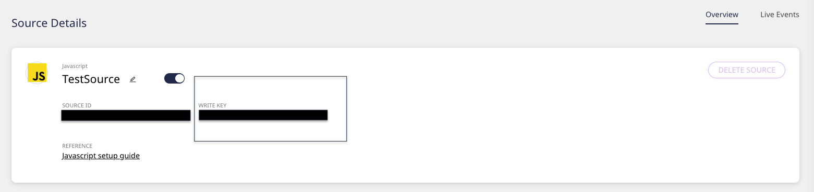

### Instrument your Gatsby site with RudderStack

To instrument your Gatsby website with RudderStack, we will leverage the open-source Gatsby plugin for RudderStack. Follow these steps:

1. Navigate to the root directory, which contains your site’s assets and resources. 

2. Type the following command depending on the package manager of your choice:

*   **For NPM**: `$ npm install --save gatsby-plugin-rudderstack` 

*   **For YARN**: `$ yarn add gatsby-plugin-rudderstack`

3. To set up the plugin, you will need to configure your **gatsby-config.js** file with the source **Write Key** and the **Data Plane URL** that you have obtained from the previous section (**Create a source in RudderStack**). 

4. The configuration options are as shown:

`
plugins: [
  {
    resolve: `gatsby-plugin-rudderstack`,
    options: {
      prodKey: `RUDDERSTACK_PRODUCTION_WRITE_KEY`,
      devKey: `RUDDERSTACK_DEV_WRITE_KEY`,
      trackPage: false,
      trackPageDelay: 50,
      dataPlaneUrl: `https://override-rudderstack-endpoint`,
      controlPlaneUrl: `https://override-control-plane-url`,
      delayLoad: false,
      delayLoadTime: 1000,
      manualLoad: false,
    }
  }
];
`

For details on each of the above parameters, please check out our [docs](https://docs.rudderstack.com/how-to-guides/how-to-integrate-rudderstack-with-a-gatsby-website#the-configuration-options).

### Important Notes

*   Assign the source write key to the `prodKey `parameter if you are using a production environment. Otherwise, assign it to the `devKey `parameter.
*   If you are using a self-hosted control plane to manage your event stream configurations, enter the URL for the `controlPlaneUrl`. For this post, we have used the RudderStack-hosted free control plane, which requires no setup. It also has more features than the open-source control plane, such as **Live Events** - which allows you to view the live events captured from your event source.

## (Optional) Step 2: Set up the RudderStack Tracking Code for Your Website

**Note**: This section describes how to track page views manually using the below JavaScript code snippet. A prerequisite for this is that you have set `trackPage `to `false `in your **gatsby-config.js** file. (Step 4 in the previous section, **Instrument Your Gatsby Site with RudderStack**).

If you want to track pageviews automatically, set `trackPage `to `true `in your **gatsby-config.js** file. For more details on tracking page views automatically, refer to our [docs](https://docs.rudderstack.com/how-to-guides/how-to-integrate-rudderstack-with-a-gatsby-website#tracking-pageviews).

Next, we will set up the code for RudderStack to track page views from our Gatsby site. This means that RudderStack will capture every page view activity each time a user accesses/ views a page on your website.

To do so, follow these steps:

1. Go to your local site repository and navigate to **node_modules** - **gatsby-plugin-rudderstack** folder. 

2. Locate and open the **gatsby-browser.js** file. 

3. Add the following code at the end of this file: 
 
`// gatsby-browser.js 
`

`
    exports.onRouteUpdate = () => {
      window.rudderanalytics && window.rudderanalytics.page();
    };
`

4. Save the file.

## Step 3: Create a Tool Destination in RudderStack for Your Gatsby Site’s Event Data

RudderStack supports over 80 tools to which you can reliably send your event data. For this tutorial, we will configure a **Google Analytics** destination in RudderStack. To configure this destination in RudderStack, follow these steps:

1. Select the **Destinations** option in the left nav bar of your dashboard, and click on the **Add Destination** button. Since you have already configured a source, you can also click on the **Add Destination** button as shown below: 
 
**Note**: If you have already configured a destination in RudderStack before and want to send your event data to that platform, use the **Connect Destinations** option to connect to your source. 

2. Select **Google Analytics** from the list of destinations.

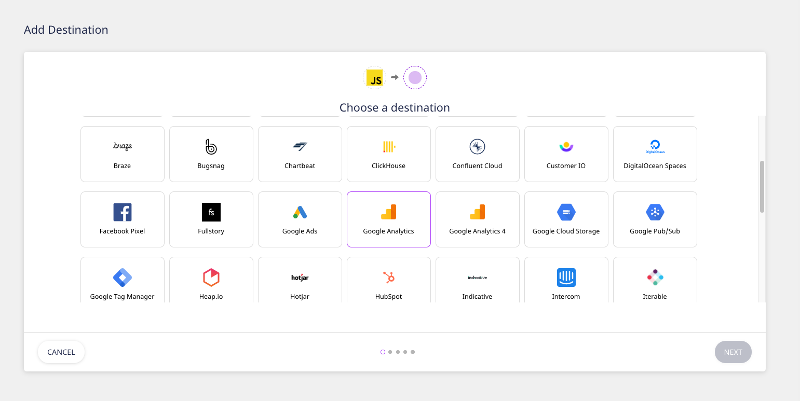
 

3. Assign a name to your destination, and click on **Next**.

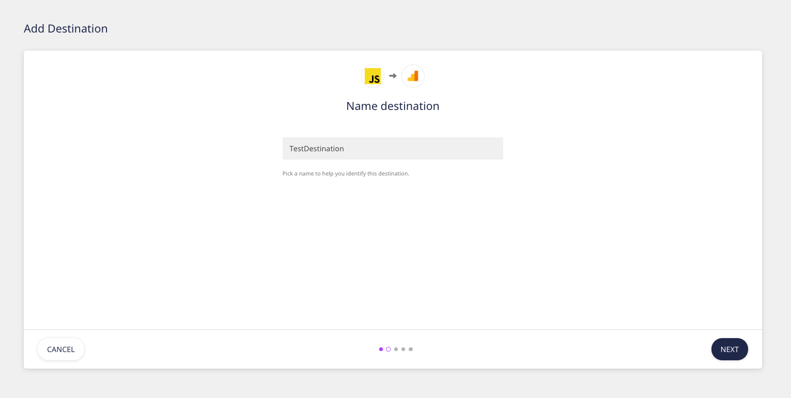
 

4. Choose the source. We will select the **JavaScript** source we have already configured for this tutorial.

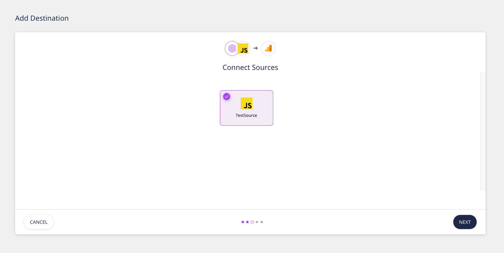
 

5. Add the relevant **Connection Settings**. Most importantly, you will be required to enter the Google Analytics **Tracking ID**. You can also configure the other optional settings as shown below, and then click on **Next**.

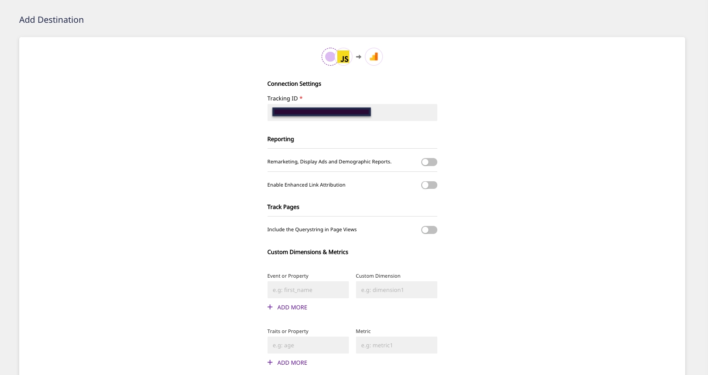
 

6. RudderStack gives you the option to transform your events before sending them to your destination. Get more information on RudderStack’s user transformation feature in our **[docs](https://docs.rudderstack.com/adding-a-new-user-transformation-in-rudderstack)**. \

7. Your destination is now configured. You should now see the following source-destination connection in your dashboard:

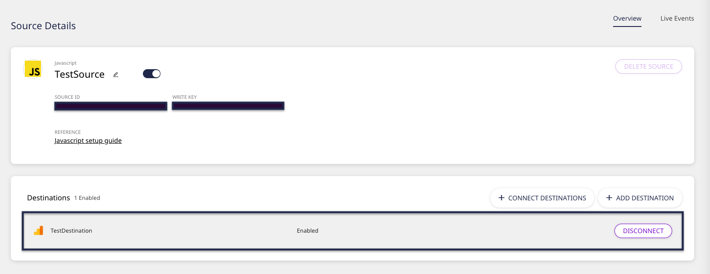
 

## (Alternate) Step 3: Create a Warehouse Destination in RudderStack for Your Gatsby Site’s Event Data

**Important**: Before configuring a data warehouse as a RudderStack destination, you will need to set up a new project in your warehouse. Also, you will need to create a new RudderStack user role with the relevant permissions. Follow our [docs](https://docs.rudderstack.com/data-warehouse-integrations) to get detailed, step-by-step instructions on how to do so for the data warehouse of your choice.

We will set up a Google BigQuery warehouse destination for this tutorial to route all the events from our Gatsby website. As mentioned above, set up a BigQuery project with the required permissions for the service account by following [our doc](https://docs.rudderstack.com/data-warehouse-integrations/google-bigquery).

Once you have set up the project and the required user permissions, follow these steps:

1. From the list of destinations, select **Google BigQuery**, as shown:

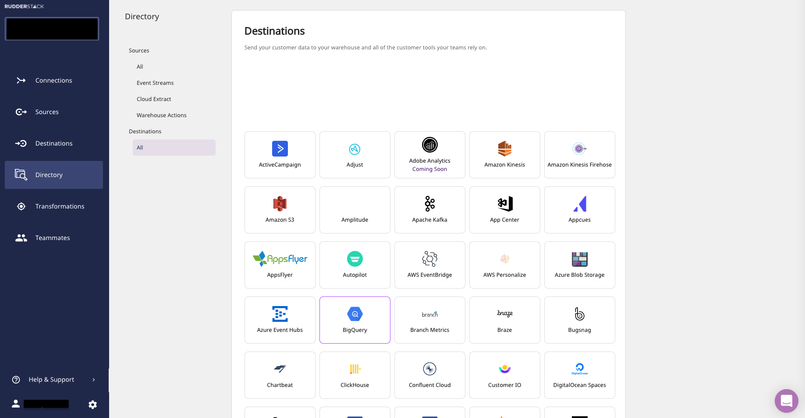

2. Assign a name to this destination, and click on **Next**.

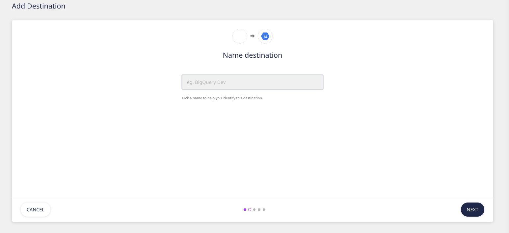

3. Choose the source from which you want to send the events. We will select the **JavaScript** source associated with our Gatsby website for this destination.

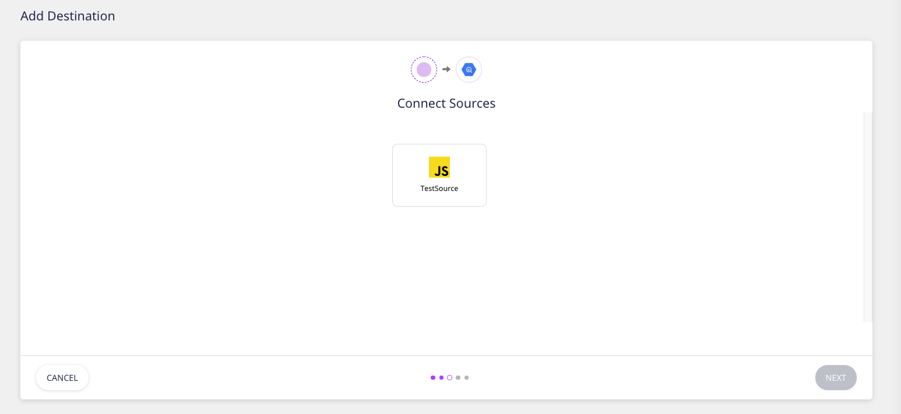

4. Specify the **Connection Credentials**. Enter the **BigQuery Project ID** and the **Staging Bucket Name**. Follow these [instructions](https://docs.rudderstack.com/data-warehouse-integrations/google-bigquery#setting-up-google-bigquery) to get this information.

5. Copy the contents of the private JSON file. More information on how to do this in our [doc](https://docs.rudderstack.com/data-warehouse-integrations/google-bigquery#setting-up-the-service-account-for-rudderstack).

That’s it! You have successfully set up BigQuery as a warehouse destination in RudderStack.

## Step 4: Deploy Your Gatsby Site and Verify the Event Stream

To verify if everything works correctly, let’s finally deploy our website and test if the events are being delivered to the destination. For this post, we will test the event stream for our Google Analytics destination, which we set up in **Step 3 (Instrument a Tool Destination in RudderStack)**.

Follow these steps:

1. Navigate to the folder of your local site, as shown:

2. Run the command `gatsby build` if you are using a production environment. If you are using a development environment, run the command `gatsby develop`.

3. Since we are using a production environment, let’s deploy our site using `gatsby serve`. A localhost URL will be served, which we can then use to access our site:

4. Browse through your website by clicking on different posts or pages.

5. See if RudderStack can track the different page views by going to the **Live Events** section on the source dashboard page:

    **Note: After deploying your production site, there can be a lag before events start sending. Don’t worry. All events are captured and sent; just be aware that they can take a few minutes to show up in the Live Events viewer and in your downstream destinations after production deployments.**

6. RudderStack can successfully track and capture the pageview events, as seen below:

7. Now, let’s check if the events are sent to Google Analytics as well by going to your Google Analytics dashboard and navigating to **Realtime** - **Events**.

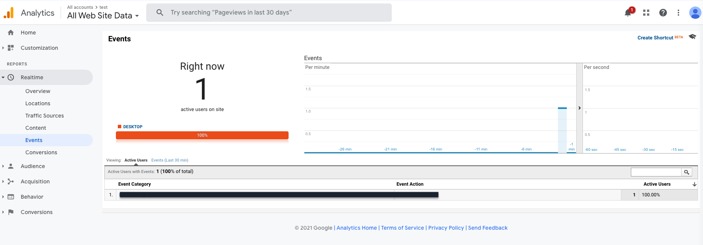

We see one active user on our Gatsby website, which means the page view event was delivered successfully. Similarly, you should also be able to see the event received in your Google BigQuery warehouse. 

## Try RudderStack Today

Start using a smarter customer data pipeline that builds your customer data lake on your data warehouse. Use all your customer data. Answer more difficult questions. Send insights to your whole customer data stack. Sign up for RudderStack Cloud Free today.

Join our [Slack](https://resources.rudderstack.com/join-rudderstack-slack) to chat with our team, check out our open source repos on [GitHub](https://github.com/rudderlabs), subscribe to [our blog](https://rudderstack.com/blog/), and follow us on social: [Twitter](https://twitter.com/RudderStack), [LinkedIn](https://www.linkedin.com/company/rudderlabs/), [dev.to](https://dev.to/rudderstack), [Medium](https://rudderstack.medium.com/), [YouTube](https://www.youtube.com/channel/UCgV-B77bV_-LOmKYHw8jvBw). Don't miss out on any updates. [Subscribe](https://rudderstack.com/blog/) to our blogs today!
