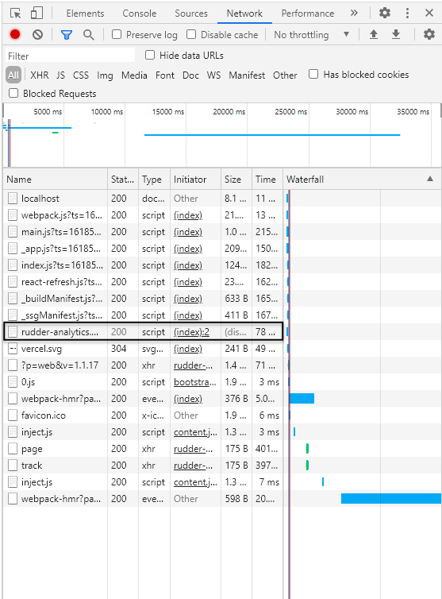

**[RudderStack](https://rudderstack.com/)** is an open-source smart customer data pipeline tool that lets you track, collect, and send events from your web, mobile, and server-side sources in real-time. You can check out our open-sourced primary repository - [rudder-server](https://github.com/rudderlabs/rudder-server) - on GitHub.

This blog will show how you can easily integrate your [Next.js](https://nextjs.org/) app with RudderStack using our [JavaScript SDK](https://github.com/rudderlabs/rudder-sdk-js). With this integration, you can track real-time user events and send them to your preferred destinations. 

You can instrument event streams on your Next.js app using RudderStack by following these three steps:

1. Integrate your Next.js app with RudderStack’s JavaScript SDK and set up the tracking code
2. Set up a tool or warehouse destination in RudderStack to route all the event data in real-time
3. Deploy your app and verify the event stream

## Pre-Requisites

This post assumes you have already installed and set up your Next.js app. If you haven’t done so, we recommend following the [official Next.js documentation](https://nextjs.org/docs) to get started.

## Step 1: Integrate Your Next.js app with RudderStack’s JavaScript SDK

### Creating a Source in RudderStack

Before you get started, you will need to set up a JavaScript source in your RudderStack dashboard, which you can then use to track events from your Next.js app. Follow these steps to set up the source:

1. Log into your [RudderStack dashboard](https://app.rudderstack.com/). If you’re new to RudderStack, [sign up here](https://app.rudderlabs.com/signup?type=freetrial).

2. Upon login, you should see the following dashboard: 

3. Note the **Data Plane URL**. You will need this URL to integrate your Next.js app with RudderStack. 

4. Next, create a Source. To do so, simply click on the **Add Source** button. You can also click on the **Directory** option in the left nav bar and select **Event Streams** under **Sources**, as shown. Then, select **JavaScript**.

 

5. After assigning a name to your source, click on **Next**. 

6. Your JavaScript source is now configured and ready to track events. Note the **Write Key** associated with this source. This is also required to set up the RudderStack integration with your Next.js app. 

### Integrate Your Next.js app with RudderStack

To integrate RudderStack with your Next.js app and set up the tracking code, follow these steps:

1. Create a new `_document.js` file in your app’s **pages** folder, as shown:

2. Add the following lines in your index.js file (present in your app’s pages folder), as shown:

`gist:Veenap/a1d1454492cc356cd70600d9d634969d`

**Important: You can refer to our sample Next.js app present in our [RudderStack Next.js repository](https://github.com/rudderlabs/rudder-analytics-next) for more information on modifying these files.**

## Step 3: Create a Tool Destination in RudderStack for Routing Your Next.js app Events

RudderStack currently supports more than [80 third-party tools](https://rudderstack.com/integration/) and platforms to which you can reliably send your tracked events. For this tutorial, we will route the Next.js app events to **[Google Analytics](https://docs.rudderstack.com/destinations/google-analytics-ga)**. To configure Google Analytics as a destination in RudderStack, follow these steps:

1. In the left navigation bar of your dashboard, click on **Destinations**, followed by **Add Destination**. Since we have already configured a source, you can simply click on the source and choose the **Add Destination** option, as shown: 
 
**Note**: If you have already configured a destination in RudderStackand want to send your event data to that platform, use the **Connect Destinations** option. 
 

2. From the list of destinations, select **Google Analytics**.

 

3. Give a name to your destination and click on **Next**, as shown:

 

4. Then, select the **JavaScript** source that we have already configured for this tutorial.

5. In the **Connection Settings**, configure your Google Analytics destination with your Google Analytics **Tracking ID** and other optional settings, as shown below. Then, click on **Next**.

6. You can also transform your events before sending them to Google Analytics. For more information on this feature, check out our [docs](https://docs.rudderstack.com/adding-a-new-user-transformation-in-rudderstack). 

7. That’s it! Google Analytics is now configured as a destination. You should now see the following source-destination connection in your dashboard:

## (Alternate) Step 3: Create a Warehouse Destination in RudderStack for Your Next.js app Events

**Important**: Before you configure a data warehouse as a destination in RudderStack, you will need to set up a new project in your data warehouse. Also, you need to create a new RudderStack user role with the relevant permissions. 

Follow our [docs](https://docs.rudderstack.com/data-warehouse-integrations) to get detailed, step-by-step instructions on how to do so for the data warehouse of your choice.

For this tutorial, we will set up a Google BigQuery warehouse destination to route all the events from our Next.js app. As mentioned above, you can set up a BigQuery project with the required permissions for the service account by following [our doc](https://docs.rudderstack.com/data-warehouse-integrations/google-bigquery).

Once you have set up the project and assigned the required user permissions, follow these steps:

1. From the list of destinations, select **Google BigQuery**:

2. Give a name to this destination. Then, click on **Next**.

3. Choose the **JavaScript** source from which we will track our Next.js app events. Then, click on **Next**.

4. Specify the **Connection Credentials**. Enter the **BigQuery Project ID** and the **Staging Bucket Name**. Follow these [instructions](https://docs.rudderstack.com/data-warehouse-integrations/google-bigquery#setting-up-google-bigquery) to get this information.

5. Finally, copy the contents of the private JSON file. Find more information on how to do this in our [doc](https://docs.rudderstack.com/data-warehouse-integrations/google-bigquery#setting-up-the-service-account-for-rudderstack).

That’s it! You have successfully set up BigQuery as a warehouse destination in RudderStack.

## Step 4: Deploy Your Next.js app and Verify the Event Stream

Now that we’ve successfully configured our event source and destination, it’s time to verify if our event stream works correctly. To do so, let’s deploy our Next.js application and test if the events are tracked by the **JavaScript** source and delivered to **Google Analytics** - our destination.

To do this, follow these steps:

1. Navigate to the folder containing your Next.js app.

2. To deploy the app, run the command `npm run dev`, as shown:

3. Open your app by going to the URL [http://localhost:3000](http://localhost:3000) on your browser. Refresh the page and click on various links to track different events:

4. To verify if `rudder-analytics.js` (RudderStack’s JavaScript SDK) has loaded correctly, you can go to your browser's developer tools and navigate to the **Network** tab. The following screenshot highlights this option for Google Chrome:

5. See if RudderStack can track the different pageviews and clicks by going to the **Live Events** tab of your JavaScript source on the RudderStack dashboard page:

**Note: After deploying your app, there can sometimes be a lag before events start sending and are visible in your dashboard and destination. Don’t worry. All events are captured and sent; just be aware that they can take a few minutes to show up.**

6. RudderStack has successfully tracked and captured the events, as seen below:

7. Now, let’s check if the events are sent to our Google Analytics destination. Go to your Google Analytics dashboard and navigate to the **Realtime** - **Events **option.

We see one active user on our Next.js app, and the track event is visible too. This means the event was tracked and delivered successfully. Similarly, you should also receive the event in your Google BigQuery warehouse. 

## **Try RudderStack Today**

Start using a smarter customer data pipeline that builds your customer data lake on your data warehouse. Use all your customer data. Answer more difficult questions. Send insights to your whole customer data stack. 

Join our [Slack](https://resources.rudderstack.com/join-rudderstack-slack) to chat with our team and follow us on social: [Twitter](https://twitter.com/RudderStack), [LinkedIn](https://www.linkedin.com/company/rudderlabs/), [dev.to](https://dev.to/rudderstack), [Medium](https://rudderstack.medium.com/), [YouTube](https://www.youtube.com/channel/UCgV-B77bV_-LOmKYHw8jvBw). Don't miss out on any updates. [Subscribe](https://rudderstack.com/blog/) to our blogs today!
