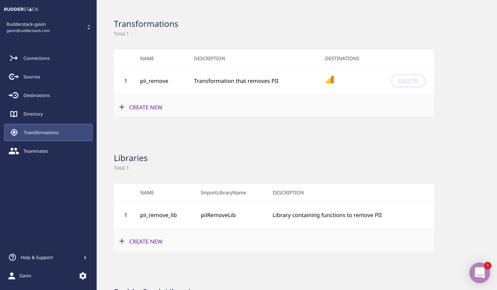
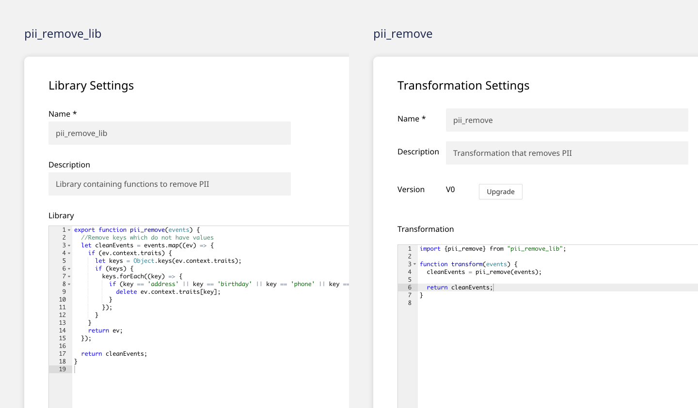
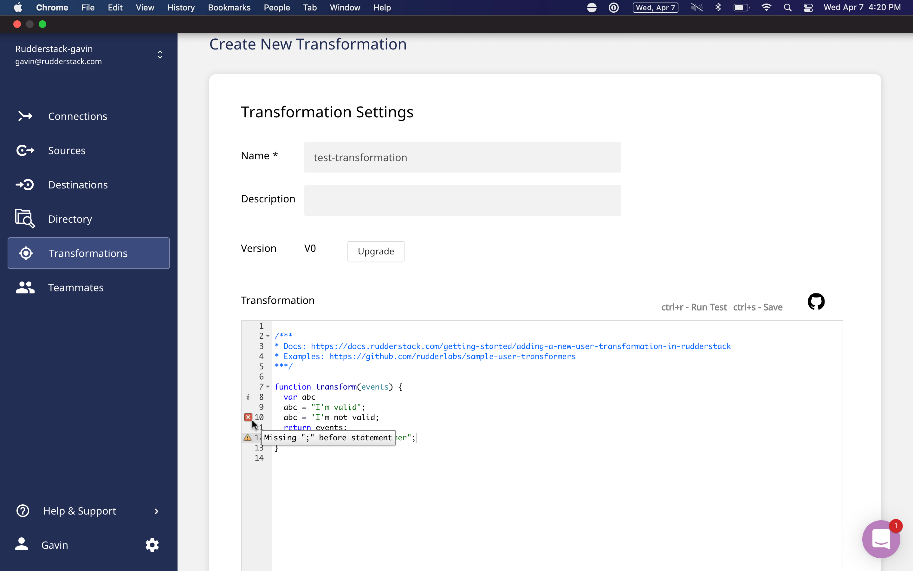

Transformations are one of the most powerful and loved features of RudderStack. They let you transform any data that you send through RudderStack and you can use them across Event Stream, Warehouse Actions, and Cloud Extract pipelines. They are easy to build, debug, and manage; and they run in real-time, after data collection and before delivery to a destination. They’re data transformations that work like you think they should.

Today, we’re making Transformations even better and easier to use. We exposed the **Transformations API** so you can programmatically create and manage your transformations. We added the **Transformations Library**, modular blocks of transformation code that can be saved and reused as part of other transformations, just like libraries in software programming. We also added a transformation **debugger** so you can validate that your transformations will run before saving and applying them to your pipelines.

## Transformations API

Currently, our users could only deploy transformations from within the RudderStack Control Plane (aka our UI). To make Transformations easier to create and manage, we’ve launched the RudderStack Transformations API.

The Transformations API enables you to perform multiple operations - create, read, update and delete - on your transformations and transformation libraries programmatically via simple HTTP API calls. It also allows you to publish multiple transformations/libraries in a single operation - a functionality that is not yet available on the RudderStack UI.

Learn more about the Transformations API in our post, [RudderStack’s Transformations API](https://rudderstack.com/blog/rudderstacks-transformations-api).

## Transformations Library 

Currently, transformations are reusable. Only one transformation can be applied to a pipeline destination though. So if you need to reuse two transformations on a pipeline, you can’t. To solve this problem and to make Transformations more powerful and flexible overall, we’ve launched the Transformations Library.

The Transformations Library lets you save blocks of transformation code to your organization’s library.

You can reuse them as part of other transformations, just like libraries in software programming.

Libraries make Transformations modular, and make code reuse and debugging much easier.

## Debugger

Currently, if you have a code error in a transformation, it isn’t easy to identify. Debugging why a transformation won’t run requires more work than it should. To solve this problem and make it easier to build transformations in the RudderStack Control Plane, we’ve launched a transformation debugger.

## Transformations Let you go Further with Your Event Data 

Transformations can help you programmatically add, remove, and/or change data in your pipelines before it’s delivered to a destination. It helps you easily implement transformations for common yet powerful logic. 

### Aggregation

Aggregations collect data from multiple sources and stores it in a single format to perform statistical analysis. Aggregated data makes it easier to understand customer interactions or analyze marketing campaigns and improvise your marketing strategies. 

### PII Masking

Organizations often avoid sending PII data to downstream tools as it may lead to security challenges. However, PII may escape due to unexpected development errors. Transformation can help capture and mask sensitive data.

### Hunting Down the Nulls

Change in event schemas, manual errors, or decommissioned fields cause data errors. Developers need the ability to to detect data anomalies and react on them closely from the backend. This saves data engineers valuable time in fixing a broken data pipeline. With RudderStack Transformations, you can detect common errors such as _null_ values and correct early on the data pipeline.

## Try RudderStack Today

Start building a smarter customer data pipeline. Use all your customer data. Answer more difficult questions. Send insights to your whole customer data stack. Sign up for [RudderStack Cloud Free](https://app.rudderlabs.com/signup?type=freetrial) today. 

Join our [Slack](https://resources.rudderstack.com/join-rudderstack-slack) to chat with our team, check out our open source repos on [GitHub](https://github.com/rudderlabs), subscribe to [our blog](https://rudderstack.com/blog/), and follow us on social: [Twitter](https://twitter.com/RudderStack), [LinkedIn](https://www.linkedin.com/company/rudderlabs/), [dev.to](https://dev.to/rudderstack), [Medium](https://rudderstack.medium.com/), [YouTube](https://www.youtube.com/channel/UCgV-B77bV_-LOmKYHw8jvBw).
