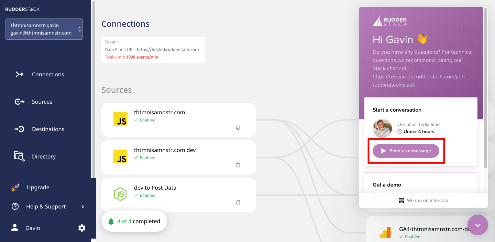
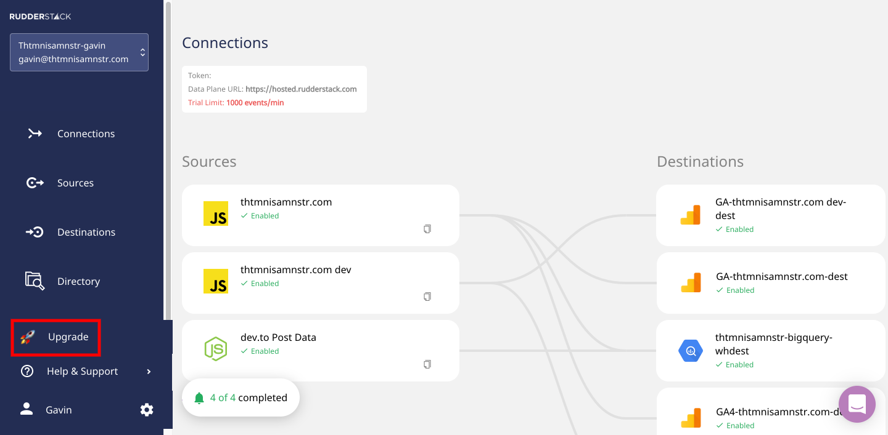
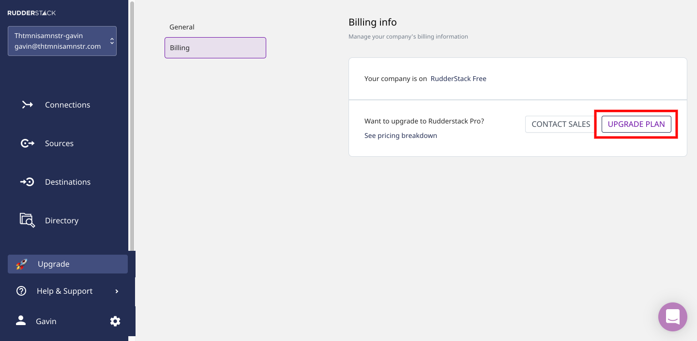
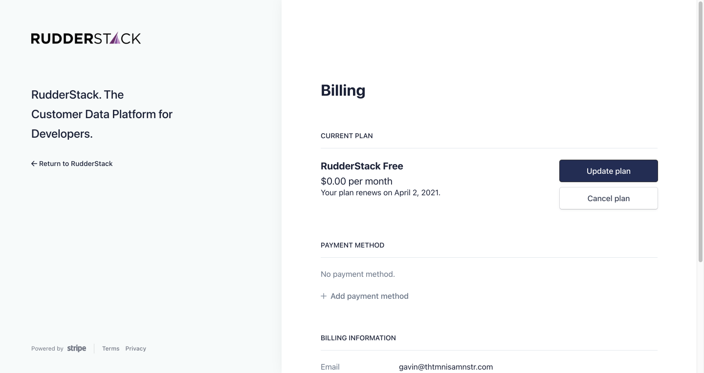
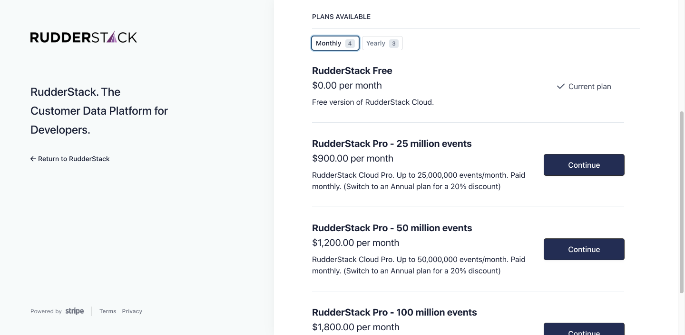

## Upgrade to RudderStack Pro with just a credit card. No more complicated invoicing processes or mandatory sales calls.

Today, we are announcing the availability of our RudderStack Pro self-serve plans. Now, you can purchase RudderStack Pro, up to 100M events per month, with just a credit card. No complicated invoicing processes and no mandatory discussions with salespeople.

_We also announced our product redesign along with our RudderStack Pro self-serve plans. Read about that in our blog post- [Good Products Deserve Good Design: Introducing the Redesigned RudderStack](https://rudderstack.com/blog/good-products-deserve-good-design-introducing-the-redesigned-rudderstack)._

## Our Self-Serve Plans

All of our self-serve plans give you access to RudderStack Pro (you can learn more about how our Pro tier compares to our Free and Enterprise tiers on [our Pricing page](https://rudderstack.com/pricing/)). We offer three plans based on monthly event volume- monthly, pay-as-you-go, and reduced annual pricing.

<table>
  <tr>
   <td><strong>Event Volume</strong>
   </td>
   <td>

<strong>Monthly Price</strong>

   </td>
   <td>

<strong>Annual Price</strong>

<em>20% discount</em>

   </td>
  </tr>
  <tr>
   <td>Up to 25M events/mth
   </td>
   <td>

$900

   </td>
   <td>

$9,000

   </td>
  </tr>
  <tr>
   <td>Up to 50m events/mth
   </td>
   <td>

$1,200

   </td>
   <td>

$12,000

   </td>
  </tr>
  <tr>
   <td>Up to 100m events/mth
   </td>
   <td>

$1,800

   </td>
   <td>

$18,000

   </td>
  </tr>
</table>

If you want access to RudderStack Enterprise or your event volumes are greater than 100m events per month, contact our sales team - by either [requesting a demo](https://resources.rudderstack.com/request-a-demo) or sending us a message in our application like in the image below.

## How to Upgrade from RudderStack Free to a RudderStack Pro Self-Serve Plan

1. Login to [RudderStack Cloud](https://app.rudderstack.com/login). If you don’t have an account, [sign up for free](https://app.rudderlabs.com/signup?type=freetrial).
2. Click on **Upgrade** in the left navigation menu:

    

3. Click on the **Upgrade Plan** button:

    

4. This takes you to our Billing page. Here you can add a payment method and update your billing information.

    

5. Click on the **Update Plan** button.
6. Select the monthly or yearly plan for your desired monthly event volume and click the **Continue** button.

    

7. Click the **Confirm** button to finalize your new RudderStack Pro plan.

    

## Try RudderStack Today

If you haven’t already, sign up for [RudderStack Free](https://app.rudderlabs.com/signup?type=freetrial) today. Start using a smarter customer data pipeline that builds your customer data lake on your data warehouse. Use all your customer data. Answer more difficult questions. Send insights to your whole customer data stack.

Join us on [Slack](https://resources.rudderstack.com/join-rudderstack-slack) to chat with our team, explore our open source repos on [GitHub](https://github.com/rudderlabs), subscribe to [our blog](https://rudderstack.com/blog/), and follow us on our socials: [Twitter](https://twitter.com/RudderStack), [LinkedIn](https://www.linkedin.com/company/rudderlabs/), [dev.to](https://dev.to/rudderstack), [Medium](https://rudderstack.medium.com/), [YouTube](https://www.youtube.com/channel/UCgV-B77bV_-LOmKYHw8jvBw). Don’t miss out on any updates. [Subscribe](https://rudderstack.com/blog/) to our blogs today!
