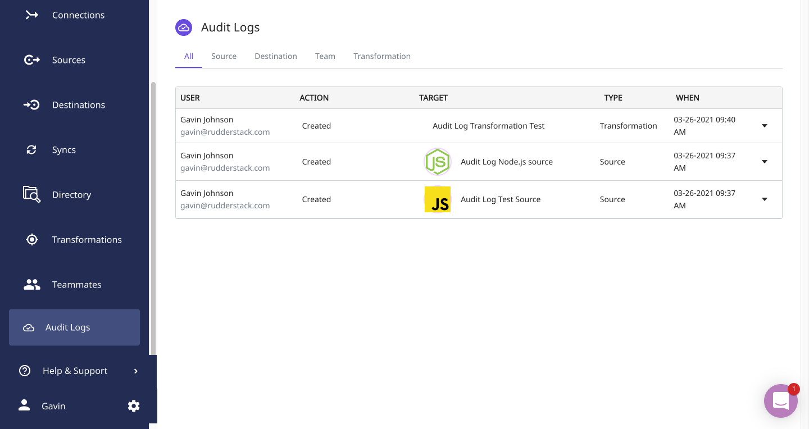
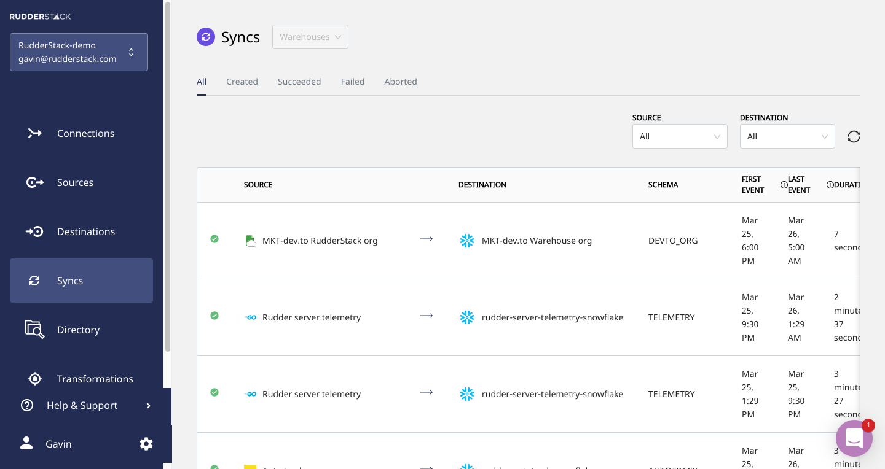

Our engineering teams continually build and release new features. We tell you, our users, about various functionality we build in our launch blogs. Every feature isn’t big enough for its own launch, though. To keep you up-to-date on everything that doesn’t fit into a launch, we will be writing regular, recurring product roundups to cover the features, fixes, and integrations that our engineers build.

## New Features, Enhancements, and Bug Fixes

### Transformations API

Users love our Transformations. It is one of our most popular features. Its API wasn't accessible until now, though. We released improvements to the Transformations API and exposed it to users, programmatically interacting with the Transformations functionality.

With the Transformations API, you can:

*   Programmatically add and remove transformations to the platform.

    **Note:** New transformations are always checked for successful compilation and execution.

*   Create an organization-wide sandbox where your team can store transformations before publishing them to the live environment.
*   Define Libraries - collections of transformations that can be re-used in RudderStack.
*   Version control your transformations - every change in a transformation creates a new version, and the whole lineage of a single transformation is available.

Also included with this release is a selection of useful and popular transformation libraries, exposed under the name RudderStack Libraries in the Transformations UI.

### Warehouse Syncs

We released a new feature called **Warehouses Syncs**. It gives you observability for the pipelines that load data into your warehouse.

With Warehouse Syncs, you can:

*   See a chronologically ordered list of all syncs to all your data warehouse destinations in RudderStack.
*   Find important metadata, like the total time a sync took, if the sync was successful or not, what the source was, etc.
*   Search syncs based on various criteria.
*   Get detailed information about each sync by clicking on the sync in the UI, e.g., details on the table data synced to, error reports, etc.

### Audit Logs

Security and compliance around data and its infrastructure are becoming increasingly important for our users. That’s why we released the first version of **Audit Logs**.

The Audit Log is a log of all the actions every user has taken in RudderStack. Actions that are tracked include:

*   CRUD operations for every object in RudderStack (e.g., Sources, Destinations, and connections).
*   Invitations and user management events.
*   Logins and password operations.

### Other Features and Bug Fixes

In addition to the above features, we also released the following minor features, enhancements, or bug fixes.

*   Improved performance for loading data to warehouses.
*   Improvements to the Data Governance API.
*   Improved sign-up and login flows, including Google authentication.
*   Updated UX for many user journeys.
*   Other bug fixes.

## New integrations

### Event Stream Sources

*   [Appcues](https://rudderstack.com/integration/appcues/)
*   [Userlist](https://rudderstack.com/integration/userlist/)
*   [Microsoft App Center](https://rudderstack.com/integration/app-center/)
*   [ActiveCampaign](https://rudderstack.com/integration/activecampaign/)
*   [Klaviyo](https://rudderstack.com/integration/klaviyo/) 
*   [Salesforce Marketing Cloud](https://rudderstack.com/integration/salesforce-marketing-cloud/)
*   [CleverTap](https://rudderstack.com/integration/clevertap/)
*   Kustomer

### Cloud Extract Sources

*   [Zendesk](https://rudderstack.com/integration/zendesk-source/) → Support Data
*   Pardot → Marketing Data
*   Stripe → Financial Data
*   Improved usability for sources, e.g., now it's possible to define prefixes for tables.
*   Bug fixes for various sources.

## Try RudderStack Today

If you haven’t already, sign up for [RudderStack Free](https://app.rudderlabs.com/signup?type=freetrial) today. Start using a smarter customer data pipeline that builds your customer data lake on your data warehouse. Use all your customer data. Answer more difficult questions. Send insights to your whole customer data stack.

Join us on [Slack](https://resources.rudderstack.com/join-rudderstack-slack) to chat with our team, explore our open source repos on [GitHub](https://github.com/rudderlabs), subscribe to [our blog](https://rudderstack.com/blog/), and follow us on our socials: [Twitter](https://twitter.com/RudderStack), [LinkedIn](https://www.linkedin.com/company/rudderlabs/), [dev.to](https://dev.to/rudderstack), [Medium](https://rudderstack.medium.com/), [YouTube](https://www.youtube.com/channel/UCgV-B77bV_-LOmKYHw8jvBw). Don’t miss out on any updates. [Subscribe](https://rudderstack.com/blog/) to our blogs today!
