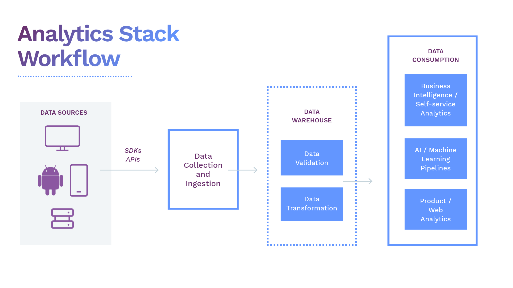

_Thank you Yakko Majuri from [PostHog](https://posthog.com/) for coming up with the idea for this article and for your feedback and contributions to it._

A data analytics stack enables all of the teams across your organization to look at important metrics and make data-driven decisions. It integrates different technologies needed to efficiently collect, store, transform, and analyze your data and to derive critical insights from it. 

When it comes to using an analytics stack, businesses are often faced with two choices - buy one or more proprietary tools or build an open source analytics stack. While proprietary tools often offer best-in-class analytics and data management services, they also have some major downsides that include premium pricing plans, vendor lock-in, limited flexibility, and, often, no ability to host the solution on your own infrastructure. 

These downsides as well as the high level of sophistication of today's open source tools are why we make the argument that you should build an open source analytics stack. In this post, we'll talk about why you should use open source software to build your analytics stack and the types of tools you need along with some popular open source examples of each.

## Why an open source analytics stack?

Setting up your analytics stack with proprietary software often allows you to get started quickly but comes at the significant cost of data ownership. This often makes these solutions unsuitable for large enterprises, who either build key parts of their own stack from scratch or require extensive due diligence, to ensure compliance with their own security protocols as well as regulations such as GDPR and CCPA, before incorporating a new proprietary tool into their processes.

Open source software, on the other hand, reduces the concerns regarding data privacy and ownership, since users can deploy the software in their own infrastructure. First, companies can ensure the software meets their requirements, as open source software gets rid of the “black box” effect, allowing anyone to inspect the code that they’re running. Second, not sending any data to third parties makes compliance with enterprise security protocols and data legislation easier. And, most importantly, having full access to the underlying data you’re processing makes it much simpler to perform custom analytics, run ETL between platforms, and even tweak the software to your specific use-cases.

Open source software also offers better flexibility in terms of the tools you use to build your stack. You aren’t tied to a handful of proprietary solutions that it fiscally makes sense to run multiple business processes through, inevitably delivering less than optimal performance across many, if not all, of those processes. Using open source tools allows you to, instead, use the best solution to solve each problem. This encourages teams to innovate and gives them the freedom to leverage better tools and features than what many proprietary solutions deliver.

Proprietary tools make you heavily dependent on vendors for updates, bug fixes, and more. Open source products help prevent this vendor lock-in, since users themselves can make or suggest changes to the product, without having to rely on vendors for updates and bug fixes. It’s also easier to migrate away from a tool when you’re in full control of its deployment and the data it handles.

Additionally, a lot of this proprietary software is ridiculously expensive. If you don’t have a six- or seven-figure budget for an analytics stack, open source tooling is really your best choice. Open source software, in addition to generally being cheaper to try out at the early stages, allows companies to more easily scale their infrastructure up and down as needed to cope with fluctuating volumes, optimizing for lower costs as a result. Moreover, support is not limited to the company who developed the software, as it can be sourced from the open source community for free.

To achieve the control, flexibility, and data-privacy of open source, you often have to build tools in-house. However, leveraging existing, high-quality, open source software means significantly reducing development and product costs, for what is likely a much higher quality and more easily maintained solution than most can build in-house.

## What does an open source analytics stack look like?

A great analytics stack should be able to:

*   Integrate data (in different formats) sitting within multiple platforms.
*   Ingest data into a storage system (a data warehouse).
*   Clean and Transform data for different use cases.
*   Use transformed data for analytics like visualization or machine learning.

Here’s what an ideal open source analytics stack would look like:

Our goal is to help you understand how building your entire data analytics stack with completely open source solutions can help your business scale with minimal cost and a high-level of security.

## What tools make up an open source analytics stack?

Almost all data analytics systems follow the same basic approach for setting up their analytics stack:  data collection, data processing, and data analytics. The tools used to perform each of these activities form the analytics stack. An open source analytics stack is no different, just that it uses open source tools to obtain the same results or better than proprietary tools. 

Let's understand each of the processes in detail and how open source tools contribute to each process in the open source analytics stack.

### Data Ingestion and Transformation

The primary step for collecting your data for analytics is to ingest it from all your sources including your in-house applications, SaaS tools, data from your IoT devices, and all other sources. Various tools are available to make this process a seamless experience. 

#### ETL vs ELT

Until recently, data ingestion followed a simple ETL (Extract, Transform, and Load) process in which data was collected from a source, realigned to fit the properties of a destination system or business requirements, and then loaded into that system. Creating in-house ETL tools would mean taking developers away from the user-facing products which puts the accuracy, availability, and consistency of the analytics environment at risk. While commercially packaged ETL solutions are available, an open source alternative is a great option. One such example is **Singer** ([website](https://www.singer.io/), [GitHub](https://github.com/singer-io)), an open source ETL tool used to program connectors for sending data between any custom sources and targets like web APIs and files. 

Due to the rise in cloud-based data warehouses, businesses can directly load all the raw data into the data warehouse without prior transformations. This process is known as ELT (Extract, Load, Transform) and gives data and analytics teams freedom to develop ad-hoc transformations based on their particular needs. ELT became popular as the cloud's processing power and scale became better suited to transforming data. **DBT** ([website](https://www.getdbt.com/), [GitHub](https://github.com/fishtown-analytics/dbt)) is a popular open source tool recommended for ELT and allows businesses to transform data in their warehouses more effectively.

#### Real-time data streams

With the increase in real-time data streams and event streams, certain use cases emerged that require access to real-time data such as financial services risk reporting or detecting a credit card fraud. Real-time streams can be obtained using a stream processing framework like **Apache Kafka** ([website](https://kafka.apache.org/), [GitHub](https://github.com/apache/kafka)). The focus is to direct the stream of data from various sources into reliable queues where data can be automatically transformed, stored, analyzed, and reported concurrently.

#### Customer Data Platform (CDP)

Talking about successful data ingestion tools, most businesses rely increasingly on different Customer Data Platforms (CDPs) that track, collect, and ingest data from multiple sources and systems into a single platform to get a unified customer view. **Apache Unomi** ([website](https://unomi.apache.org/), [GitHub](https://github.com/apache/unomi)) is a perfect example of an open source CDP that ingests data and collects it at one place. 

However, limitations to traditional CDPs, especially around connecting to best of breed customer tooling and exposing data for use across an organization have driven a new generation of non-CDPs. Solutions like **Snowplow’s** ([website](https://snowplowanalytics.com/), [GitHub](https://github.com/snowplow)) data delivery platform and **RudderStack’s** ([website](https://rudderstack.com/), [GitHub](https://github.com/rudderlabs/rudder-server)) smart customer data pipeline ingest data from a multitude of sources, apply in-stream transformations, and route data to your data warehouse, like Snowplow, or your warehouse plus your preferred customer tooling destinations for activation, like RudderStack. 

### Data Warehouses

This is the next important piece of the analytics stack. Data warehouses act like a common repository for companies to store data collected from different sources where it can be transformed or combined for different use cases. Data warehouses store both raw and transformed data and can be easily accessed by all employees within an organization. They are often similar to a traditional database, but many traditional databases were designed to store data based on and be accessed by specific domains like finance, human resources, and so on, which results in data silos and disconnected data. Over the years, as cloud data warehousing has taken roots, more and more companies are migrating from an on-premise to a modern, cloud data warehouse. \

Moreover, using open source warehouse tools can allow unlocking additional insights from your data in real-time and with lesser cost. **PostgreSQL** ([website](https://www.postgresql.org/), [repo](https://git.postgresql.org/)) is a popular example of an efficient and low-cost data warehousing solution. Another example is **ClickHouse** ([website](https://clickhouse.tech/), [GitHub](https://github.com/ClickHouse/ClickHouse)), an open source, analytics-focused DBMS that allows generating analytical reports from data in real-time using SQL.  

### Data Consumers

After your data is ingested and transformed, it is sent to different platforms to leverage cutting edge analytics and get more out of your data. There are various tools available for your different analytics needs. We have curated a few leading open source tools that will fit right into your analytics stack and provide a lot of valuable insight. 

**Matomo** ([website](https://matomo.org/), [GitHub](https://github.com/matomo-org/matomo)) is an open source web analytics tool and calls itself a Google Analytics alternative. Matomo gives you valuable insights into your website's visitors, marketing campaigns etc., making it easy to optimize your strategy and online experience of your visitors.

The self-hosted **PostHog** ([website](https://posthog.com/), [GitHub](https://github.com/PostHog/posthog)) is an excellent open source alternative for product analytics and can be easily integrated into your infrastructure. You can easily analyze how customers interact with your product, the user traffic, and ways to improve your user retention. 

**Countly** ([website](https://count.ly/), [GitHub](https://github.com/Countly)) is also an open source product analytics platform that is designed primarily for marketing organizations. It helps marketers track website information (website transactions, campaigns and sources that led visitors to the website, etc.). Countly also collects real-time mobile analytics metrics like active users, time spent in-app, customer location, etc., in a unified view on your dashboard.

### Business Intelligence

Business intelligence (BI) has become prevalent in nearly every organization to get a regular health check on their business operations. BI provides you with excellent ways to analyze your historical data, apply learnings to your current operations, and make better-informed business decisions for your future. Every business is different with different goals, so choosing a BI tool that exactly fits your use case is essential.

 

With self-service dashboards, business leaders can fully leverage BI tools to understand the impact of their decisions on the business. BI tools also provide ad-hoc analysis with customizable features such as data filters and data grouping to find interesting trends. They connect directly to your data warehouse and can be applied to any set of transformed data in your warehouse.

Open source BI platforms such as **Metabase** ([website](https://www.metabase.com/), [GitHub](https://github.com/metabase/metabase)) and **Apache SuperSet** ([website](https://superset.apache.org/), [GitHub](https://github.com/apache/incubator-superset)) are easy to deploy without IT involvement. Metabase lets you build dashboards from the data in your warehouse easily, with no SQL, or, if you have data engineering or science know-how, inside more powerful and flexible notebooks or with SQL itself. Similarly, Apache SuperSet helps businesses explore and visualize data from simple line charts to detailed geospatial charts.

### ML and AI for Analytics

If implemented and trained well, machine learning (ML) and artificial intelligence (AI) can rapidly and accurately spot actionable trends in your data that would take even the best data science teams months or years to do manually. They are notoriously difficult to implement and train well though, generally requiring large, rich datasets for training with a predilection to pick up and emphasize any biases in the training data. That is one of the big reasons that these advanced analytics tools may not be implemented by many data companies, even less so full-fledged, but, if done well, they can add tremendous value to your data.

ML allows you to input transformed or modelled data into platforms such as **KNIME** ([website](https://www.knime.com/), [GitHub](https://github.com/knime)), deployed on open source tools like R, Python, and so on, to train, evaluate, and deploy models. These models integrate with your company's existing products to create customer-facing features like a recommendation engine. 

## Build your own open source analytics stack

Building a completely open source analytics stack can be challenging. However, as your business evolves and the systems you use evolve, your data evolves too, and your needs change. You will have to look for new data tools to scale and grow. An open source analytics stack will let you test and choose the best data tools for your company without the cost and security concerns presented by many proprietary, hosted SaaS tools. As you can see in this article, the variety of high quality, open source data tools spans the whole analytics stack, frequently with multiple options at each layer. The number of these tools and coverage of the analytics stack has been increasing and will continue to increase in the future. So as time goes on, your open source analytics stack will only get better and better.

## Try RudderStack Today

Start building a smarter customer data pipeline. Use all your customer data. Answer more difficult questions. Send insights to your whole customer data stack. Sign up for [RudderStack Cloud Free](https://app.rudderlabs.com/signup?type=freetrial) today.

Join our [Slack](https://resources.rudderstack.com/join-rudderstack-slack) to chat with our team, check out our open source repos on [GitHub](https://github.com/rudderlabs), subscribe to [our blog](https://rudderstack.com/blog/), and follow us on social: [Twitter](https://twitter.com/RudderStack), [LinkedIn](https://www.linkedin.com/company/rudderlabs/), [dev.to](https://dev.to/rudderstack), [Medium](https://rudderstack.medium.com/), [YouTube](https://www.youtube.com/channel/UCgV-B77bV_-LOmKYHw8jvBw). Don’t miss out on any updates. [Subscribe](https://rudderstack.com/blog/) to our blogs today!

This blog was originally published at The New Stack [here](https://thenewstack.io/redefine-customer-data-analytics-using-an-open-source-stack/).
