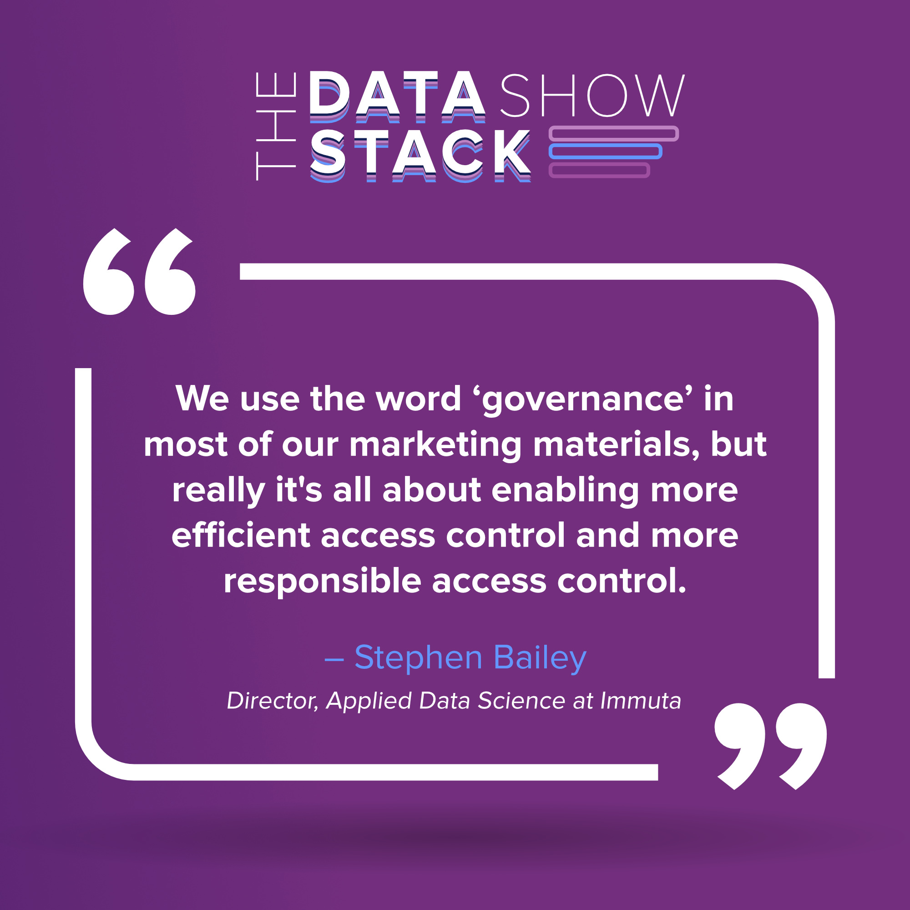
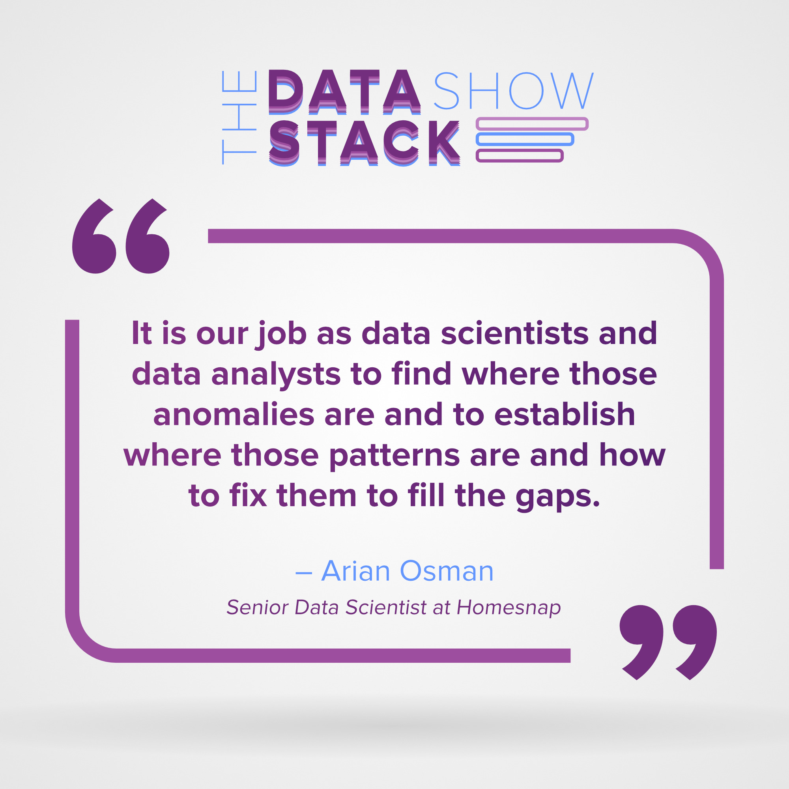

Dear readers, we are back with this year’s highlights from recent episodes on our Podcast, the [Data Stack Show](https://datastackshow.com/). Eric Dodds, our Head of Customer Success, and Kostas Pardalis, Head of Product at RudderStack, host the show. They interview experts working in the world of data to solve modern, unique data problems.

 

Our January playlist included interesting episodes with [Immuta](https://www.immuta.com/), [Homesnap](https://www.homesnap.com/), and, [Iteratively](https://iterative.ly/) where Eric and Kostas discussed the following topics:

*   Enabling fast, efficient, and understandable data governance
*   Transforming real estate data with predictive analytics
*   Trusting your data and technology to speed up your organizational workflows

Check out exciting highlights from each episode below, and subscribe to get new episodes every week. 

## Understanding Data Governance with Stephen Bailey from Immuta

This talk with Stephen Bailey, Director of Applied Data Science at Immuta, kicked off with a background on Stephen. Interestingly, he holds a Ph.D. in cognitive neuroscience. With a background researching how the brain works and a love for data, Stephen landed a job at Immuta. This startup focuses on enabling data teams to have fast, efficient, and understandable access controls on their data.

He talks about how Immuta implements access control and solves the problem related to data governance. Stephen briefly talks about Immuta’s stack and plans to push the organization to build centralized governance or access control capability. One of the core innovations of Immuta, Stephen says, is the availability of a global policy builder that's quite human-comprehensible.

Stephen also highlights how Immuta focuses on data quality by defining critical fields and building visibility that makes them easy to maintain. Stephen talks about building trust among different stakeholders and how their confidence in the numbers and grows over time. Lastly, he talks about plans to grow and build sustainable data pipelines at Immuta.

_Listen to this [episode](https://datastackshow.com/podcast/19-data-governance-with-stephen-bailey-from-immuta/)_.

## Predictive Analytics in Real Estate Market with Arian Osman from Homesnap

Arian Osman is a senior data scientist at Homesnap who works on different theoretical and custom implementations. Arain’s background includes roles as a software engineer, database administrator, database developer, and QA. With this varied background, he’s involved in everything related to data, including creating data pipelines. Arian has a mathematics background and is currently pursuing his Ph.D. in computational sciences and informatics at George Mason University in Fairfax, Virginia. 

Homesnap is designed for both homebuyers and agents to access data from the MLS (Multiple Listing Service), providing real-time, accurate information to all parties involved. Arian gives an overview of his role and responsibilities at HomeSnap and how he got there, and he expresses his appreciation for the great team he works with. He sheds light on how accessing MLS data can be challenging and how his role at HomeSnap is to implement artificial intelligence into the application and help the company gain insights internally.

Arian’s background in mathematics and computational sciences inspires him to create more customized tools. He started his e-commerce clothing brand and based the business around a tool he created that suggests optimal looks, feels, cuts, and fabrics to the customer using image processing. He also talks about creating “sell speed”, an integrated tool within Homesnap that attends to problems with multiple dimensions. 

Arian dives into how to decide the lifecycle of a model, effectively train a model based on previous results, create new validation tests, and test the model to see how it's progressing. He also gave an example of how Homesnap implements this. 

Lastly, Arian shares some of his favorite third-party tools, such as AWS Sagemaker, Amazon Rekognition for image processing, Tensorflow, Keras, Python, deep learning models. He also suggests exploring the Julia Programming language - he thinks it’s an up and coming game changer.

Listen to the [full episode](https://datastackshow.com/podcast/20-transforming-the-real-estate-market-with-predictive-analytics-with-arian-osman-from-homesnap/). 

## Implementing Data Integrity and Governance with Patrick Thompson and Ondrej Hrebicek from Iteratively

Our duo meets the co-founders of Iteratively, CEO Patrick Thompson and CTO Ondrej Hrebicek. Iteratively helps companies ensure they can trust their data can by capturing clean, consistent product analytics.

Patrick and Ondrej dived into some of the behind-the-scenes of Iteratively and how it helps solve one of the biggest problems companies face: data mistrust because of human error.

Patrick talks about why some companies still use spreadsheet schema management. He also highlights the potential pitfalls this sets them up for. Ondrej briefly talks about what “schema” is, how the term is not often used, and its fundamental importance. 

Patrick dives into the most common mistakes that are often overlooked after one signs into Iteratively and shares some of the best practices to make the process easier. We also got a short walkthrough from Eric of how Iteratively works - Ondrej agreed Eric covered the product well. Ondrej says Iteratively achieves phenomenal data analytics by using a JSON schema format to its full potential. Eric also came up with an interesting and practical question to understand how effectively Iteratively can be used. Ondrej also talks about their SDK, **Audit SDK**, which gives the ability to effectively audit and inspect the instrumentation that you have in your product today through some other SDK (for example, Mixpanel).

Lastly, they discuss their plans for Iteratively and how they want to build the best collaboration tool for tracking plans. They also want to ensure that their product is working the way that they had expected.

Listen to the [full episode](https://datastackshow.com/podcast/21-data-integrity-and-governance-with-patrick-thompson-and-ondrej-hrebicek-from-iteratively/).

## **Explore More Podcast Episodes and Subscribe**

We release new episodes every week and have a fantastic lineup of guests on deck. Listen to more episodes and subscribe to[ The Data Stack Show website](https://datastackshow.com/).

Start building a smarter customer data pipeline. Use all your customer data. Answer more difficult questions. Send insights to your whole customer data stack. Sign up for [RudderStack Cloud Free](https://app.rudderlabs.com/signup?type=freetrial) today.

Join our [Slack](https://resources.rudderstack.com/join-rudderstack-slack) to chat with our team, check out our open source repos on [GitHub](https://github.com/rudderlabs), subscribe to [our blog](https://rudderstack.com/blog/), and follow us on social: [Twitter](https://twitter.com/RudderStack), [LinkedIn](https://www.linkedin.com/company/rudderlabs/), [dev.to](https://dev.to/rudderstack), [Medium](https://rudderstack.medium.com/), [YouTube](https://www.youtube.com/channel/UCgV-B77bV_-LOmKYHw8jvBw). Don’t miss out on any updates. [Subscribe](https://rudderstack.com/blog/) to our blogs today!
