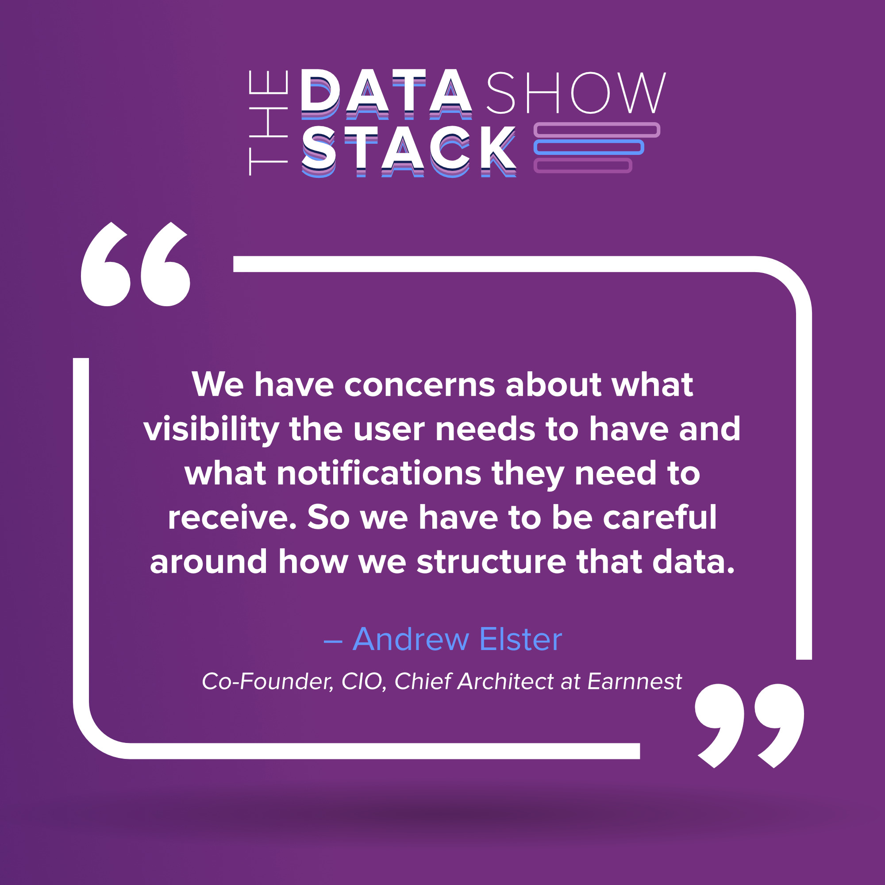
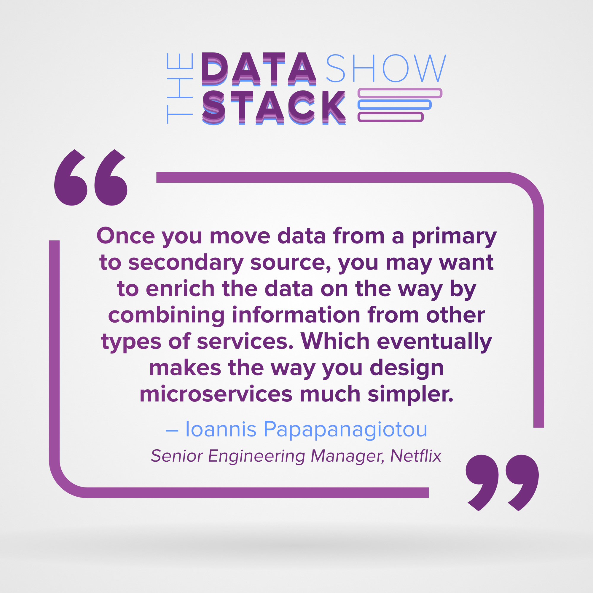
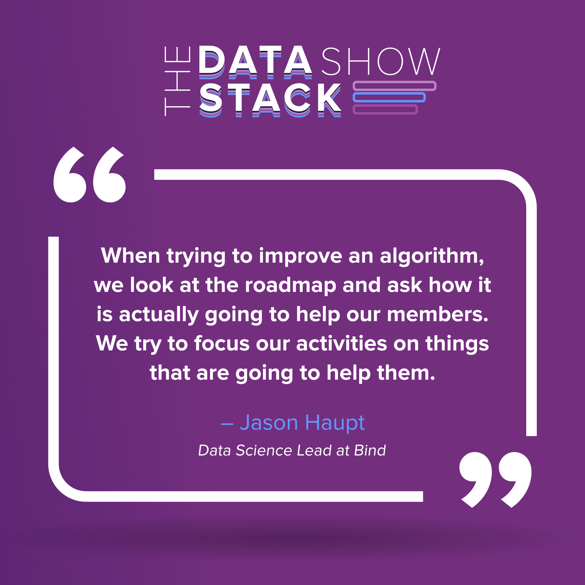

Happy New Year! We are back with highlights from recent episodes on our Podcast, the [Data Stack Show](https://datastackshow.com/) hosted by Eric Dodds, our Head of Customer Success, and Kostas Pardalis, our Head of Product. On this podcast, they interview guests working in the world of data, from data engineering to data science and more.

 

Our December playlist included a follow-up episode with [Earnnest](https://earnnest.com/) and interesting talks with data leads from [Netflix](https://www.netflix.com/) and [Bind](https://www.yourbind.com/). Our duo discussed the following topics this month:

*   Adopting an event sourcing pattern for real estate transactions
*   Working with large scale uncompressed data at Netflix
*   Bringing transparency to costs in health insurance

Check out the highlights below and subscribe to get new episodes every week. 

## Applying the Event Sourcing Pattern at Scale with Andrew Elster from Earnnest

This talk with Andrew Elster is part two of a previous episode with [Earnnest](https://earnnest.com/), a digital platform originally designed for facilitating real estate transactions. 

Andrew shared how their current focus is abstracting the functionality of the platform to expand beyond only real estate transactions. It’s fascinating to hear about his plan to have underlying payment primitives that can be used by any of their clients to build customized workflows and payment scenarios for their specific workforce and industry needs. 

We also learned about the benefits of the Elixr/Phoenix framework used by Andrew and his team. It’s not incredibly common to see startups like Earnnest built on Elixr, but we learned about several of the advantages Andrew has discovered as he’s built out their event sourcing platform and prepared for scale. 

_Listen to this [episode](https://datastackshow.com/podcast/16-applying-the-event-sourcing-pattern-at-scale-with-andrew-elster-from-earnnest/)_.

## Working with Data at Netflix with Ioannis Papapanagiotou

Netflix is renowned for their innovation in engineering and Eric and Kostas had the privilege of talking with Ioannis Papapanagiotou, a former senior engineering manager at Netflix. Ioannis dives into his work with the data integration and data storage needs and how they have evolved over the past few years. 

 

In addition to learning about their process for building (and open-sourcing) their own tools, Iaonnis also discussed other more common tools they’ve found helpful—for example, they use CockroachDB to index metadata for different kinds of data and store them efficiently. He also discussed how they efficiently carry out data encryption on such a large scale.

 

Another interesting point Iaonnis shared is how Netflix is implementing **Change Data Capture (CDC)** and is working on more powerful advancements in area. Lastly, he talked about [Bulldozer](https://netflixtechblog.com/bulldozer-batch-data-moving-from-data-warehouse-to-online-key-value-stores-41bac13863f8), a self-serve data platform to efficiently move data in batches from data warehouse tables to key-value stores.

Listen to the full [episode](https://datastackshow.com/podcast/17-working-with-data-at-netflix-with-ioannis-papanagiotou/). 

## Data Science in Health Insurance with Jason Haupt of Bind

Because he’s a data scientist by day, you might not know that Jason Haupt is also a Ph.D. in particle physics. Eric and Kostas get a fascinating look into his path from the world of physics, working at the Large Hadron Collider at CERN, to the world of healthcare, leading data science at Bind. Jason talks about what Bind is, what it does, and their cloud-native approach to managing data using AWS services. 

On the data side, we learned that a single health claim form unpacks to more than 11,000 data columns, which creates unique challenges for data processing and model-building. 

Jason also dug into the relationship between his data science team and the marketing team. Bind has achieved a unique collaborative relationship between the two teams and Jason has intentionally structured his data feeds and data science products to connect directly into the marketing tech stack, creating fertile ground for collaboration and high velocity for testing and optimization in the customer experience.  

Listen to the full [episode](https://datastackshow.com/podcast/18-data-science-in-health-insurance-with-jason-haupt-of-bind/).

## Explore More Podcast Episodes and Subscribe

We publish new episodes every week and we have a great lineup of guests this spring. Listen to more episodes and subscribe to[ The Data Stack Show website](https://datastackshow.com/).

To learn more about RudderStack, visit us on our [website](http://www.rudderstack.com/) or join our [Slack](https://resources.rudderstack.com/join-rudderstack-slack) to chat with our team, check out our open source repos on [GitHub](https://github.com/rudderlabs), and follow us on social: [Twitter](https://twitter.com/RudderStack), [LinkedIn](https://www.linkedin.com/company/rudderlabs/), [dev.to](https://dev.to/rudderstack), [Medium](https://rudderstack.medium.com/), [YouTube](https://www.youtube.com/channel/UCgV-B77bV_-LOmKYHw8jvBw). Don’t miss out on any updates. [Subscribe](https://rudderstack.com/blog/) to our blogs today!
