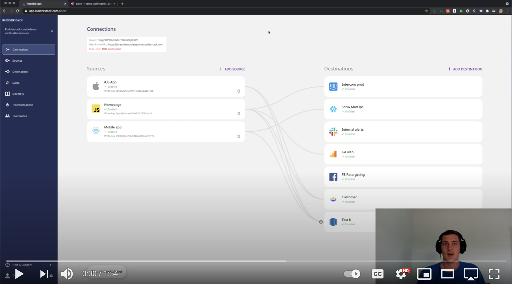
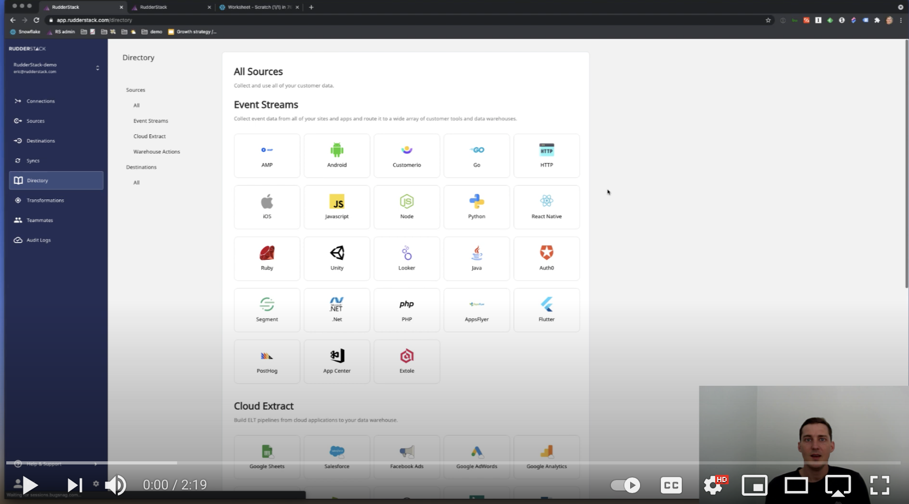

---

title: "Premium Cloud ELT and Reverse-ETL Features are Now Available in RudderStack Cloud Free"
siteMetadescription: "RudderStack Free now gives you access to Warehouse Actions and Cloud Extract, which are RudderStack premium features. Learn what you can do with RudderStack Free and the limitations."
date: 2021-05-05T00:00:00+05:30
featureImg: ../assets/markdown/warehouseactionsandcloudextractionsfree.png
category:
author: Eric Dodds
authorPic: ../assets/author/Eric-Dodds.png
authorPosition:
authorDescription: "Eric leads our Customer Success team and has a long history of helping companies architect customer data stacks and use their data to grow."
slug: "premium-cloud-elt-and-reverse-etl-features-are-now-available-in-rudderstack-cloud-free"
weight: 1
---

Data stacks are becoming more complex as both the volume and use cases for data proliferate across companies. That’s one significant reason we believe that engineering should own the customer data stack. 

It’s also why we are focused on building a unified pipeline—one place for data engineers and developers to manage all of their key customer data pipelines. There’s still a huge amount of work to do to accomplish our mission, but we’ve made some big strides over the last six months. 

Back in November, we [launched our free tier](https://rudderstack.com/blog/start-building-a-better-cdp-for-free-with-rudderstack-cloud-free), RudderStack Cloud Free, which enabled users to send up to 500,000 events per month for free through our Event Stream pipeline.  A lot of people liked it: over 1000 people have signed up and used the product. 

We [introduced two additional pipelines](https://rudderstack.com/blog/introducing-rudderstack-cloud-extract-and-warehouse-actions) in January: our reverse-ETL and cloud ELT pipeline features (Warehouse Actions and Cloud Extract). 

These features were a huge step in unification, enabling data engineers to manage all three primary pipelines in the customer data stack through RudderStack. 

Until now, though, only the Event Stream pipeline was available through the free tier. Now that many of our customers have activated on Warehouse Actions and Cloud Extract, we’re excited to make them available to all free-tier users as well. 

Here’s a quick overview of the new features: 

## Warehouse Actions for Reverse-ETL

RudderStack Warehouse Actions is our [reverse-ETL](https://rudderstack.com/blog/reverse-etl-is-just-another-data-pipeline) feature. It turns your warehouse into a data source, translating rows into configurable JSON payloads that can be sent to hundreds of tools across your stack, from Salesforce to Zendesk to Kafka and even webhooks. 

Our customers use Warehouse actions for all sorts of use cases, from enriching leads with product data to sending cleansed internal events (like transactional data). Best of all, because we translate each row into an event, you can use our Transformations feature to configure the payloads for each downstream destination. 

## Cloud Extract for Cloud ELT Pipelines

RudderStack Cloud Extract is our cloud ELT feature. It gives you out-of-the-box integrations with popular cloud sources – such as Salesforce, Customer.io, Google AdWords, and even Google Sheets – that make it easy to build cloud-to-warehouse pipelines.

## Try RudderStack Today

Start using a smarter customer data pipeline that builds your customer data lake on your data warehouse. Use all your customer data. Answer more difficult questions. Send insights to your whole customer data stack.

Join our [Slack](https://resources.rudderstack.com/join-rudderstack-slack) to chat with our team and follow us on social: [Twitter](https://twitter.com/RudderStack), [LinkedIn](https://www.linkedin.com/company/rudderlabs/), [dev.to](https://dev.to/rudderstack), [Medium](https://rudderstack.medium.com/), [YouTube](https://www.youtube.com/channel/UCgV-B77bV_-LOmKYHw8jvBw). Don’t miss out on any updates. [Subscribe](https://rudderstack.com/blog/) to our blogs today!

