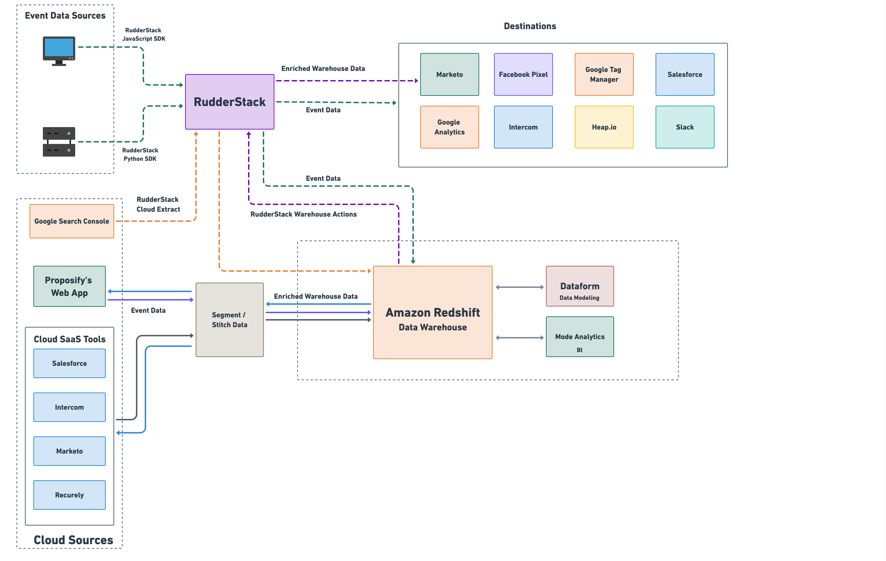

This post explores [Proposify’s](https://www.proposify.com/) customer data stack. We’ll show you how they leverage data from real-time customer activities and their Cloud SaaS tools to perform effective inbound marketing. 

## What is Proposify?

Proposify is an online proposal software. It helps you build a predictable, scalable closing process. It gives you complete control of your closing process - from content and template standardization to workflow definition to CRM integration and more. With Proposify, you can eliminate any inconsistency in the messaging, pricing, approvals, and workflow for your sales documents and avoid costly mistakes that can jeopardize your deals.

## How Proposify Uses their Data

At Proposify, there are two major consumers of data:

*   **Data Operations** **team** - manages their data pipelines
*   **Business teams** - use downstream tools that leverage the data supplied by Data Operations

Proposify’s data team mirrors their marketing automation, CRM, customer support, and payment data into their data warehouse. This data is then processed, modeled, and transformed to give accurate insights into various business processes and units, such as their Sales, Marketing, Support, and Customer Success teams.

## Proposify’s Customer Data Stack

*   **Data Collection and Synchronization**

    RudderStack SDKs, RudderStack Event Stream, RudderStack Warehouse Actions, RudderStack Cloud Extract, Stitch Data, Segment

*   **Data Warehouse**

    Amazon Redshift

*   **Data Transformation**

    DataForm

*   **Business Intelligence**

    Mode Analytics

*   **Cloud Toolset for Activation Use-cases**

    Marketo, Google Analytics, Facebook Pixel, Intercom, Google Tag Manager, Heap.io, Salesforce, Slack

## How Data Flows Through their Stack

A visual representation of the data flow through Proposify’s data stack is as shown:

### Data Collection

The data team at Proposify deals with two categories of data: **event** and **catalog** data. Their event data is normal cross-platform tracking data, which tracks user activities related to account creation, login, subscriptions, etc. They also capture catalog data - which is data obtained from different sources and used in their data processing, ETL, and downstream distribution systems.

### Event Streaming

Proposify leverages RudderStack **Event Stream** to collect real-time event data. To track and capture events from their web app, they use the [RudderStack JavaScript SDK](https://docs.rudderstack.com/rudderstack-sdk-integration-guides/rudderstack-javascript-sdk). For server-side capturing, they use the [RudderStack Python SDK](https://docs.rudderstack.com/rudderstack-sdk-integration-guides/rudderstack-python-sdk). RudderStack routes their event data to various downstream destinations for a variety of use-cases, such as:

*   Google Analytics and Google Tag Manager (Analytics and Tag Management)
*   Facebook Pixel, Heap.io (Marketing)
*   Salesforce (CRM)
*   Intercom (Customer Support)
*   Slack (Messaging)

_“Before RudderStack, instrumentation of the new ‘destinations’ for the marketing website required either Google Tag Manager or actual code deployments, thus, doubling our efforts. Now, we can just add the destinations in RudderStack and skip all the manual deployments.”_

**- Max Werner, Data Operations Manager, Proposify**

### Data from their SaaS Platform and Cloud Tools

Proposify leverages RudderStack **Cloud Extract** to collect their website traffic and performance data from Google Search Console and build efficient cloud ELT pipelines to their data warehouse. 

Proposify’s data team also pulls different types of data into their warehouse from a variety of cloud sources, including:

*   Event data from their marketing web app
*   Marketing data from **Marketo**
*   CRM data from **Salesforce**
*   Subscription and billing data from **Recurly**, and
*   Customer support and messaging data from **Intercom**

To collect this data, Pachyderm uses Segment and Stitch Data. This data is then routed to **Amazon Redshift** - their data warehouse - where they unify and process it to stitch together comprehensive customer profiles.

### Data Transformation and Business Intelligence

For transforming their data, Proposify’s data team uses [Dataform](https://dataform.co/), a data modeling tool that runs on their data warehouse without any infrastructure management. It allows them to run SQL queries and model their raw data to make it analytics-ready and discoverable across the organization. Once they have transformed the data, they materialize it back into their data warehouse.

This transformed data in their warehouse is then routed to downstream marketing platforms like Marketo by leveraging RudderStack **Warehouse Actions**. They also route this enriched data to their marketing web app and other cloud tools for various activation use-cases via Segment.

For Business Intelligence, they use [Mode Analytics](https://mode.com/). This collaborative tool brings together the power of data querying and visual analytics to gain deeper insights into their product and the users.

_“Because we have a lot of catalog data - not just the event data - we do some data modeling to distill things like MRR and the usual SaaS metrics. We then use Warehouse Actions to make sure those metrics are synced in our tools that could use it.”_

   **- Max Werner, Data Operations Manager, Proposify**

### Data Activation Use-Case: Marketing Channel Analytics

Proposify uses the unified and transformed data in their warehouse for effective marketing channel analytics and inbound attribution. By leveraging the rich insights from their warehoused data, Proposify’s product and marketing teams can:

*   Identify the marketing channels that drive the most leads,  
*   Track the impact of these channels on revenue, and
*   Better understand how users interact with their marketing website and web app. 

They use these insights to make refinements that drive more signups and conversions.

## Standardizing Data Sync Across their Customer Data Stack

Before implementing RudderStack as part of their customer data stack, Proposify faced many issues instrumenting event tracking for their web and mobile apps. App blockers were proving to be an obstacle too. So they had to rely mostly on server-side streaming. As a result, it was almost impossible for them to link website event data with known user events from their app without extensive manual coding.

Also, the disparity between the data in their warehouse and their downstream tools affected almost every team. They would have to delay marketing, sales, and product initiatives because different versions of the same data persisted in various systems and had to be manually double-checked or freshly imported again from the warehouse via manual CSV uploads. This made the product team less confident about making accurate data-driven decisions.

With RudderStack, Proposify’s data team was able to:

*   Standardize data sync across their customer data stack
*   Instrument new destinations in a matter of minutes
*   Ensure timely and reliable collection and delivery of their event and catalog data to their data warehouse and downstream tools 
*   Leverage the transformed data in their warehouse to track and optimize their sales funnel and build effective marketing campaigns

_“With RudderStack, top-of-funnel insight is a solvable problem now.”_

**- Max Werner, Data Operations Manager, Proposify**

Start building a better, warehouse-first CDP that delivers complete, unified data to every part of your marketing and analytics stack by signing up for [RudderStack Cloud Free](https://app.rudderlabs.com/signup?type=freetrial) today. [Subscribe to our blogs](https://rudderstack.com/blog/), join [Slack](https://resources.rudderstack.com/join-rudderstack-slack) to chat with our team, check out our open-source repos on [GitHub](https://github.com/rudderlabs), and follow us on our socials: [Twitter](https://twitter.com/RudderStack), [LinkedIn](https://www.linkedin.com/company/rudderlabs/), [dev.to](http://dev.to/), [Medium](https://rudderstack.medium.com/), [YouTube](https://www.youtube.com/channel/UCgV-B77bV_-LOmKYHw8jvBw). Don’t miss out on any updates. [Subscribe](https://rudderstack.com/blog/) to our blogs today!

