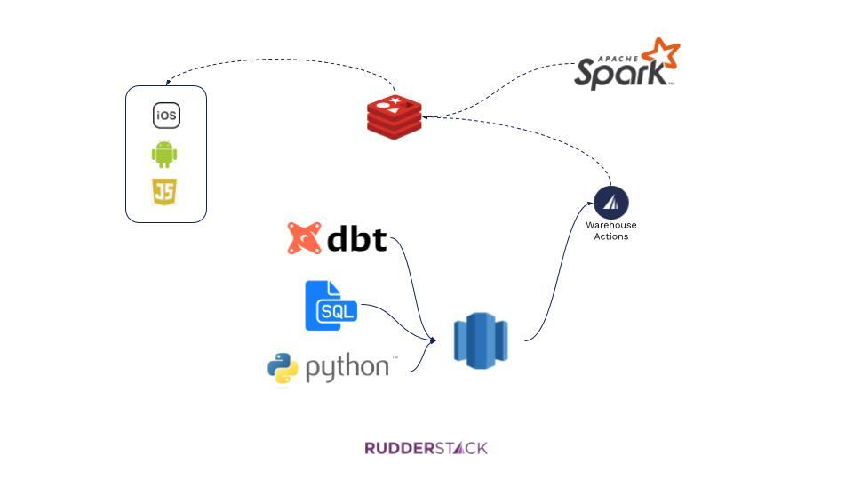

Personalization is a big topic, and for a good reason. Companies that achieve high-quality personalization see significant improvements, to the tune of a [5-15 percent increase](https://www.mckinsey.com/business-functions/marketing-and-sales/our-insights/the-future-of-personalization-and-how-to-get-ready-for-it#) in _revenue_! There’s much excitement on the topic; however, the reality is that many businesses haven’t moved past basic personalization. Companies are still providing users only basic customization, such as one-size-fits-all recommendations or one of a few simple, pre-defined customer journeys. 

In fact, a [McKinsey survey](https://www.mckinsey.com/business-functions/marketing-and-sales/our-insights/the-future-of-personalization-and-how-to-get-ready-for-it#) found that only 15 percent of companies feel like they are on the right track with personalization and technology is a significant reason many companies struggle. Even brief research on the challenges of personalization returns phrases such as “disparate systems and silos that can lead to fragmented business intelligence”, “issues related to collecting, managing, and storing customer data”, and “making this technological leap forward requires marketing and IT to join forces.” 

In this post, we break down the technological challenges around personalization and show you how companies use technologies such as Redis and RudderStack together to drive personalization use cases. 

## The two Data Drivers of Personalization: Behaviors and Profiles

When it comes to personalization, especially from the standpoint of the data and technology that drive the customer experience, it is critical to distinguish between the two primary methodologies for personalization: **behaviors and profiles**. 

This distinction is important because the data sources and technologies behind each can vary significantly. 

### Behavior-Based Personalization

In behavior-based personalization, _one step determines the next step_ in the customer journey. One example is a product similarity model, where the recommended product is similar or related to the product a customer recently viewed or purchased. 

This generally means that in-session behavior, such as page views, product views, or the sequence of certain behaviors, determines what a user sees or experiences in their next steps. This approach is used heavily in eCommerce, especially where there is a lack of data about the actual user. For a long time, algorithms for models like the product similarity model were solved through market-basket analysis, though recently, data scientists have been applying collaborative filtering methodologies, including those based on deep learning. 

Behavior-based models require a significant amount of _event_ data for training the model as well as driving personalization in real-time—data that represents the granular actions taken by each user. Events are collected using some sort of streaming pipeline, and real-time personalization requires a robust infrastructure that can handle high volume with low latency. 

### Profile-Based Personalization

In profile-based personalization, ‘characteristics determine the next step’ in the customer journey. This generally means that some demographic characteristic of the user (i.e., age, gender, job title, interests, etc.) determines the next steps in the customer journey. This approach is used in both consumer-facing businesses (using people similarity models) as well as B2B businesses (in which role and hierarchy influence the B2B buying process).

Profile-based models require programmatic access to user profiles in real-time. This model can present technical challenges because profile data often lives in CRMs, marketing tools, and order history, but real-time personalization requires all data points to be collected into a unified profile store that is readily available. 

### Combined Models

While the use of the above personalization methods individually is common, most companies’ goal is a combined model, which leverages both behavioral data, rich profile data, and, many times, other outside data, such as geography, time of year, demographic enrichment, etc. 

Combined models are particularly challenging because they require robust pipelines and centralized storage for both event and profile data. When more advanced data science workflows are involved, you also have to manage pipelines that receive algorithms’ output. 

## Building a Real-Time Personalization Engine Using Redis and RudderStack

Modern tooling has made real-time personalization significantly more simple than it was even in the recent past, and many companies are using Redis and RudderStack to drive various personalization use cases. 

Here’s the high-level architecture: 

*   Redis is used as the repository for recent behavioral (event) data and profile data, which drive the actual changes in the user experience (whether implemented directly or through a 3rd-party tool). 
*   Redis receives event data directly from RudderStack Event Stream, which provides a real-time event stream from SDKs installed in apps and websites.
*   Redis receives profile data from RudderStack Warehouse Actions, a low-latency job that sends updates from a user profile table _in the same format as event data_. (This is important because using the same format requires far less engineering work.) 
*   The user profile table in the warehouse can be built to suit the use case. Many companies build cohorts using Event Stream (for behavior) and RudderStack Cloud Extract (for data points in other cloud tools). It is becoming more common, though, to combine event and cloud data with advanced modeling, whether through DBT or more complex data science workflows (using tools like Spark). 

Let’s briefly look at each of these components using a simple use case as an example. Let’s say you want to present personalized recommendations first based on a user’s most recent purchase, but also based on characteristics from the user profile if present. Specifically, your recommendations model: 

*   Considers the five most recent purchases in real-time (to enable use cases like immediate post-purchase recommendations)
*   Considers membership status in a rewards program
*   Considers income level, if available as a profile characteristic

### Redis as the Central Data Store and Driver of Personalization

Many companies attempt to cobble together point solutions for personalization. For example, the marketing team might use a third-party personalization software for the web, while the product team might use separate tooling to personalize the experience in a mobile app. From a data and infrastructure perspective, this point solution approach gets complex quickly, making it harder to deliver cross-platform personalization efficiently. 

Redis provides an elegant solution to the challenge of storing all of the various types of data needed for personalization, then making it available to drive the personalization itself. (Here’s [a great guide from Redis](http://www.evolvedmedia.com/wp-content/uploads/2018/05/CITO-Research_Redis_Pseudo-Code_2107.pdf) on real-time personalization.)

Firstly, Redis is an in-memory database with extremely low latency, a mandatory requirement for real-time use cases. 

Redis also supports multiple modules and data structures (key-value, but also sets, sorted sets, hashes, etc.) and modules, giving you flexibility on ingestion (i.e., you can ingest events directly or ingest models directly from tools like Spark) and the ability to store both event data and user profile data, which is critical for having a centralized engine for personalization. 

No matter your pipeline structure, once you have the data, Redis enables the elegant delivery of real-time personalization. Below are simple examples of pseudo-code that could be used to drive personalization for our use case above. Note that this code would interface with the actual user experience layer, where you would leverage the data available from Redis to make the actual changes in the interface. 

This is how you might call a user profile, including membership status, income bracket, and product recommendations based on their most recent purchase: 

`gist:Veenap/f57a8d69390de41b080013d35acde37c`

## Feeding Redis with the Right Data Using RudderStack

The code samples above represent the “last mile” of personalization, where Redis and the app/website drive the actual user experience. Let’s take a step back and see how to feed Redis with the data it needs, starting with behavioral data. 

### Behavioral Data Pipelines with RudderStack Event Stream (a Real-Time, Event-Based Feedback Loop)

RudderStack’s Event Stream can send user events directly to Redis in real-time. Specifically, you can run RudderStack SDKs on your website and apps, then run `.identify()` calls that include the information you need for personalization and send that data to Redis in real-time, which drives the last mile of personalization. 

Our customers have called this the **real-time event feedback loop**, where the live event stream can drive personalization step-by-step for the user. 

Looking at our use case above, we want to send the most recent five purchases to Redis so that the model can use those data points to make personalized recommendations in the next step after checkout. Let’s say this set of data points is called `recent_five_purchases` with the item SKUs as the values. In this case, the user has only made 3 purchases. 

`gist:Veenap/0185ed7e018102b95ccff1739775c4e8`

When the user makes an additional purchase, we can grab the item SKU, append it to the `recent_five_purchases` object that we already had in the data layer from our initial Redis call. Then we can include that object in an `identify()` call that RudderStack will send to Redis. The payload might look like this, where `purchase_4` is the most recent purchase: 

`gist:Veenap/e60cc9e420dbd092370a8a8a5d0c4eb9`

When the `identify()` call runs, the user data is sent to Redis in real-time, making the complete set of recent purchases immediately available to the front-end, which can then use that data to call the model (whether via Redis or another API). The end result is that the page after the most recent purchase will include recommendations based on the users’ five most recent purchases, including the one they just made. 

This is a simple example, but RudderStack Event Stream is extremely flexible and can populate Redis with all kinds of event data in real-time, enabling a variety of personalization use cases. 

It’s worth noting that a significant advantage of using an event stream pipeline like RudderStack is that the `identify()` call can be sent to all other downstream destinations in the stack in addition to Redis. So, for example, you might want to send the same `.identify()` payload to marketing tools to drive email campaigns, analytics tools for analysis, and even back into your warehouse. RudderStack Event Stream allows you to instrument a single message and send it to Redis and over 100 additional destinations. 

### Profile Data Pipelines with RudderStack Cloud Extract and Warehouse Actions

While the RudderStack Event Stream can support many use cases for profile updates, it is very common for user profile data points to live in other systems that aren’t easily accessible to the RudderStack SDK running on the website or app (whether that is for technical or security reasons). 

Continuing with our use case, let’s say that the two additional data points that we want to use to drive personalization, membership status and income bracket, live in different systems. Membership status is managed by the customer loyalty team, who uses Salesforce. At the same time, data on income bracket comes from an enrichment job running on internal infrastructure and lives in the data warehouse. 

To get both data points to Redis, we can use RudderStack Cloud Extract to pull membership status from Salesforce, join it with income bracket data in the warehouse, then send the derived table to Redis through RudderStack Warehouse Actions. 

**_Step 1: pulling membership status from Salesforce to the warehouse_**

First, we would set up Salesforce as a source in RudderStack and configure the integration to pull the Contact object, which contains a custom field for membership status. 

When the sync runs, a `CONTACT` table is created and populated in our warehouse, giving us access to membership status by the user. 

**_Step 2: combining membership status the income bracket data sets_**

Once you have both data points in the warehouse, you can join them to create a table that includes a unique identifier for the user, their membership status, and their income bracket. The resulting table might look something like this: 

<table>
  <tr>
   <td>userId
   </td>
   <td>email
   </td>
   <td>membership_status
   </td>
   <td>income_bracket
   </td>
  </tr>
  <tr>
   <td>a1b2c3d4e5f6g7h8i9
   </td>
   <td>eric@rudderstack.com
   </td>
   <td>loyalty_member
   </td>
   <td>null
   </td>
  </tr>
  <tr>
   <td>aa11bb22cc33dd44
   </td>
   <td>ryan@rudderstack.com
   </td>
   <td>expired
   </td>
   <td>level_2
   </td>
  </tr>
</table>

**_Step 3: pushing the data points to Redis through RudderStack Warehouse Actions_**

Once we have the combined data, we can use RudderStack Warehouse Actions to translate the table into an event stream and send `.identify()` calls to Redis with the additional data points. 

This part is easy: simply connect your warehouse to RudderStack, select the schema and table and verify that the table sample and resulting `.identify()` payload are correct. Here’s what this looks like in the RudderStack Warehouse Actions interface: 

Note that Warehouse Actions translates each row in the table into an event, meaning no additional configuration in Redis. Additionally, you can send that same `identify()` payload from the Warehouse Actions source to every other tool in your stack, the same functionality available in Event Stream. 

By default, the Warehouse Action will run every 30 minutes, which is usually sufficient for data like membership status and income bracket, which don’t change often, but the sync time can be configured to run even faster. 

Again, this data will be available to the front end of the user experience, which communicates with the personalization model and serves recommendations accordingly. 

## Personalization Models with...Whatever Tooling you Want

Earlier in the post, we assumed that a model was in place to produce personalized recommendations, but we didn’t discuss that model’s source. 

One of the unique features of this personalization architecture is that you have full flexibility in the source of your personalization models. 

At the simple end of the spectrum, you could build basic models on your warehouse itself (using SQL, etc.) and push them to Redis using RudderStack Warehouse Actions. Companies are increasingly using ML functionality in tools like Big Query to drive modeling on top of the warehouse as well, which can be pushed to Redis either through RudderStack or directly. 

At the more complex end of the spectrum, data teams can combine data from multiple sources (Event Stream, Cloud Extract, internal sources, third party data sets, etc.) and perform advanced modeling on their data science stack, then use tools like Spark to deliver the model directly to Redis to drive recommendations. 

No matter the use case or complexity of modeling, Redis and RudderStack enable powerful, efficient infrastructure for driving real-time personalization. 

## Try RudderStack Today

Start building a smarter customer data pipeline. Use all your customer data. Answer more difficult questions. Send insights to your whole customer data stack. Sign up for [RudderStack Cloud Free](https://app.rudderlabs.com/signup?type=freetrial) today.

Join our [Slack](https://resources.rudderstack.com/join-rudderstack-slack) to chat with our team, check out our open source repos on [GitHub](https://github.com/rudderlabs), subscribe to [our blog](https://rudderstack.com/blog/), and follow us on social: [Twitter](https://twitter.com/RudderStack), [LinkedIn](https://www.linkedin.com/company/rudderlabs/), [dev.to](https://dev.to/rudderstack), [Medium](https://rudderstack.medium.com/), [YouTube](https://www.youtube.com/channel/UCgV-B77bV_-LOmKYHw8jvBw). Don’t miss out on any updates. [Subscribe](https://rudderstack.com/blog/) to our blogs today!