When it comes to your customer data there tend to be very common silos for many businesses. One is around the event data from different customer touchpoints, frequently residing in your customer data platform and streamed to different tools, or in individual analytics tools (product, marketing, etc.). 

Another common silo is your customer master data, frequently stored in [Salesforce](https://www.salesforce.com/). Another could be around your paid advertising campaigns with data residing in [Google Ads](https://ads.google.com/), [Facebook Ads](https://www.facebook.com/business/ads), and [LinkedIn Ads](https://business.linkedin.com/marketing-solutions/ads). It only gets more complicated and siloed the more tools you use. Bringing all of these different types of customer data into one place is incredibly difficult, but, if you can do it, your analysis can be deeper and drive more meaningful insights.

To help make this challenging technical problem simple, we are launching RudderStack Cloud Extract, including integrations with popular cloud tools like Salesforce, ZenDesk, and many more (even Google Sheets). Cloud Extract enables you to access and integrate data from your product, sales, marketing, support, and finance teams’ cloud tools (and databases/data lakes) to expand the types of analysis your teams can do and make the insights your teams derive more specific, accurate, and actionable.  

In this post, we detail Cloud Extract. We explain how Cloud Extract works, some of the benefits of using it, and how to set it up in RudderStack.


`youtube: HZDX7TVf848`


## How Cloud Extract Works

Cloud Extract allows you to collect raw data from different cloud tools, including [Marketo](https://www.marketo.com/), [Facebook Ads](https://www.facebook.com/business/ads), [Google Ads](https://ads.google.com/), [Google Analytics](https://analytics.google.com/), [Google Search Console](https://search.google.com/search-console/welcome), [HubSpot](https://www.hubspot.com/), [LinkedIn Ads](https://business.linkedin.com/marketing-solutions/ads), and many more. You can also pull data from databases and data lakes like [Postgres](https://www.postgresql.org/), [S3](https://aws.amazon.com/s3/), and others. 

The raw datasets from Cloud Extract can be routed to supported data warehouses (Snowflake, Google BigQuery, Amazon Redshift, ClickHouse, and PostgreSQL) for analysis.


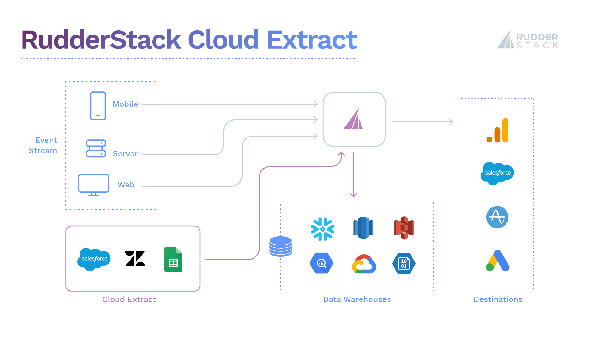


## Benefits of Using Cloud Extract

RudderStack Event Stream has always made it easy to aggregate customer event data from all of your digital touchpoints into your data warehouse. Cloud Extract extends this functionality, making it easy to send customer data from all your different third-party tools into your data warehouse. This enables you to easily combine data from different customer teams like product, sales, marketing, or support, so you can surface answers to more complicated, nuanced business questions. Then, with [RudderStack Warehouse Actions](https://rudderstack.com/blog/rudderstack-warehouse-actions-unlocks-the-data-in-your-warehouse), you can easily feed these business insights into your pipelines, enriching customer events with data from in-warehouse analysis for activation in your downstream customer tools.

As an example, let's say you want to perform a deeper analysis on churn and understand the relationship between number and type of customer support tickets and product usage. Normally, these are siloed data sets. With RudderStack, though, you can use Event Stream to collect product usage behavior and Cloud Extract to pull support tickets from Zendesk, then combine both data sets in your warehouse for analysis.

Let's say you identify some leading indicators of churn and use queries on your warehouse to build a "likely to churn" cohort. Using Warehouse Actions, you can pull that cohort of users back through RudderStack as identify calls to update user profiles in all of your downstream tools, giving teams the ability to see and take action on users who have a higher likelihood to churn.


## Setting up Cloud Extract in RudderStack

Cloud Extract integrations are easy to set up and maintain. Just use the ready-made connectors to connect to any data source, and your data will start flowing through RudderStack. 

Let’s use a real world example to walk through setup. We will set up Salesforce as a Cloud Extract source and send the Lead object data to Snowflake. 


1. Log in to your [RudderStack dashboard](https://app.rudderstack.com/).
2. Click on **Sources** on the left panel of your dashboard. Select **Salesforce**, and then click on **Next**.


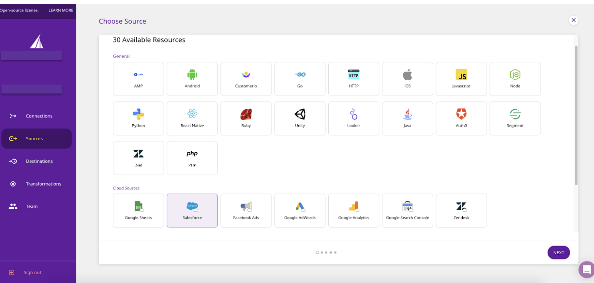


3. Name your source and click on **Next.**


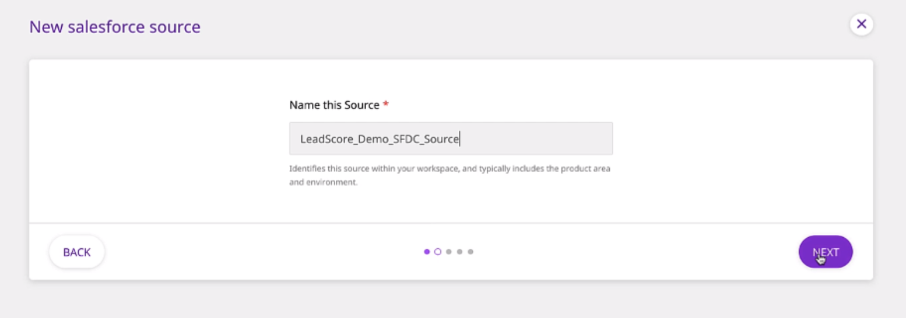


4. Next, you will be required to authenticate your Salesforce account . To do so, click on **Connect with Salesforce**.  After granting the necessary permissions, your account should be successfully connected and visible on the dashboard. Then, click on **Next**.


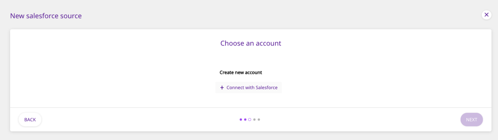


```
Note: If you have already logged into your Salesforce account previously, clicking on the Connect with Salesforce option will automatically connect that account to RudderStack. To connect  a different account, you will have to log out of your Salesforce account, then log in to the account you want to connect.
```


5. In the next window, select the Run Frequency. This configuration controls how often RudderStack will pull data from your Salesforce integration. Then, click on **Next**.


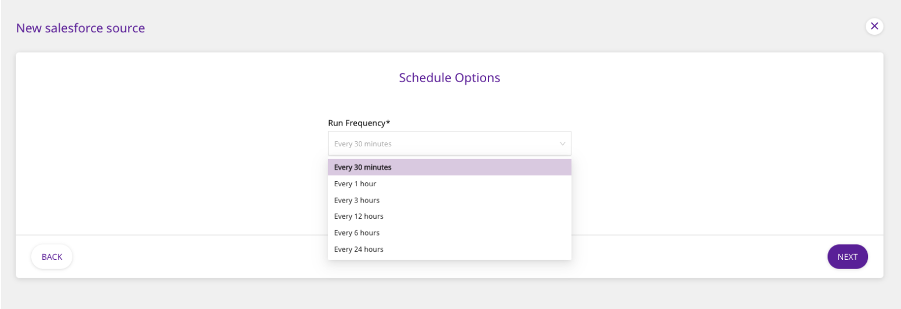


6. Next, choose the Salesforce data you want to pull through RudderStack and click on Next. You can choose to import selected Salesforce resources or choose all of them. In this example, we want to import the Lead object data, so we select **Lead** as shown.


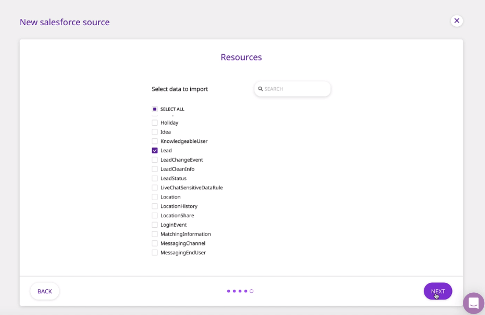

You have successfully configured Salesforce as a source in your RudderStack pipeline. RudderStack will start ingesting data at the specified frequency. 


7. Connect this source to your data warehouse by clicking on Connect Destinations or Add Destinations, as shown: 


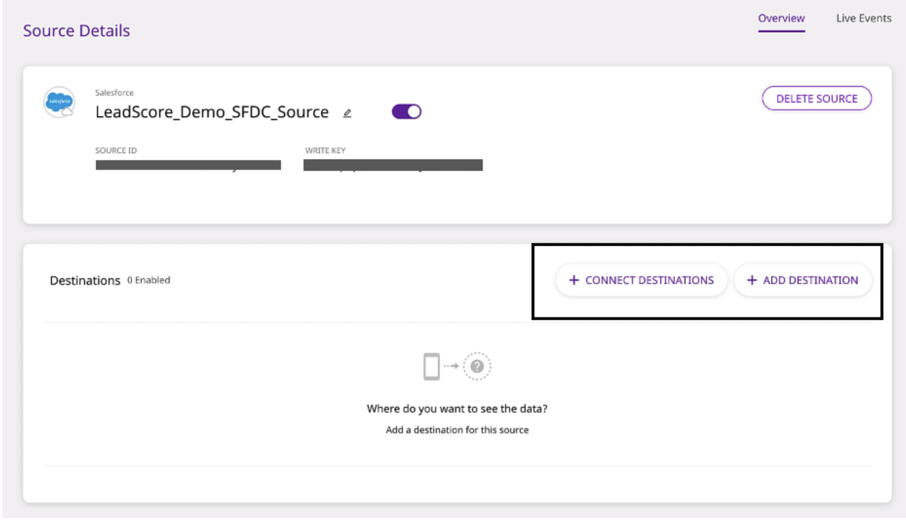

In this example, we will be importing the Lead data into Snowflake. Before setting up Snowflake as a destination, we need to create a database and a warehouse in Snowflake. We have also created an S3 bucket which acts as a staging area for the data flowing into Snowflake.


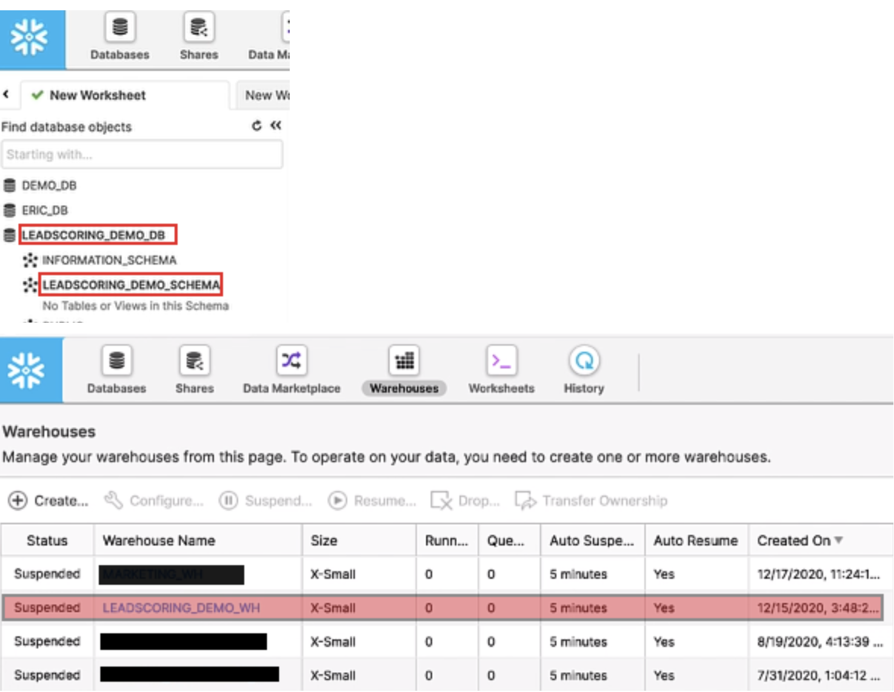


8. Next, **name the destination** and Connect it to your Cloud Source by adding all the required credentials in the **Connection Credentials **section**.**


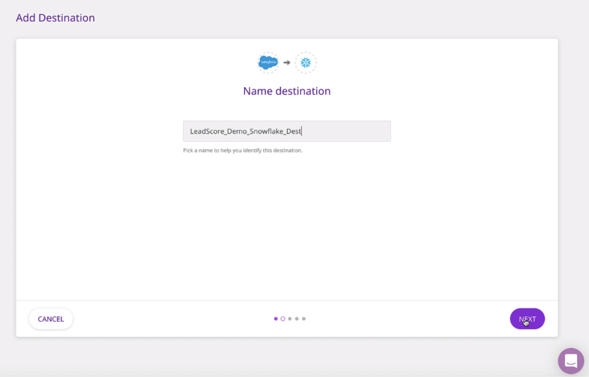


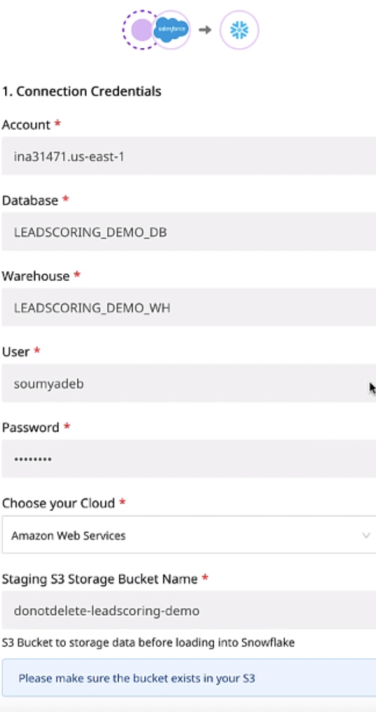


9. Next, you can choose to add a Transformation. You can choose no transformation, an existing transformation, or create a new one (in this example we do not need any transformation).


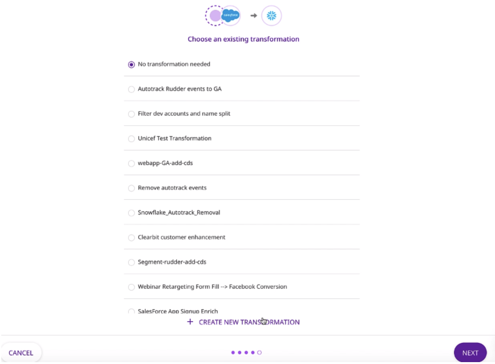

That’s it! You have successfully added Snowflake as a destination for your Salesforce source. Your data will sync according to the schedule you defined. You can also trigger a sync manually by clicking on **Sync Now**.


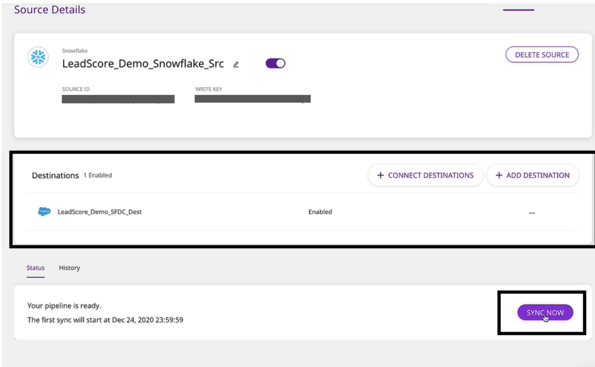

Once the sync is completed, you can go to your Snowflake Dashboard to verify that the new **Lead** table is present and  has been populated with data from the Salesforce:  


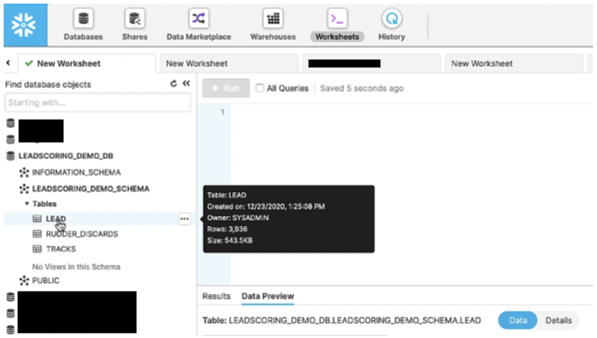


To explore the different Cloud Extract Sources and to know more details, visit our [documentation](https://docs.rudderstack.com/sources).

One of our clients, [Proposify](https://www.proposify.com/) has the following to say:

_At Proposify, we get a lot of traffic from organic search sources. Being able to have insight into GSC data to monitor relevant search trends, keyword rankings, and landing page performance is crucial to inform everything from content, SEO, and inbound marketing. RudderStack’s Cloud Extract lets us seamlessly integrate this data into our Redshift warehouse and data modeling workflows for a complete view of our acquisition efforts. It’s a powerful turnkey solution!_ - Max Werner, Data Operations Manager at Proposify


## Try RudderStack Today

Start building a smarter customer data pipeline. Use all your customer data. Answer more difficult questions. Send insights to your whole customer data stack. Sign up for [RudderStack Cloud Free](https://app.rudderlabs.com/signup?type=freetrial) today.

Join our [Slack](https://resources.rudderstack.com/join-rudderstack-slack) to chat with our team, check out our open source repos on [GitHub](https://github.com/rudderlabs), subscribe to [our blog](https://rudderstack.com/blog/), and follow us on social: [Twitter](https://twitter.com/RudderStack), [LinkedIn](https://www.linkedin.com/company/rudderlabs/), [dev.to](https://dev.to/rudderstack), [Medium](https://rudderstack.medium.com/), [YouTube](https://www.youtube.com/channel/UCgV-B77bV_-LOmKYHw8jvBw). Don’t miss out on any updates. [Subscribe](https://rudderstack.com/blog/) to our blogs today!
