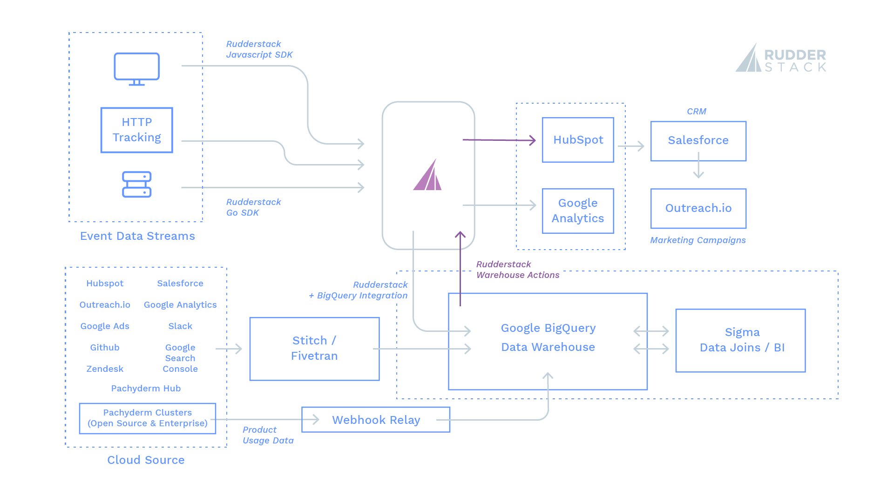

This post explores the customer data stack of business partner [Pachyderm](https://www.pachyderm.com/), which offers a Kubernetes-based ETL (extract, transform, load) tool of the same name. We’ll show how Pachyderm leverages real-time customer event data across different sources to gain deeper insights into user behavior in its product and optimize the UX to increase customer adoption.

## What Is Pachyderm?

Pachyderm [was designed](https://thenewstack.io/pachyderm-aims-displace-hadoop-container-based-collaborative-data-analysis-platform/) to make building and managing end-to-end ML/AI pipelines easier, regardless of their size and complexity. With Pachyderm, you can track your data lineage and bring together version control for your data with the tools, languages, and frameworks of your choice to build scalable data science pipelines.

With Pachyderm, there are three easy ways to get up and running with your data science pipelines. You can either deploy Pachyderm in your local environment, on your favorite cloud provider or use the company’s hosted and fully-managed SaaS platform: [Pachyderm Hub](https://hub.pachyderm.com/).

## How Pachyderm Uses Its Data

Being a modern data science platform, all the teams within Pachyderm make extensive use of data for all their operations and KPIs. The customer team at Pachyderm uses their customer event data — collected, routed, and warehoused with RudderStack Event Stream — to understand user behavior and product usage patterns better. They also use this data to drive effective inbound and outbound marketing campaigns.

Pachyderm uses product usage data — again collected, routed, and warehoused with RudderStack Event Stream — from within the Pachyderm Hub, its SaaS platform, for product analytics and optimizing the platform. They then leverage their event stream and product usage data along with non-event data from their cloud tools like Salesforce, HubSpot, Zendesk, Slack, and Google Analytics — collected and warehoused with tools like Fivetran and Stitch.

With a unique combination of customer event data, product usage data, and data from customer tools, along with modern data storage and processing tools, Pachyderm has set up a robust, powerful stack to leverage unlimited data for all activation use-cases.

## Pachyderm’s Customer Data Stack

*   **Data Collection and Synchronization:** RudderStack SDKs, RudderStack Event Stream, RudderStack Warehouse Actions, Stitch, Fivetran
*   **Data Warehouse:** Google BigQuery
*   **Data Processing and Business Intelligence:** Sigma Computing
*   **Cloud Toolset for Activation Use-cases:** HubSpot, Google Analytics, Zendesk, Salesforce, Outreach.io

### How Data Flows Through the Pachyderm Stack

Here’s a visual representation of the data flow through Pachyderm’s data stack:

### How Data Flows Through the Pachyderm Stack

Here’s a visual representation of the data flow through Pachyderm’s data stack:

### Data Collection

Pachyderm generates hundreds of gigabytes of data through tracking user interactions and data from cloud sources. All of this data resides in the customer data lake built on top of their data warehouse, Google BigQuery.

### Data Streaming and Warehousing

Pachyderm teams mainly use customer event data to track user journeys and trigger various downstream use-cases (such as marketing campaigns). They use [RudderStack](https://rudderstack.com/?utm_content=inline-mention) Event Stream to route event data to downstream destinations such as [HubSpot](https://rudderstack.com/integration/hubspot/) and [Google Analytics](https://rudderstack.com/integration/google-analytics/) and their data warehouse [Google BigQuery](https://rudderstack.com/integration/bigquery/). RudderStack’s seamless integration with these platforms allows them to stream near real-time events for their activation use-cases.

To track and capture event data on their web app, Pachyderm uses the [RudderStack JavaScript SDK](https://docs.rudderstack.com/rudderstack-sdk-integration-guides/rudderstack-javascript-sdk). For server-side capturing, it uses the [RudderStack Go SDK](https://docs.rudderstack.com/rudderstack-sdk-integration-guides/rudderstack-go-sdk). In addition to the SDKs, Pachyderm also uses the [RudderStack HTTP API tracking](https://docs.rudderstack.com/rudderstack-api-spec/http-api-specification) for seamless recording and capturing of customer events.

_“RudderStack has given us better access to our data. Our data was siloed in cloud sources. Now we have it all in a warehouse, making it accessible to everyone.”_

— Dan Baker, Marketing Ops Manager, Pachyderm

### Data from Its SaaS Platform and Cloud Tools

Apart from customer events, Pachyderm collects data from Pachyderm Hub, its SaaS platform. This data mainly includes the customers’ workspace usage details and other metrics related to the platform usage and performance. Pachyderm clusters (which host both their open-source and enterprise offerings) also generate a large chunk of the workspace usage data. This data is processed by [Webhook Relay](https://webhookrelay.com/) and streamed directly into the company’s data warehouse.

_“With RudderStack, there are fewer moving pieces. Having RudderStack means that we don’t have to have a bunch of manual processes or APIs that we have to build for and support ourselves.”_

— Dan Baker, Marketing Ops Manager, Pachyderm

Pachyderm also pulls different types of data from a variety of cloud sources. Some of these include marketing data from HubSpot, customer and CRM data from tools like Salesforce and Zendesk, messaging data from Slack, advertisement and campaign data from tools like Google Ads, and insights from Google Analytics. To collect this data, Pachyderm uses popular ETL tools like Fivetran and Stitch.

All of this information is useful for stitching together comprehensive customer profiles and understanding Pachyderm’s in-product behavior.

### Data Transformation and Business Intelligence

Once the data is in its data warehouse, Pachyderm uses [Sigma](https://www.sigmacomputing.com/) — a warehouse-focused analytics and BI tool — for internal reporting and metrics tracking. Beyond general BI, it also uses Sigma to build queries, join tables, and aggregate the data stored from various sources, to give a single source of truth for customers.

This transformed data is materialized in BigQuery for storage. The software then uses RudderStack Warehouse Actions to send this transformed data from the warehouse to downstream destinations like HubSpot.

_“We already have a bunch of uses for Warehouse Actions, and we’re only at the tip of the iceberg. Our future plans involve getting more data insights out of the warehouse, and Warehouse Actions will continue to be our go-to solution for this.”_

— Dan Baker, Marketing Ops Manager, Pachyderm

### Data Activation Use-Cases

The way Pachyderm uses transformed data for the activation use-cases is quite interesting. All the customer event data and data coming from the apps and systems is primarily used for lead qualification and analyzing customer journeys and behavior.

### Lead Qualification

When a user first signs up on Pachyderm, the first course of action suggested is to create a workspace. Pachyderm’s customer team encourages this action with drip emails. Once the user has created a workspace, an event is sent from the application backend to their data warehouse.

The team then uses Sigma to determine the total number of workspaces created and workspaces created since the last run, and materialize this data on the data warehouse. This information is then sent back to HubSpot with RudderStack Warehouse Actions. Once in HubSpot — the inbound lead system — this data is synced with Salesforce — the outbound lead system. After the behavioral data from the application has made its way into their CRM, they use Outreach.io to drive their personalized messaging and email campaigns, and (in this example) they stop sending drip emails to a user that has created a workspace.

_“Getting aggregated event data into HubSpot and Salesforce is key for our Sales team to be able to effectively communicate with our customers.”_

— Dan Baker, Marketing Ops Manager, Pachyderm

### Customer Journey and Behavior Analysis

With event data captured across various customer touchpoints, the Pachyderm teams can now understand their customer’s product journey and pinpoint any issues. They also get deeper insights into how their users are using the platform and optimize those specific aspects of the product to improve their customer experience.

## Simplified Data Access and No Data Silos

Before incorporating RudderStack into their customer data stack, the team at Pachyderm had to do many plumbing in HubSpot to move the data around the data warehouse. This, in turn, created a lot of data silos. They looked at other customer data platforms to solve these problems, but the cost was unjustifiable given what they were getting in return.

With RudderStack now a core component of their customer data stack, Pachyderm can get all the event data into a centralized location — the data warehouse — to be used efficiently for analytics. In addition, RudderStack Warehouse Actions sends insights from the analysis to downstream tools for lead qualification and personalized marketing.

## Try RudderStack Today

If you haven’t already, sign up for [RudderStack Free](https://app.rudderlabs.com/signup?type=freetrial) today. Start using a smarter customer data pipeline that builds your customer data lake on your data warehouse. Use all your customer data. Answer more difficult questions. Send insights to your whole customer data stack.

Join us on [Slack](https://resources.rudderstack.com/join-rudderstack-slack) to chat with our team, explore our open source repos on [GitHub](https://github.com/rudderlabs), subscribe to [our blog](https://rudderstack.com/blog/), and follow us on our socials: [Twitter](https://twitter.com/RudderStack), [LinkedIn](https://www.linkedin.com/company/rudderlabs/), [dev.to](https://dev.to/rudderstack), [Medium](https://rudderstack.medium.com/), [YouTube](https://www.youtube.com/channel/UCgV-B77bV_-LOmKYHw8jvBw). Don’t miss out on any updates. [Subscribe](https://rudderstack.com/blog/) to our blogs today!

This blog was originally published on [The New Stack](https://thenewstack.io/rudderstack-how-pachyderm-pipelines-help-parse-customer-event-data/).
