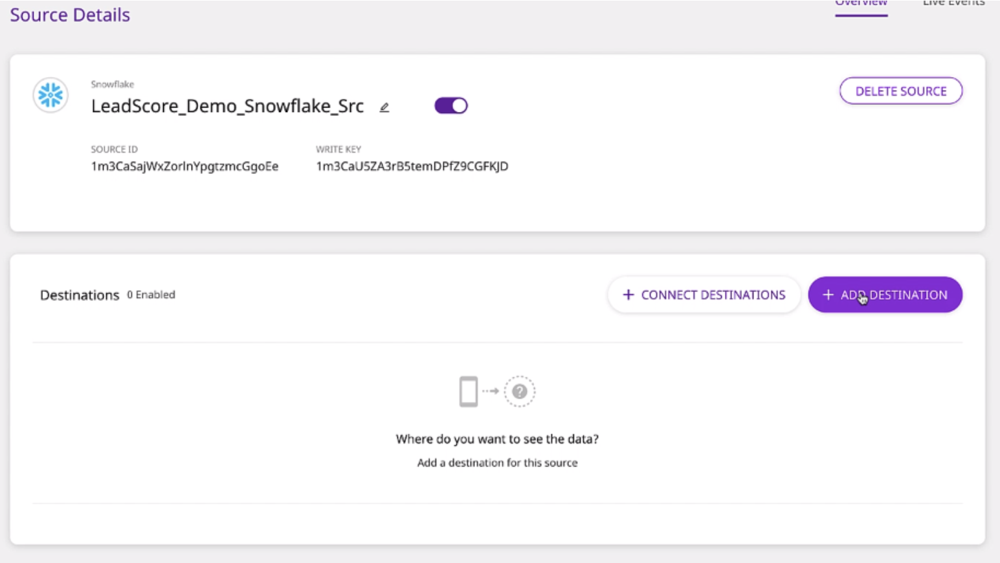

---

title: "RudderStack Warehouse Actions Unlocks the Data in Your Warehouse"
siteMetadescription: "Launching Warehouse Actions - enables you to leverage processed customer data stored in your data warehouse and directly route this enriched information to your entire customer data stack."

date: 2021-01-26T00:00:00+05:30

featureImg: ../assets/markdown/warehouseasasourcelaunch.blog.rs.png

category:

author: Eric Dodds

authorPic: ../assets/author/Eric-Dodds.png

authorPosition:

authorDescription: "Eric leads our Customer Success team and has a long history of helping companies architect customer data stacks and use their data to grow."

slug: "rudderstack-warehouse-actions-unlocks-the-data-in-your-warehouse"

---

[Your data warehouse is the platform your customer data stack is built on](https://rudderstack.com/blog/the-complete-customer-data-stack/). It acts as a robust central system for driving critical business decisions while maintaining a unified source of truth for your entire organization. Businesses are constantly looking to improve their product or marketing strategies to get an extra edge over their competitors. Data warehouses help you get that competitive edge by serving analytical data to make fact-based decisions that drive innovation and business growth. While teams turn those analysis-driven insights into strategies and tactics, it's tough to activate the warehouse’s actual data that the insights are based on.


To make it easier to utilize and activate all of the analytics your teams build, we’re launching a new feature called RudderStack Warehouse Actions. Warehouse Actions enables you to leverage processed customer data stored in your data warehouse and directly route this enriched information to your entire customer data stack.


In this post, we detail Warehouse Actions. We explain how configuring your warehouse as a data source can fully unlock your data’s value, how Warehouse Actions works, some of its benefits, and how to set it up in RudderStack.


`youtube: iafB9gyoWtc`


## Why Warehouse Actions?

Data warehouses are an indispensable tool as they enable decision-makers to access data quickly through business intelligence tools, SQL clients, and other analytical applications. Without a data warehouse in place, you are forced to rely on the individual (siloed) applications you use and the raw data from each for analysis. 

A warehouse helps guarantee that your data is unified, consistent, and high-quality by eliminating duplicate records, errors, and inconsistent information. It also enables your teams to perform deep analysis and modeling on your data, something that is nearly impossible without a warehouse.  Given the quality of the data in your warehouse and your teams’ can derive from it, it makes sense to use the customer data in your warehouse to activate your customer tools. 

Warehouse Actions makes feeding customer insights into your customer data pipelines easy by turning tables into event streams that can trigger activation in your downstream customer tools. 


## How Warehouse Actions Works 


.png)


RudderStack makes it easy to collect data from different sources, event and non-event, and securely ingest them into your warehouse. Once data is successfully ingested, your teams can then apply advanced queries or models to generate valuable data composites (either tables or views) that are frequently materialized (aka written) as their tables and stored in your data warehouse. For example, [dbt](https://www.getdbt.com/) can be used to transform data within your warehouses by simply writing select statements. dbt turns these select statements into tables and views.

With Warehouse Actions, any updates to the analytics-derived datasets that live in your warehouse can be collected by RudderStack and pushed as events to all of your customer tools.


## Benefits of Using a Warehouse Actions

Even if collected and unified across multiple touchpoints, customer event data may lack the necessary information to build complete or enriched customer profiles. Event data alone doesn’t give context into any of the information stored in your customer master data, campaign data, or even your advertising data. When you have data from sources beyond events that could make your customer profiles better or enable deeper, more meaningful analysis, you need a data warehouse. Your warehouse is where you can combine all of these different types of customer data to define better customer profiles and derive more meaningful insights from more in-depth analysis. With Warehouse Actions, you can route the customer insights in your data warehouse to third-party tools for further activation. 

For example, when running a new marketing campaign, you are often challenged with gathering the “right data” for personalized emails,  push notifications, or targeted audiences. This “right data” often starts with simple data, such as name and email address, and then expands to complex customer data, including behavioral traits, products viewed, subscriptions enrolled, and so on. All of the data you need to make the “right data” is either already in your data warehouse or easily could be. 

Warehouse Actions lets you action on the “right data”, routing the outputs of your team’s analysis to all of your customer tools. As a result, it is significantly easier to help your marketing teams build and automate things like customized recommendations for campaigns. Also, it allows your product team to build win-back flows for users likely to churn. 


## Setting up Warehouse Actions in RudderStack

We will use a real-world example to walk through how to set up Warehouse Actions. Let’s say your company wants to use the number of log-ins over seven days to calculate a lead score for new users. Multiple log-ins will increase the lead score. 

Let’s also say that because you use RudderStack Event Stream and RudderStack Cloud Extract, you have the log-in event data from your website, iOS app, and Android app, as well as the lead records from Salesforce in your warehouse. You can use SQL (or another method of querying the data) to build a simple model for calculating each lead score. The result is a table in your warehouse that lists Salesforce leads and their associated score. 

In Snowflake, the query to calculate lead score and produce a table might look something like this: 


With Warehouse Actions, you can easily pull the updated lead profiles from the table in Snowflake back through RudderStack and send them to Salesforce, meaning your sales team will have the most up-to-date status on new signups. Because the table is translated into an event stream, you can also route it to any other tools that need the lead score, like marketing automation and customer experience platforms. 

Configuring Warehouse Actions is simple and only takes a few minutes.


1. Log into your [RudderStack Cloud dashboard](https://app.rudderlabs.com/signup?type=freetrial).
2. Navigate to **Sources** in the left panel, select your preferred data warehouse to be added as Source, and click on **Next**.


_Note: RudderStack currently supports Google BigQuery, Amazon Redshift, and Snowflake as sources. We have chosen Snowflake as a warehouse source in this example._


3. Assign a name for the source in the **Name the Source** section, and provide connection credentials for RudderStack to access the data warehouse. (If you are configuring your data warehouse in the RudderStack dashboard for the first time, click on the **Create credentials from Scratch **button).


4. Enter the data warehouse schema and the table name on the “**Configure Data**” page. RudderStack will collect the data from this table.


```
Please note that your source table must include at least one of the following columns for it to be considered a valid source:
email
user_id
anonymous_id

```


5. Examine the table and define the data that should be pulled out of the data warehouse.  In our example, we are pulling lead emails and lead scores. Note that you see the payload sent through RudderStack and can modify that payload by including/excluding keys and modifying column names to match fields in downstream destinations. Once you’ve configured the payload, click on Next.


6. In the “**Schedule Options**” section, choose a data pull schedule and specify how often the data synchronization should run.


That’s it! Your data warehouse is now configured and added as a RudderStack source.


Now that your table from Snowflake is set up in Warehouse Actions,  you can push identify calls through RudderStack into Salesforce so your sales team can prioritize outreach. To do this, you need to add Salesforce as a destination by clicking on Connect Destinations or Add Destinations:





Next, **name the destination**, and connect it to the Snowflake source in the **Connection Settings**.


That’s it! You have successfully added Salesforce as a destination. Your data will sync according to the schedule you defined. You can also trigger sync manually by clicking on **SYNC NOW**.


After your data has been synced, you can view the results by clicking on the “**Live Events**” option in the upper-right corner.


_For detailed steps, read our documentation, [Configuring Data Warehouse Actions on RudderStack](https://docs.rudderstack.com/sources/data-warehouse-as-a-source)._

Pachyderm Uses Warehouse Actions to Automate Their Onboarding E-mails

[Pachyderm](https://www.pachyderm.com/), an enterprise-grade, open-source data science platform, implemented Warehouse Actions for lead qualification. After creating an account, the first action Pachyderm wants their customers to do is create a workspace. They encourage users to do this in a series of drip emails sent through [HubSpot](https://www.hubspot.com/), but they don’t want these drip emails to go out to customers that have already created a workspace. This data is already in their data warehouse, and now, with Warehouse Actions, they can automatically exclude these customers from this drip email series.


Pachyderm uses their BI tool, [Sigma](https://www.sigmacomputing.com/), to create a data composite of users that have created a workspace since the last run. Then they use Warehouse Actions to send that data composite to HubSpot. HubSpot excludes this set of customers from further drip emails in the series.

Qualifying leads for drip emails is only one use case for Warehouse Actions. There are many more, and Pachyderm plans to increase their use of Warehouse Actions substantially.

“_We have a bunch of uses for Warehouse Actions, and we’re only at the tip of the iceberg, really. A lot of what we want to do in the future will involve getting that data out of the warehouse with Warehouse Actions._” - Dan Baker, Marketing Operations Manager, [Pachyderm](https://www.pachyderm.com/).


## Try RudderStack Today

Start building a smarter customer data pipeline. Use all your customer data. Answer more difficult questions. Send insights to your whole customer data stack. Sign up for [RudderStack Cloud Free](https://app.rudderlabs.com/signup?type=freetrial) today.

Join our [Slack](https://resources.rudderstack.com/join-rudderstack-slack) to chat with our team, check out our open source repos on [GitHub](https://github.com/rudderlabs), subscribe to [our blog](https://rudderstack.com/blog/), and follow us on social: [Twitter](https://twitter.com/RudderStack), [LinkedIn](https://www.linkedin.com/company/rudderlabs/), [dev.to](https://dev.to/rudderstack), [Medium](https://rudderstack.medium.com/), [YouTube](https://www.youtube.com/channel/UCgV-B77bV_-LOmKYHw8jvBw). Don’t miss out on any updates. [Subscribe](https://rudderstack.com/blog/) to our blogs today!
