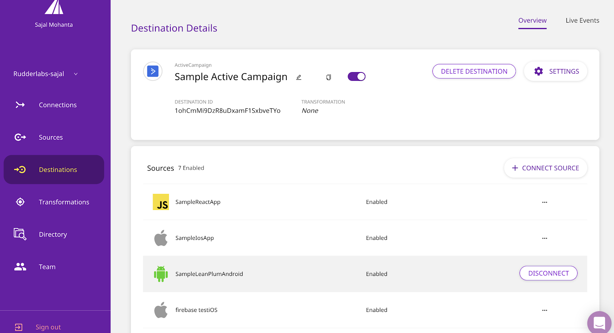

RudderStack is an open-source platform that enables collecting and routing your customer event data to focus on data privacy and security. RudderStack replaces the need to build separate integration with each third-party tool and unlocks rapid iteration for your product and growth teams.

RudderStack offers various [Client Side and Server Side SDK(s)](https://docs.rudderstack.com/rudderstack-sdk-integration-guides), [Cloud Sources](https://docs.rudderstack.com/cloud-extract-sources), [Event Streams](https://docs.rudderstack.com/rudderstack-event-streams) that enable you to collect your application event data and send it to the RudderStack Server. It further routes this data to your desired destinations (including Warehouses) for downstream analytics.

This post discusses how RudderStack helps you route your customer data to any destination in six simple steps.   

## Routing Data to Any Destination

[RudderStack](https://app.rudderstack.com/) provides an easily configurable dashboard for adding and connecting your destinations with any source in an _m:n_ manner. You can also enable tools that need to be loaded on the user’s device (either a computer or mobile device) to function properly. Different destinations have Device Mode integration based on availability.

**Note: If you don’t have a source configured in RudderStack from where you would like to send the data to the destination, skip the following section and move to [Adding a New Source](#adding-a-new-source).**

## Six Simple Steps to Adding New Destinations

Adding a destination and connecting it to a source from the RudderStack dashboard is effortless. You’ll need a token or API key for the destination or some way to confirm your account in the tool. 

*   1. From your RudderStack workspace, click on the **ADD DESTINATION** option. You can find this option on the **Connections** home page from the **Destinations** list.
*   2. Search for the desired destination in the **Destinations** catalog, and click on the destination’s tile (e.g., **ActiveCampaign**).

*   3. Enter the desired name for your destination and click on **Next**.

    

*   4. Choose which source(s) should send data to this destination, and click **Next**.

    

*   5. Next, in the **Connection Settings** section, enter the required fields, such as **API Key**, **ActID**, **Event Key**, and click **Next**.  

    

*   6. Next, choose the transformation you wish to use. You can write your custom transformation and select it. Else, you can select **No transformation needed** and click **Next**.

    

   Voila! You have successfully added your destination to your sources(s):

## There’s More...

You can also connect the previously added destination(s) to your other Source (s) using **CONNECT DESTINATIONS** by visiting your Source in the **Sources** catalog.

Wasn’t it simple? Now you can easily and securely connect with multiple sources and route your customer event data to your favorite destinations through RudderStack.

## Adding a New Source

Adding a source on the RudderStack dashboard is simple and takes just a few minutes.

*   1. Log into your [RudderStack workspace](http://app.rudderstack.com/) and click on **ADD SOURCE**. This option appears on the **Connections** home page or the **Sources** list.

    

*   2. Select your desired Source from the **Sources** catalog, and click the Source’s tile (e.g., **iOS**)

    

*   3. Enter the desired name for your source and click on **Next**, and It’s done!

    

Now, you can connect your source to your preferred destination to route your customer data from the [Six Simple Steps to Adding New Destinations](#six-simple-steps-to-adding-new-destinations).

## Explore More with RudderStack

We currently support over 20 sources, including [Warehouse Actions](https://docs.rudderstack.com/warehouse-actions), [Cloud Extracts](https://docs.rudderstack.com/cloud-extract-sources), and [Event streams](https://docs.rudderstack.com/rudderstack-event-streams). We also support over 80 [destinations](https://docs.rudderstack.com/destinations) and add a new one every two weeks, so be sure to look at the other [integrations](https://rudderstack.com/integration/) we support.    

[Sign up](https://app.rudderstack.com/signup) with RudderStack Cloud Free to try out these integrations for free! Simply.  

Join our [Slack](https://resources.rudderstack.com/join-rudderstack-slack) to chat with our team, explore our open source repos on [GitHub](https://github.com/rudderlabs), and follow us on social: [Twitter](https://twitter.com/RudderStack), [LinkedIn](https://www.linkedin.com/company/rudderlabs/), [dev.to](https://dev.to/rudderstack), [Medium](https://rudderstack.medium.com/), [YouTube](https://www.youtube.com/channel/UCgV-B77bV_-LOmKYHw8jvBw). Don't miss out on any updates. [Subscribe](https://rudderstack.com/blog/) to our blogs today!
