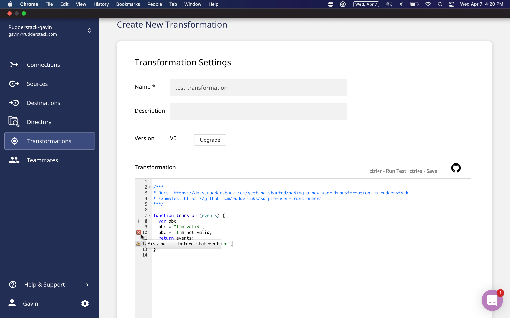

Everybody hates data transformations in their pipeline tools. Developers hated the transformations in ETL tools so much that they came up with a whole new tool classification – ELT – that removed transformations completely, leaving that work to specialized tools such as [dbt](https://www.getdbt.com/) to do on the data warehouse.

It’s easy to understand why. Data pipeline tools have always made transformations difficult to use. Send it to the warehouse and transform it there. It’s easier. You only have to know SQL, and those scripts run way faster.

Well… I’m calling BS on this commonly held belief. While it's not wrong, the problem with it is that no data pipeline tool has implemented data transformations well.

That’s not true anymore. We have.

RudderStack Transformations are easy to build, debug, and manage; and they run in real-time. They’re data transformations that work like you think they should.

## The Problems with Data Transformations in Every Data Pipeline Tool You’ve Ever Used

### Difficult to Build and Manage

When you’re transforming data there is always going to be some level of technical complexity. It almost always takes programming knowledge to build data transformations in pipeline tools. Yet these tools always seem to have some level of disdain for the data engineers that use them, and that is where things get complex.

At this point, most of these tools support reusing data transformations, which is good, but reuse is the bare minimum.

Can I reuse this transformation? Yes. Great, can I reuse it in this other transformation to perform a more complex transformation???

Data pipeline tools don’t support common software engineering concepts such as modularity. This makes a data engineer’s job more complex. You end up having to copy and paste code from one transformation to another to replicate existing functionality as part of a new but different transformation. Then you have to manually maintain it forever.

It’s difficult to integrate building transformations into your engineering processes too. The code for your transformations lives in the data pipeline tool, and, while you can likely version your transformations at this point, only a few tools have git integration. Even more rare is a data pipeline tool having an API that lets you build and manage your transformations with all your preferred processes and tools.

Yuck. Give me dbt instead.

### Difficult to Debug

Debugging data transformations is a nightmare too. Having a debugger on the code is great and most do at this point, but that’s the bare minimum once again.

Can my code run? Yes. Great, does it produce the expected results???

The solution that data pipeline tools have come up with for this is... nothing. Run data through it, and see what comes out the other side. Some have a data debugger, but you still have to run data through it.

Nobody in the history of time has ever thought doing this testing on Production was a good idea (or, if they did, they regretted it). So what do you do? Build a test environment... for your ETL tool?

Hard pass.

### Transformed Data is More Valuable in Real-Time

Data transformations in pipeline tools always run in batches. This is an artifact of the tools they are a part of – ETL tools – which run jobs in batch and apply the transformations when the job runs.

The stereotype of traditional ETL tools is that you’d have to wait until tomorrow morning or next week to get updated data. These waiting periods are the frequency each batch runs, and they aren’t anywhere near as bad as they used to be. Most of the major ETL tools are configurable and have trimmed it down to 5 minutes or so at the shortest.

That’s much improved, but the standard isn’t 5 minutes – that’s the best and most expensive option – and 5 minutes isn’t close to real-time. A lot of the data you want to integrate and transform in-transit is more valuable when delivered in real-time.

## There are Good Reasons why You’d Want to Transform Data Before Sending it to a Destination

Given the deficiencies, the mantra of ELT seems like a plain one to align with. Your data pipeline is for extracting and loading data. Use specific data transformation tools to transform your data in your warehouse. It works better.

ELT assumes something that isn’t true in data pipelines anymore. ELT assumes the destination is the data warehouse. So, if you don’t apply a transformation before loading, no biggie. Apply it after. It makes no real difference.

Modern data stacks are more complex than that though. You want to send your data to your warehouse, but you also have 20 other tools you want to send it to as well. Each of them has its own transformation needs, and applying transformations after the fact often isn’t realistic or possible.

While you should do most modeling and heavy transformation at-rest in your warehouse with tools like dbt, in-transit transformations are still critical to solving the problems modern companies face.

One classic use case that benefits from in-transit transformations is filtering and enforcing data quality before sending to your warehouse. Performing this transformation in-transit means the data in your warehouse is always analysis-ready. If done at-rest, the fidelity of your analysis-ready data will only be as often as your transformation runs.

Another, more modern use case that benefits from in-transit transformations is masking or removing PII and sensitive data. It’s better if this kind of data is never loaded anywhere it isn’t needed, including your warehouse. While you can mask/remove PII after loading data into your warehouse, you probably can’t after loading into your 20 other destination tools. You need in-transit transformations to support this very common use case.

## Transforming Data Before Sending it to a Destination Tool in Real-Time is Incredibly Valuable

When you step outside of the batch world of ETL and ELT pipelines and into the real-time world of event streaming pipelines, the ability to transform data before loading in a destination tool becomes much more critical.

Sending real-time events is incredibly valuable, because you can start to implement behavior-based tactics by sending this data to tools that use it to automate execution – think sending an email through [Customer.io](https://customer.io/) or personalizing a user’s experience through [Braze](https://www.braze.com/), both based on triggering actions in your application. These behavior-based tactics can have a very high ROI when done well.

You can’t send a raw event stream to every destination tool that you use though. Your data quality would suffer. Also, you probably want to enrich your events – such as adding info from Clearbit or location data.

More importantly, you can’t send the PII and sensitive data in your event stream to all your destination tools. That is a data privacy nightmare. You should be masking or removing as much PII and sensitive data as possible before it ever reaches a destination tool. This is the safest approach for your customers and your business. For businesses in highly regulated industries, the feasibility of event streaming will hinge on this.

## RudderStack Transformations. Data Transformations that Work Like you Think They Should.

RudderStack Transformations let you transform any data that you send through RudderStack and you can use them across Event Stream, Warehouse Actions, and Cloud Extract pipelines. They are easy to build, debug, and manage; and they run in real-time, after data collection and before delivery to a destination. They’re data transformations that work like you think they should.

**RudderStack Transformations are easy to write and maintain.** You write them in Javascript, which is a common and easy-to-use language. Every transformation is reusable. So if you write it once, you can use it everywhere. Transformations are modular too. You can save them to your organization’s Transformation Library and reuse them as part of other transformations, just like libraries in software programming (we’re even including some out-of-the-box transformation libraries in the RudderStack Library).

You can even build transformations using all the processes and tools you prefer with the Transformations API. With it, you can programmatically add and remove transformations to the platform, create an organization-wide sandbox where your team can store transformations before publishing them to the live environment, define libraries, and version control your transformations.

**RudderStack Transformations makes it easy to debug your code and your data.**

Not only do we give you a code debugger so you can confirm your transformation will run, but we have a transformation test as well. It lets you send a sample payload through the transformation and see the results inside of RudderStack before ever applying it to your data pipelines. We provide sample event stream payloads you can use for testing your transformations, but you can change the payload to replicate the data you will be transforming.

**RudderStack Transformations run in real-time.** They aren’t batch. They are applied in-transit after data collection and before delivery to a destination. So they work with our event streaming and reverse-ETL pipelines in addition to our ELT pipelines.

_Learn more about all of the new functionality we added to Transformations in our post, [Introducing New Functionality to RudderStack Transformations: API, Libraries, and Debugger](https://rudderstack.com/blog/introducing-new-functionality-to-rudderstack-transformations-api-library-and-debugger)._

_Learn more about the Transformations API in our post, [RudderStack’s Transformations API](https://rudderstack.com/blog/rudderstacks-transformations-api)._

## Try RudderStack Today

Start using a smarter customer data pipeline that builds your customer data lake on your data warehouse. Use all your customer data. Answer more difficult questions. Send insights to your whole customer data stack. Sign up for RudderStack Cloud Free today.

Join our [Slack](https://resources.rudderstack.com/join-rudderstack-slack) to chat with our team, check out our open source repos on [GitHub](https://github.com/rudderlabs), subscribe to [our blog](https://rudderstack.com/blog/), and follow us on social: [Twitter](https://twitter.com/RudderStack), [LinkedIn](https://www.linkedin.com/company/rudderlabs/), [dev.to](https://dev.to/rudderstack), [Medium](https://rudderstack.medium.com/), [YouTube](https://www.youtube.com/channel/UCgV-B77bV_-LOmKYHw8jvBw). Don’t miss out on any updates. [Subscribe](https://rudderstack.com/blog/) to our blogs today!
