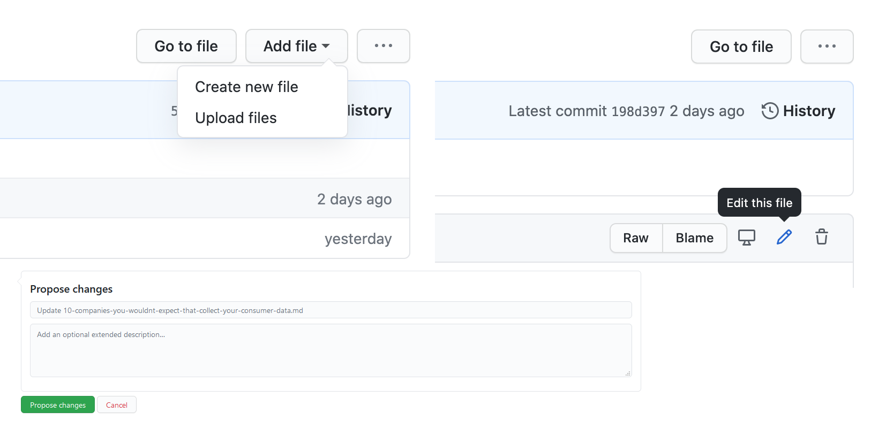

## It’s all About Open Source

Open source is a component of almost all software development that takes place today. If you look back, the influence has been potent. For example, the main reason Python became the language most-suited for machine learning is the open-source contributors. In fact, because of the enormous size of the open-source community that is tirelessly developing Python, [Google open-sourced TensorFlow](https://www.wired.com/2015/11/google-open-sources-its-artificial-intelligence-engine/). 

Joe Worrall, Director of Open Source and Developer Advocacy at New Relic, [describes](https://blog.newrelic.com/product-news/contributor-centric-systems/) the dynamics behind the power of building contributor-centric systems: 

_“Contributors don’t give to the cause. They are a part of it.”_

RudderStack is an open-source customer data pipeline tool for developers. Being open source is a tag we wear with pride, so much so that we recently partnered with GitHub for [GitHub Sponsors for Companies](https://github.com/sponsors). We value the developer community that works hard to build and support open source projects. In a recent [blog](https://rudderstack.com/blog/RudderStack-gitHub-sponsors-making-open-source-more-sustainable-for-developers), we explained why RudderStack directly compensates developers for their contributions to our project. This post discusses why and how we open-sourced our content and took the next step in our open source journey.

## Why we Open Sourced our Blog and Docs

Said simply, bringing more voices to the table increases our content’s quality and value, both in thought leadership and our technical documentation. 

We want developers to share their ideas, thoughts, and findings while working with RudderStack, customer data, and data in general. We want to learn about the data stacks you are building, problems you are solving, and solutions you are creating. Blogs, tutorials, and even case studies are great ways to share that knowledge.  In short, we want you to contribute!

## Our Previous Blog Infrastructure

We used [WordPress](https://wordpress.org/) for our blog before we decided to open source it. WordPress itself is open source and is fantastic for its simplicity, SEO settings, advertising, and flexible themes. In fact, WordPress is the _numero uno_ choice of bloggers for hosting their own websites as per [Tech Radar](https://www.techradar.com/in/best/cms). 

From a site performance and version-control standpoint, though, it’s less straightforward than more modern tooling. Also, to allow contribution, you have to use some sort of plugin (like [User Submitted Posts](https://wordpress.org/plugins/user-submitted-posts/)), a less-than-ideal experience for developers, and opens up your dashboard to outside users. 

All-in-all, building an open-source, version-controlled blog that enables developers to create content and submit it via pull requests easily is a cumbersome and tricky process on WordPress.

## Open Source Frameworks Options for our Blog

When we decided to open-source our blog and docs, we were spoilt for choices. Today there are multiple well-supported and fully-featured frameworks for open-source content creation. Some of the options that we considered were  [Ghost](https://ghost.org/features/), [Jekyll](https://jekyllrb.com/), [Hugo](https://gohugo.io/), [Nanoc](https://nanoc.ws/), and [Gatsby](https://www.gatsbyjs.com/). There are even more frameworks beyond these,  and each tool has its pros and cons. Which one do we recommend? Well, we don’t. The best tool for you is the one that fulfills your requirements.

## Why we Picked Gatsby

We picked [Gatsby.js](https://www.gatsbyjs.com/docs) as the framework for open-sourcing our content. While making the decision, Jekyll was a strong contender, but the final choice for us was Gatsby. 

Here’s why we chose it:

*   Writing content in Gatsby is simple and developer-friendly. It uses Markdown for formatting. It just takes two plugins to set it up (`gatsby-source-filesystem` and `gatsby-transformer-remark`). 
*   Integration with GitHub Pages is simple, which was a priority for us.
*   Gatsby has a rich library of plugins, which you can use for extending and introducing additional functionalities (in fact, through GitHub Sponsors, we had a [RudderStack plugin](https://www.gatsbyjs.com/plugins/gatsby-plugin-rudderstack/) made!)
*   Implementing Gatsby is relatively straightforward in most cases. You can check their [docs](https://www.gatsbyjs.com/docs/quick-start/) to see how to get started with Gatsby.js.
*   Gatsby is super high performance, meaning speedy page load times.
*   Gatsby allows creating an interactive experience for the readers.
*   A vast modern web development community contributes to it.

## Wait, What About the Docs?

Our docs still run on Gitbook but are now open-sourced so that others can contribute. We are currently exploring other open-source frameworks like Slate that will give us more flexibility and better telemetry. We will write another post when we make a decision and complete the migration. 

## We are Open Source now!

So, the RudderStack Blog and Docs are now open source. We’re excited about contributions from the RudderStack community and beyond. 

In fact, developers have already started contributing to our documentation. Recently, [Benedikt](https://github.com/benedikt) from the [Userlist](https://userlist.com/) team created the [docs for the Userlist destination](https://docs.rudderstack.com/destinations/userlist) for RudderStack (see the pull request [here](https://github.com/rudderlabs/rudderstack-docs/pull/12)). They also built the Userlist integration, submitted a pull request, and it is now live on our platform!  This is the beauty of open source!

## How to Contribute

Contributing to RudderStack is simple!

*   Visit [RudderStack Blog](https://github.com/rudderlabs/rudder-blog/tree/main/content/blog) to contribute to blogs or [RudderStack Docs](https://github.com/rudderlabs/rudderstack-docs) for docs..
*   If you wish to add a new blog/doc, click on **Create new file** or **Upload files** as shown in the following diagram.
*   Also, to suggest changes to an existing file, go to the file and select Edit this file.
*   Once you make the changes, Click on **Propose changes**.

*   Once your Pull Request is created, we will review the changes you’ve made.
*   If everything looks okay, our team will accept it (or edit to make it reader friendly), and [Voilà](https://www.merriam-webster.com/dictionary/voil%C3%A0)! Your changes will reflect on the pages.

Start building a better, warehouse-first CDP that delivers complete, unified data to every part of your marketing and analytics stack by signing up for [RudderStack Cloud Free](https://app.rudderlabs.com/signup?type=freetrial) today. [Subscribe to our blogs](https://rudderstack.com/blog/), join [Slack](https://resources.rudderstack.com/join-rudderstack-slack) to chat with our team, check out our open-source repos on [GitHub](https://github.com/rudderlabs), and follow us on our socials: [Twitter](https://twitter.com/RudderStack), [LinkedIn](https://www.linkedin.com/company/rudderlabs/), [dev.to](http://dev.to/), [Medium](https://rudderstack.medium.com/), [YouTube](https://www.youtube.com/channel/UCgV-B77bV_-LOmKYHw8jvBw). Don’t miss out on any updates. [Subscribe](https://rudderstack.com/blog/) to our blogs today!
